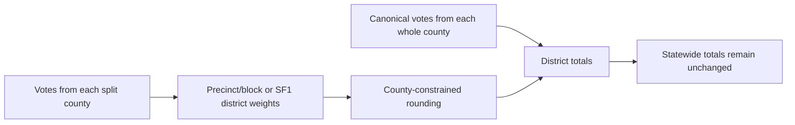

# Change history

## March–September 2026

**Last updated:** September 22, 2026

### Reliability and Structure (September 22, 2026)

- Regional Quick Jumps are grouped by metro, region, and corridor; all preset zoom boxes now come from their county geometry, and the NC Commerce Southeast Prosperity Zone is available as a new preset.
- Added a locally saved, shareable custom county region using the existing regional summary and trend paths; county selection is validated against the map's county inventory.
- Moved the main stylesheet into `css/atlas-main.css` without changing its cascade order, and moved dated development notes from the README into this file.
- Added a read-only catalog validation command covering every published manifest target and checking vote-row arithmetic. GitHub Actions runs it with core tests and inline-script parsing.
- Comparison cards now warn when either source uses geographic allocation or a synthetic model; displayed vote totals and margin precision are unchanged.
- Kept the restored decimal formatting untouched in this pass.

### Source & Confidence Inspector (September 22, 2026)

- Added an expandable provenance card to the statewide, county, precinct, regional, and district focus panel without changing election calculations or display precision.
- Source metadata already carried by contest and district slices now becomes user-visible, including direct match coverage, non-geographic vote allocation, district-line basis, and crosswalk/bridge details.
- Where identifiable, the focus card also reports votes from administrative/non-geographic precinct rows that do not have their own map shapes.
- Exact county totals, official NCGA StatPack benchmarks, calibrated estimates, bridged precincts, county fallbacks, and synthetic modeled contests receive distinct plain-language labels.
- Added isolated provenance classification tests so future source-method changes cannot silently overstate confidence.

### Frontend Precision Alignment (September 21, 2026)

- Election margins, candidate shares, shifts, trends, hover tooltips, sidebar cards, statewide summaries, and comparison cards use two decimal places. Deterministic rounding prevents floating-point boundary drift.
- Ultra-close races retain three decimal places so results such as the 2024 NC Supreme Court contest remain visible rather than appearing as `0.0%`. The change is presentational only: calculations, exports, and stored election values retain their existing precision.
- Winner margins are rounded directly from the raw vote margin rather than calculated by subtracting independently rounded candidate shares (for example, President 2016 in NC-13 on the 2022 lines displays as `R+2.33`). Map colors and competitiveness tiers use that same displayed margin.

### Mixed Whole-County and Split-County Districts (September 17, 2026)

- Added a shared, reproducible component catalog for State House and State Senate districts on both the 2022 and 2024 line sets: `data/mappings/mixed_county_components.json`.
- In a mixed district, every complete county retains its canonical county vote totals; only the portion drawn from a split county uses the calibrated precinct/block allocation. For example, **SD-18 = exact Granville County + allocated northern Wake County** on both line sets.
- Geometry overlaps covering at least 99.9% of a county are treated as complete. Overlaps of 0.1% or less are treated as geometry slivers rather than genuine county splits.
- The catalog is regenerated and audited with `python scripts/apply_mixed_county_components.py --write`. It covers 23 mixed House and 16 mixed Senate districts on each line set.
- Regression coverage locks the SD-18 Granville/Wake classification on both plans and the changed HD-7 split: exact Franklin plus allocated Granville on the 2022 lines, but exact Franklin plus allocated Vance on the enacted 2024 lines.
- Rebuilt the available 2016–2024 legislative district slices from NCSBE precinct-sort distributions reconciled to certified county/contest/party totals. Final integer allocation now uses largest-remainder rounding separately within each county before county contributions are summed into districts.
- The constrained rebuild produced zero differences across 58,000 county-total checks and 768 statewide-total checks. No district winners changed; mixed-district margins moved by at most 0.01 percentage point. Files containing protected exact NCGA/statpack rows are preserved atomically rather than mixing two allocation authorities within one contest.
- Added a separate experimental builder for elections without NCSBE precinct-sort files: `scripts/build_historical_district_contests_county_constrained.py`. It imports the established historical parser, aliases, SF1/VAP weights, and lineage helpers without modifying that production builder, and should write to a staging directory until reviewed. Mixed districts are now computed as an explicit sum: canonical whole-county votes are added directly, while only the split-county component uses precinct/SF1 weights.
- President 2004 and President 2012 staging trials conserve Democratic, Republican, other, county, and statewide totals exactly. They are not promoted: comparison with the existing SF1-enhanced live slices found materially different historical margins, reaching 10.50 points in a mixed House district and 5.92 points in a mixed Senate district in the 2012 trial.
- A second President 2004 trial explicitly loaded `district_weights_2004.json`; county and statewide conservation passed. Component separation reduced the maximum mixed House comparison to 1.72 points, while the 8.32-point mixed Senate outlier is now specifically attributable to SD-46's estimated Buncombe component (its Burke and McDowell component is exact). The trial remains staged pending validation of split-county historical weights; see `data/reports/historical_county_constrained_trial.json`.
- The same component-separated trial was run against the 2022 House and Senate lines. County and statewide party totals again reconcile exactly; versus the existing live files, maximum mixed-district margin differences were 5.03 House / 3.55 Senate points for 2012 and 11.67 House / 6.16 Senate points for 2004. These remain staging diagnostics, not production replacements.
- A precinct-level audit of the 2004 Buncombe SD-46/SD-49 split found 71 of 71 precinct rows matched and no weight-sum failures. Sixty-eight precincts use exact SBE2006 geometry; only three use historical plan-cell estimates because their 2004 precincts changed or split before the 2006 geometry. Those three account for 6.1% of county votes and do not create the SD-46 Republican lean, which is already present in the 68 exact-geometry precincts. The existing live allocation is therefore a stale comparison baseline rather than evidence of a bad current lineage; see `data/reports/buncombe_2004_split_component_audit.json`.

| Bundle | What was pushed | Status |
| --- | --- | --- |
| Production | Mixed-county catalog and allocator, official plan crosswalks, and reconciled 2016–2024 legislative results | Live data; county and statewide totals preserved, no winners changed |
| Verification | Regression tests plus benchmark, comparison, and rounding audit reports | Reproducibility and audit trail only |
| Historical experiment | Separate pre-precinct-sort builder and its diagnostic reports | Staged research; no historical live results replaced |



This is a statewide rule—not an SD-18 special case. Every district with both an exact whole-county component and a weighted split-county component is listed below; county details are in `data/mappings/mixed_county_components.json`.

| Line set | Example district | Exact component | Weighted component |
| --- | --- | --- | --- |
| 2022 and 2024 | HD-1 | Chowan, Currituck, Perquimans, Tyrrell, Washington | Dare |
| 2022 and 2024 | HD-2 | Person | Durham |
| 2022 and 2024 | HD-4 | Duplin | Wayne |
| 2022 | HD-7 | Franklin | Granville |
| 2024 | HD-7 | Franklin | Vance |
| 2022 and 2024 | HD-13 | Carteret | Craven |
| 2022 and 2024 | HD-16 | Pender | Onslow |
| 2022 and 2024 | HD-24 | Wilson | Nash |
| 2022 | HD-32 | Vance | Granville |
| 2024 | HD-32 | Granville | Vance |
| 2022 and 2024 | HD-46 | Columbus | Robeson |
| 2022 and 2024 | HD-50 | Caswell | Orange |
| 2022 and 2024 | HD-51 | Lee | Moore |
| 2022 and 2024 | HD-52 | Richmond | Moore |
| 2022 and 2024 | HD-54 | Chatham | Randolph |
| 2022 and 2024 | HD-55 | Anson | Union |
| 2022 and 2024 | HD-77 | Davie, Yadkin | Rowan |
| 2022 and 2024 | HD-79 | Beaufort, Hyde, Pamlico | Dare |
| 2022 and 2024 | HD-85 | Avery, Mitchell, Yancey | McDowell |
| 2022 and 2024 | HD-87 | Caldwell | Watauga |
| 2022 and 2024 | HD-90 | Surry | Wilkes |
| 2022 and 2024 | HD-91 | Stokes | Forsyth |
| 2022 and 2024 | HD-93 | Alleghany, Ashe | Watauga |
| 2022 and 2024 | HD-94 | Alexander | Wilkes |
| 2022 and 2024 | HD-113 | Polk | Henderson, McDowell, Rutherford |
| 2022 and 2024 | SD-8 | Brunswick, Columbus | New Hanover |
| 2022 and 2024 | SD-9 | Bladen, Duplin, Jones, Pender | Sampson |
| 2022 and 2024 | SD-12 | Harnett, Lee | Sampson |
| 2022 and 2024 | SD-18 | Granville | Wake |
| 2022 and 2024 | SD-20 | Chatham | Durham |
| 2022 and 2024 | SD-21 | Moore | Cumberland |
| 2022 and 2024 | SD-25 | Alamance | Randolph |
| 2022 and 2024 | SD-26 | Rockingham | Guilford |
| 2022 and 2024 | SD-29 | Anson, Montgomery, Richmond | Randolph, Union |
| 2022 and 2024 | SD-31 | Stokes | Forsyth |
| 2022 and 2024 | SD-37 | Iredell | Mecklenburg |
| 2022 and 2024 | SD-44 | Cleveland, Lincoln | Gaston |
| 2022 and 2024 | SD-45 | Catawba | Caldwell |
| 2022 and 2024 | SD-46 | Burke, McDowell | Buncombe |
| 2022 and 2024 | SD-47 | Alleghany, Ashe, Avery, Madison, Mitchell, Watauga, Yancey | Caldwell, Haywood |
| 2022 and 2024 | SD-50 | Cherokee, Clay, Graham, Jackson, Macon, Swain, Transylvania | Haywood |

Split-only complements such as HD-25 also benefit from county-constrained precinct allocation, but are not in this table because they have no whole-county component to preserve directly. For orientation: HD-24 is Wilson plus most of the Sharpsburg precinct in Nash, HD-25 is the Nash remainder, HD-55 is Anson plus part of Union, and HD-87/HD-93 divide Watauga while preserving their complete counties.

For a numeric example, 2024-lines SD-18 in the 2024 presidential contest is the exact Granville return (14,365 D / 17,383 R / 356 other) plus the weighted northern Wake component (47,275 D / 44,872 R / 1,454 other), producing 61,640 D / 62,255 R / 1,810 other (R+0.49).

### Unified Demographic Hover and Mobile Details (September 16, 2026)

- Unified Demographics-mode hover cards across county, precinct, Congressional, State House, and State Senate views. The demographic summary now appears first in the standard results card, with a `Demographics` subtitle and election rows retained below for context.
- Replaced the district-only inline demographic string with the same race-share chips used by county and precinct cards, including the expanded Native, Asian, Pacific Islander, and multiracial categories when available.
- Tightened hover-card spacing, chip sizing, and source-note typography so the expanded breakdown remains readable without overwhelming the map.
- Updated county mobile/sidebar details to prefer 2020–2024 ACS CVAP race/ethnicity shares when present and to state clearly when the displayed total or shares instead come from VAP or total-population data.

### Shift and Compare Map Scale (September 13–14, 2026)

- Expanded Shift and Compare shading from four to seven directional color bins, separating subtle movement (0.5–1 point), moderate shifts, and extreme 20–25-point realignments. Changes below 0.5 points remain near-white.
- Updated the matching normal and colorblind palettes and the detailed legends to label both Democratic and Republican directions through 25 points, with larger threshold text for readability. Compare still measures the change in signed Republican-minus-Democratic margin from the comparison contest to the primary contest.

### Judicial Seat Filtering, Labels, and Seat 10 Totals (September 13, 2026)

- Hid stale uncontested judicial district slices unless they correspond to a valid statewide contest, while preserving the named-to-numbered seat-family crosswalk used by historical timelines.
- Corrected the 19-candidate 2014 Court of Appeals Seat 10 vacancy to use the candidates' actual votes: John S. Arrowood 336,839 (14.40%), John M. Tyson 557,700 (23.84%), and all other candidates 1,444,655 (61.76%). Tyson's certified statewide margin is 220,861 votes, or 9.44 percentage points of all votes cast.
- Rebuilt the 2014 Seat 10 county, precinct, Congressional, State House, and State Senate results on both the 2022 and 2024 lines. The 14 whole-county State Senate clusters were then restored from exact county sums on both line sets. The 2026 congressional slice mirrors the corrected 2024 districts except for changed CD-01 and CD-03, which are recalculated on the SL 2025-95 lines.
- Audited the remaining pre-2018 statewide judicial candidate labels against the source results and party-override table; no other substantive top-candidate labeling mismatch was found.
- Included the pending Caswell precinct display-name correction from September 11 (`YANC`: `Yanceyville 2` → `Yanceyville`).
- Split every demographic map category into a lighter plurality shade (largest group below 50%) and a darker majority shade (50% or greater), with matching normal, high-contrast, and colorblind-aware legend colors.
- Bumped the frontend build/data cache token to `2026-09-13-demographic-majority`.


### Canonical Single-County and Grouped-County House Totals (September 11, 2026)

- Corrected State House district calculations for districts composed entirely of one or more whole counties. These rows now use canonical statewide-contest county totals instead of accepting small precinct-crosswalk or rounding drift.
- This produces more accurate margins of victory because the qualifying districts have complete or near-complete county coverage: certified county totals capture essentially 100% of the relevant votes, whereas precinct crosswalks can introduce small matching, allocation, and rounding differences.
- A single-county district copies that county's complete Democratic, Republican, and other vote totals. A grouped-county district adds the complete totals for every constituent county, then recalculates total votes, margin, margin percentage, winner, competitiveness color, and candidate labels from the combined result.
- For example, **HD-22** is calculated as **Bladen + Sampson**, while **HD-119** is calculated as **Jackson + Swain + Transylvania**. The same rule covers the other verified whole-county groups defined in `scripts/fix_2024_house_whole_county_totals.py`.
- The correction applies to matching State House contest slices in both `data/district_contests/` (2022 lines) and `data/district_contests_2024_lines/` (2024 lines). Districts containing any split county are intentionally excluded from this override.

| District shape | Example | Result calculation | Expected coverage |
|---|---|---|---|
| One complete county | HD-65: Rockingham; HD-86: Burke; HD-97: Lincoln | Copy that county's complete DEM, REP, and OTHER totals, then recalculate the margin | 100% or effectively 100% |
| Several complete counties | HD-22: Bladen + Sampson; HD-118: Haywood + Madison; HD-119: Jackson + Swain + Transylvania | Sum DEM, REP, and OTHER votes across all listed counties, then recalculate the margin | 100% or effectively 100% |
| Includes part of a county | Any district containing a county split | Retain the precinct/block-weighted allocation | Depends on precinct matching and crosswalk coverage |

All verified whole-county House clusters covered by this correction are listed below:

| District | Type | Complete county composition |
|---|---|---|
| HD-5 | Grouped counties | Camden + Gates + Hertford + Pasquotank |
| HD-12 | Grouped counties | Greene + Jones + Lenoir |
| HD-22 | Grouped counties | Bladen + Sampson |
| HD-23 | Grouped counties | Bertie + Edgecombe + Martin |
| HD-27 | Grouped counties | Halifax + Northampton + Warren |
| HD-48 | Grouped counties | Hoke + Scotland |
| HD-65 | Single county | Rockingham |
| HD-67 | Grouped counties | Montgomery + Stanly |
| HD-86 | Single county | Burke |
| HD-97 | Single county | Lincoln |
| HD-118 | Grouped counties | Haywood + Madison |
| HD-119 | Grouped counties | Jackson + Swain + Transylvania |
| HD-120 | Grouped counties | Cherokee + Clay + Graham + Macon |

The following examples show why the canonical sum is used. “Previous” is the pre-September 11 precinct/crosswalk-derived margin; “canonical” is the current margin calculated from the complete county totals. Positive Republican margins are written as `R+`; negative stored margins are written as `D+`.

| District | Complete counties | Election | Previous margin | Canonical margin now used | Change |
|---|---|---:|---:|---:|---:|
| HD-22 | Bladen + Sampson | President 2012 | R+6.10 | R+6.03 | 0.07 pt toward D |
| HD-22 | Bladen + Sampson | President 2020 | R+19.21 | R+19.23 | 0.02 pt toward R |
| HD-118 | Haywood + Madison | President 2012 | R+12.72 | R+12.39 | 0.33 pt toward D |
| HD-118 | Haywood + Madison | President 2020 | R+25.70 | R+25.73 | 0.03 pt toward R |
| HD-119 | Jackson + Swain + Transylvania | President 2012 | R+8.74 | R+8.48 | 0.26 pt toward D |
| HD-119 | Jackson + Swain + Transylvania | Governor 2016 | R+4.73 | R+4.64 | 0.09 pt toward D |

These are illustrative contests, not fixed partisan baselines: each election is independently summed from that contest's certified county totals. Small changes are expected because the correction removes allocation and rounding drift; the resulting vote counts and margins are the higher-coverage values used by the atlas.

### August 2026 Precinct Display Refresh (September 5, 2026)

- Advanced the live precinct overlay to the August 24, 2026 SBE geometry while retaining December 2025 as the canonical historical allocation basis.
- Added a composed historical-to-2026 browser bridge and fixed merged precinct rendering so retired source precinct vote rows are summed rather than overwritten.
- Filled the six numeric-only Forsyth labels from the county Board of Elections polling-place list and removed redundant trailing precinct codes from Davidson display names.
- Added regression coverage for all 17 retired-to-current key changes, the seven merge targets, Forsyth labels, and Davidson suffix cleanup.

### Canonical Whole-County State Senate Totals (September 4, 2026)

The same canonical-county method applies to 14 State Senate districts in each plan. The tables are separate because the northeastern districts changed between the 2022 and 2024 lines. In particular, the 2022 SD-02 Beaufort + Craven + Lenoir cluster became SD-03 in the 2024 plan, while the former SD-01 and SD-03 counties were redistributed between the new SD-01 and SD-02. Other districts containing county splits remain precinct/block-weighted. The lists below were verified against both the enacted census-block assignments and GeoPandas county/district coverage.

##### 2022 State Senate lines

| District | Type | Complete county composition |
|---|---|---|
| SD-01 | Grouped counties | Carteret + Chowan + Dare + Hyde + Pamlico + Pasquotank + Perquimans + Washington |
| SD-02 | Grouped counties | Beaufort + Craven + Lenoir |
| SD-03 | Grouped counties | Bertie + Camden + Currituck + Gates + Halifax + Hertford + Martin + Northampton + Tyrrell + Warren |
| SD-04 | Grouped counties | Greene + Wayne + Wilson |
| SD-05 | Grouped counties | Edgecombe + Pitt |
| SD-06 | Single county | Onslow |
| SD-10 | Single county | Johnston |
| SD-11 | Grouped counties | Franklin + Nash + Vance |
| SD-23 | Grouped counties | Caswell + Orange + Person |
| SD-24 | Grouped counties | Hoke + Robeson + Scotland |
| SD-30 | Grouped counties | Davidson + Davie |
| SD-33 | Grouped counties | Rowan + Stanly |
| SD-36 | Grouped counties | Alexander + Surry + Wilkes + Yadkin |
| SD-48 | Grouped counties | Henderson + Polk + Rutherford |

##### 2024 State Senate lines

| District | Type | Complete county composition |
|---|---|---|
| SD-01 | Grouped counties | Bertie + Camden + Currituck + Dare + Gates + Hertford + Northampton + Pasquotank + Perquimans + Tyrrell |
| SD-02 | Grouped counties | Carteret + Chowan + Halifax + Hyde + Martin + Pamlico + Warren + Washington |
| SD-03 | Grouped counties | Beaufort + Craven + Lenoir |
| SD-04 | Grouped counties | Greene + Wayne + Wilson |
| SD-05 | Grouped counties | Edgecombe + Pitt |
| SD-06 | Single county | Onslow |
| SD-10 | Single county | Johnston |
| SD-11 | Grouped counties | Franklin + Nash + Vance |
| SD-23 | Grouped counties | Caswell + Orange + Person |
| SD-24 | Grouped counties | Hoke + Robeson + Scotland |
| SD-30 | Grouped counties | Davidson + Davie |
| SD-33 | Grouped counties | Rowan + Stanly |
| SD-36 | Grouped counties | Alexander + Surry + Wilkes + Yadkin |
| SD-48 | Grouped counties | Henderson + Polk + Rutherford |

Examples of corrected margins on the 2022 lines are shown below. In these older judicial slices, the previous whole-county rows had the correct total-vote count but placed all votes in the `other` bucket, which displayed a false `TIE` at 0.00%. The canonical county sums restore the candidate-party vote split and the real margin.

| District | Election | Previous display | Canonical margin now used |
|---|---|---|---:|
| SD-01 | Court of Appeals Seat 4, 2004 | TIE 0.00 | D+13.48 |
| SD-02 | Court of Appeals Seat 5, 2004 | TIE 0.00 | R+8.76 |
| SD-06 | Court of Appeals Seat 6, 2004 | TIE 0.00 | R+32.12 |
| SD-10 | Court of Appeals Seat 4, 2004 | TIE 0.00 | D+0.44 |
| SD-23 | Supreme Court Associate Justice Seat 4, 2004 | TIE 0.00 | D+50.38 |
| SD-36 | Court of Appeals Seat 9, 2006 | TIE 0.00 | R+15.77 |

The recent 2022-line statewide rows were already canonical before the September 13 audit, so they did not require a new before/after correction. “2022 lines” identifies the boundary plan, not the election year: the same districts also contain projected 2024 contests. Representative checks across both election years include:

| District | Election | Verified canonical margin |
|---|---|---:|
| SD-01 | US Senate 2022 | R+27.02 |
| SD-02 | US Senate 2022 | R+22.18 |
| SD-03 | US Senate 2022 | R+3.84 |
| SD-06 | Court of Appeals Seat 8, 2022 | R+36.70 |
| SD-23 | Court of Appeals Seat 8, 2022 | D+34.65 |
| SD-48 | Supreme Court Associate Justice Seat 3, 2022 | R+29.80 |
| SD-01 | President 2024 | R+26.70 |
| SD-02 | Governor 2024 | R+1.82 |
| SD-03 | Attorney General 2024 | D+1.83 |
| SD-06 | President 2024 | R+35.84 |
| SD-23 | Governor 2024 | D+43.59 |
| SD-48 | Court of Appeals Seat 12, 2024 | R+25.40 |

Examples of the corrected 2024-line margins are shown below. Positive values are Republican margins and negative values are Democratic margins.

| District | Election | Previous margin | Canonical margin now used | Change |
|---|---:|---:|---:|---:|
| SD-01 | President 2024 | R+26.70 | R+14.80 | 11.90 pt toward D |
| SD-02 | President 2024 | R+19.57 | R+16.60 | 2.97 pt toward D |
| SD-01 | Governor 2024 | R+11.43 | R+7.27 | 4.16 pt toward D |
| SD-02 | Governor 2024 | R+1.82 | D+0.87 | 2.69 pt toward D; winner changes |
| SD-01 | Attorney General 2024 | R+21.70 | R+11.61 | 10.09 pt toward D |
| SD-02 | Court of Appeals Seat 12, 2024 | R+18.75 | R+14.83 | 3.92 pt toward D |
| SD-01 | President 2020 | R+23.14 | R+8.81 | 14.33 pt toward D |
| SD-02 | President 2020 | R+16.40 | R+11.75 | 4.65 pt toward D |
| SD-01 | US Senate 2014 | R+16.49 | D+1.53 | 18.02 pt toward D |
| SD-02 | US Senate 2014 | R+11.93 | R+2.16 | 9.77 pt toward D |
| SD-01 | Court of Appeals Seat 10, 2014 | R+22.36 | R+15.14 | 7.22 pt toward D |
| SD-02 | Court of Appeals Seat 10, 2014 | R+24.57 | R+16.81 | 7.76 pt toward D |
| SD-03 | Court of Appeals Seat 10, 2014 | R+9.54 | R+24.57 | Uses the former 2022 SD-02 county cluster |

### Statewide House Official Benchmark Pass (September 4, 2026)

- Replaced every State House row covered by the official NCGA StatPacks on both line sets: `1,440` exact district/contest rows for the 2022 House lines and `2,760` for the 2024 House lines. The population-deviation pages are deliberately skipped; extraction begins at the election-report pages.
- The statewide write corrected `1,388` rows on the 2022 lines and `2,617` rows on the 2024 lines. A post-write audit reports zero remaining differences, missing files, or unknown contests across all 120 districts.
- HD-108/109/110 received an additional historical pass using official NCSBE precinct-sort projections for the remaining 2016 Council of State races and MGGG's NCGA-based VTD election fields for the 2008–2014 headline races.
- The official 2016 NCSBE files add the omitted Council of State offices without a manual DRA export. All `90` geographic precincts in Cleveland, Gaston, and Lincoln match `data/crosswalks/block20_to_sbe_2016_via_block10.csv`; zero-only administrative placeholders are excluded. Across `21` rows that can be checked against an NCGA StatPack, the largest margin difference is `0.06` percentage points.
- The MGGG 2010-VTD package extends the target review to Governor and U.S. Senate in 2008, U.S. Senate in 2010, Governor and President in 2012, and U.S. Senate in 2014. Its 2016 headline-race projection reproduces the official target margins to rounding and is used as a validation check, not in place of exact StatPack rows.
- Other 2008/2012 Council of State races remain on the existing historical reconstruction because NCSBE's public precinct-sort archive begins in 2016. The older regular results retain non-geographic absentee/early-vote buckets, so replacing those rows without a stronger historical allocation source would not be an accuracy improvement.

Reproduce the NCSBE portion with:

```powershell
python scripts/fetch_ncsbe2016_precinct_sort_targets.py
python scripts/audit_ncsbe2016_house_targets.py downloads/ncsbe/2016_precinct_sort `
  --output data/reports/ncsbe2016_hd108_110_both_lines.json `
  --ncga-benchmark data/reports/ncga_house_statpack_hd108_110_2022_lines.json `
  --ncga-benchmark data/reports/ncga_house_statpack_hd108_110_2024_lines.json
```

The source-specific apply scripts run in audit mode unless `--write` is supplied. The checked-in benchmarks preserve the official rows and source methods; detailed before/after logs can be generated locally when needed.

### Official NCGA Senate and Congressional StatPack Calibration (September 4, 2026)

- Built Senate and congressional district results from official NCSBE precinct-sort returns wherever those files were available, projecting election-vintage precincts through the official plan blocks and reconciling county/party totals before district aggregation. Exact NCGA StatPack district rows supersede those projections whenever a StatPack publishes the same contest and plan; MGGG's NCGA-derived VTD fields fill selected older headline-race gaps.
- Calibrated every published district election row to the official NCGA StatPacks for the 2022 State Senate plan (`SL 2022-2`), the court-ordered 2022 interim congressional plan, the 2023 State Senate plan (`SL 2023-146`, used for the 2024 election), and the 2025 congressional plan (`SL 2025-95`).
- The four compact JSON benchmarks in `data/reports/ncga_statpack_*.json` preserve the exact party vote totals, PDF page references, plan identifiers, and official source URLs. The corresponding `*_apply.json` reports preserve every before/after change.
- The calibrated coverage is `12` contests / `600` Senate district rows and `12` contests / `168` congressional rows on the 2022 lines, `23` contests / `1,150` Senate rows on the 2024 lines, and `30` contests / `420` congressional rows on the 2026 lines.
- NCGA marks these election tables as derived from the NCSBE `statewide_precinct_sort` files with administrative precincts excluded. Precinct-mode results remain on the atlas's geographic reconstruction; only the district aggregate slices are replaced by the published NCGA totals.
- `scripts/extract_ncga_statpack_benchmark.py` reproduces a benchmark from a downloaded PDF. `scripts/apply_ncga_statpack_benchmark.py` audits by default and requires `--write` to update a line-set directory.

Congressional results were therefore affected by the September 4 work too: official precinct-sort projections supplied the broad coverage, and published StatPack rows supplied the final exact benchmark where available. Congress did not receive the complete-county override used for qualifying House and Senate districts because the congressional plans contain county splits; treating those districts as exact sums of whole counties would be incorrect. Representative final StatPack corrections include:

| Congressional plan | District | Election | Previous margin | Official margin now used | Change |
|---|---|---|---:|---:|---:|
| 2022 interim lines | NC-13 | Agriculture Commissioner 2020 | R+6.74 | R+9.05 | 2.31 pt toward R |
| 2022 interim lines | NC-13 | Labor Commissioner 2020 | D+2.95 | D+0.77 | 2.18 pt toward R |
| 2022 interim lines | NC-12 | Governor 2020 | D+35.71 | D+33.64 | 2.07 pt toward R |
| 2022 interim lines | NC-12 | US Senate 2020 | D+28.92 | D+26.85 | 2.07 pt toward R |
| 2026 `SL 2025-95` lines | NC-01 | Supreme Court Associate Justice Seat 6, 2024 | D+0.21 | R+8.27 | 8.48 pt toward R; winner changes |
| 2026 `SL 2025-95` lines | NC-03 | Supreme Court Associate Justice Seat 6, 2024 | R+18.02 | R+9.69 | 8.33 pt toward D |

### Contest Comparison (August 19, 2026)

- Added client-side CSV and JSON export controls under `More`, covering county results and comparison-mode results across county, Congressional, State House, and State Senate views.
- Bumped the front-end build/cache token to `2026-08-19-ab-comparison-v7` so the export margin correction arrives together on GitHub Pages.

- Added a general `Compare` analysis mode for any two available contest/year entries, with an automatic prior-cycle match when one exists and a control for swapping the selected contests.
- Added comparison shading and compact, named-contest tooltips across Counties, Congress, State House, and State Senate. The comparison popup replaces the taller standard-results stack, shortens presidential labels to `US President YEAR`, and uses `%` for both contest margins and their displayed difference. Coverage includes same-year legislative/congressional ticket splits and county-level statewide/judicial comparisons.
- Added `compare=` URL state, comparison-specific legend/summary text, and regression coverage for margin math, default-pair selection, URL parsing, and fast switching into the mode.
- Versioned the local JavaScript module URLs alongside the build/cache token and added a compatibility fallback, preventing a stale cached comparison module from blocking contest loading after deployment.

### Palette, Typography, and UI Stability (August 11–14, 2026)

- Refined the default Atlas/DRA partisan ramp so the Stronghold, Safe, Likely, Lean, and Tilt tiers remain visibly distinct on desktop and mobile; the static first-paint legend now uses the same colors as the live map functions.
- Restored the intended Manrope / IBM Plex Sans regular-and-bold typography setup, disabled synthetic font weights, and stabilized native-control rendering across browser modes.
- Refreshed the Playwright regression checks for the current atlas controls, corrected palette cache-buster mismatches, and fixed the inline-script syntax regression that could prevent the interface from initializing.
- Updated the documented color table below to match the current production palette, including the latest Stronghold blue and Lean red refinements.

### Democratic Mid-Ramp Monotonicity (August 14, 2026)

- Restored a strictly darkening Democratic Lean → Likely → Safe sequence (`#9ecae1` / `#6baed6` / `#4795d2`) so a larger DEM lead no longer paints lighter than a smaller one.
- Synced the first-painted Map Key spectrum with those live fill colors. Stronghold / Dominant / Annihilation navy stops are unchanged.
- Bumped the front-end cache-buster/app build token to `2026-08-14-dem-midramp-monotonic`.

### Democratic Mid-Ramp Chroma (August 14, 2026)

- Deepened Democratic Lean / Likely / Safe (`#8bbde0` / `#5aa4d0` / `#3b86c8`) so precinct-scale competitive blues match GOP visual weight without collapsing into Stronghold `#2876b5`.
- Left Tilt, Stronghold, Dominant, and Annihilation unchanged.
- Bumped the front-end cache-buster/app build token to `2026-08-14-dem-midramp-chroma-v3`.

### Congressional U.S. House Results (August 9, 2026)

- Added all 14 certified U.S. House results from the November 2022 and November 2024 general-election precinct returns to the Congressional district selector.
- Each result is displayed on the contemporaneous congressional plan: 2022 results on the 2022 lines, and 2024 results on the 2024 lines. The new slices retain Democratic, Republican, and other-party totals plus the major-party candidate names.
- Added `scripts/build_congressional_us_house_slices.py` so the direct district totals and both manifest entries can be reproduced from the source precinct returns.
- Bumped the front-end cache-buster/app build token to `2026-08-09-congressional-us-house-results`.

### Legacy Nonpartisan Judicial Manifest Cleanup (August 8, 2026)

- Removed the legacy 2008 Tyson Seat and 2010 Elmore Seat entries from the active district manifests for the 2022, 2024, and 2026 line datasets.
- These contests remain available in the archival/raw election material, but are no longer exposed in district dropdowns because both races were same-party/non-major-party for the contest visibility model.
- Bumped the front-end cache-buster/app build token to `2026-08-08-remove-legacy-judicial-manifests`.

### Historical presidential load-time fix (July 30, 2026)

- Added compact, prebuilt precinct slices for the 2000, 2004, and 2008 presidential elections and put the existing 2012 slice on the same fast path. Each payload is about 1 MB, versus 11–18 MB for the corresponding statewide OpenElections CSV.
- The normal and strict contest loaders now prefer these manifest-indexed JSON slices. The raw OpenElections CSV parser remains available only as a resilience fallback if a compact slice cannot be loaded.
- The slices are pre-matched through the appropriate VAP-weighted historical-to-December-2025 OneMap bridge, retain all 100 county totals, and avoid downloading and parsing every other contest in the election file inside the browser.
- `scripts/rebuild_statewide_contests_from_sbe_bridge.js` now permits an explicitly requested, missing statewide slice to be created without broadening its default rebuild behavior.
- Bumped the front-end cache-buster/app build token to `2026-07-30-historical-president-slices`.

### Statewide 2008 Presidential Precinct Label Fix (July 29, 2026)

- Fixed the live OpenElections presidential CSV loader so it preserves complete precinct labels before historical crosswalk and alias resolution instead of truncating every label to its first word.
- The old behavior collapsed `2,768` geographic 2008 labels into only `1,938` lookup keys, losing `830` precinct distinctions across `59` counties. The most visible failures included Wake (`198` precincts collapsed to one `PRECINCT` key), Mecklenburg (`195` collapsed to one `PCT` key), Gates (`6` collapsed to one `PRECINCT` key), and Hyde multiword labels such as `LAKE LANDING`.
- Preserving the source labels lets the existing SBE 2006-to-OneMap weighted bridge, exact-code matching, and county alias fallbacks resolve those precincts as intended; this was a loader-key regression rather than a need to replace the underlying crosswalk.
- Added core regression coverage for Wake-style verbose codes, Mecklenburg `PCT` labels, Gates numbered/north-south labels, and Hyde name-only labels.
- Added a performance follow-up so pre-2012 precinct rows that resolve through the weighted SBE bridge skip the broader alias/code fallback pass.
- Bumped the front-end cache-buster/app build token to `2026-07-29-2008-precinct-label-fix-2` so deployed clients immediately fetch the corrected and optimized loader.

### Live 2012 SBE-to-OneMap Precinct Bridge (July 29, 2026)

- Connected the existing `data/crosswalks/precinct_sbe_2012_to_onemap_2025_vap.csv` artifact to the live precinct resolver. The file was already used by rebuild scripts but was not loaded by the front end, leaving some renamed and split 2012 precincts dependent on weaker exact/current-name fallbacks.
- The checked-in bridge contains `2,746` county-scoped 2012 source precinct IDs and directly covers about `98.7%` of geographic 2012 presidential vote after administrative `ACCUMULATED` rows are excluded. Rows without a weighted hit retain the existing exact-code, stable-alias, and county-override fallback path.
- Added a reusable, county-safe weighted-crosswalk index builder with cross-county rejection and normalized split weights.
- Bumped the front-end cache-buster/app build token to `2026-07-29-2012-precinct-bridge`.

### Census 2000 SF1 + Historical Plan-Cell District Rebuild (July 28, 2026)

- Added a reproducible early-election source pipeline:
  - `scripts/fetch_nc_historical_precinct_sources.py` inventories/downloads Census, NCGA, and NCSBE source material and records it in `data/reports/urban_sf1_historical/historical_source_manifest.json`.
  - `scripts/extract_census2000_block_vap.py` produces `data/reports/nc_block_vap_geography_2000_sf1.csv`, including 2000 block, VTD, congressional, State House, State Senate, place, and VAP fields.
  - `scripts/build_urban_sf1_historical_legislative_weights.py` joins the SF1 geography and historical NCGA plan cells through the NHGIS 2000-to-2010-to-2020 bridge and emits year-specific weights for the 2022, 2024, and 2026 target plans.
- Added urban-county linkage coverage for the difficult early cycles:
  - 2000: `985` accepted/effective precinct linkages in Buncombe, Cabarrus, Cumberland, Durham, Forsyth, Gaston, Guilford, Mecklenburg, New Hanover, Union, and Wake.
  - 2002: `787` accepted (`788` effective) linkages in Cumberland, Forsyth, Gaston, Guilford, Mecklenburg, New Hanover, and Wake.
  - 2004: `845` accepted (`861` effective) linkages in Buncombe, Cumberland, Forsyth, Gaston, Guilford, Mecklenburg, New Hanover, and Wake.
- The 2000 allocator now uses an **exact VTD + historical district-cell intersection** when both pieces of evidence agree. If that intersection is unavailable, it uses the county's historical House/Senate/congressional cell instead of assigning an unrelated later-vintage SBE precinct geometry.
- Fixed a Guilford-specific source quirk: the raw 2000 export contains zero-vote rows for congressional contests that did not cover the precinct. District detection now uses positive-vote rows (while preserving a uniquely listed zero-turnout district), recovering `156` Guilford precincts that had previously been rejected as falsely ambiguous.
- Added geographic regression anchors for northern/central/southern Mecklenburg, central/outer Guilford, Raleigh/outer Wake, the Triangle and Charlotte congressional cores, and the 2026 coastal-plain / western-Mecklenburg congressional districts.
- The main audit artifacts are:
  - `data/reports/urban_sf1_historical/summary.json`
  - `data/reports/urban_sf1_historical/validation.json`
  - `data/reports/urban_sf1_historical/precinct_linkage.csv`
  - `data/reports/urban_sf1_historical/weight_detail.csv`
  - `data/reports/urban_sf1_historical/district_outlier_audit_2002_2004.json`
  - `data/reports/urban_sf1_historical/congressional_outlier_audit_2000_2004.json`

### Full 2000 Ballot on Modern Legislative/Congressional Plans (July 28, 2026)

- Rebuilt all `18` statewide 2000 contests (President, Council of State, and contested Supreme Court/Court of Appeals seats) for Congressional, State House, and State Senate on both the 2022 and 2024 plans: `54` files per line set.
- Built the same `18` contests for the enacted 2026 `SL 2025-95` congressional plan, including seven judicial slices that were previously absent.
- Promoted `126` validated files in total:
  - `54` under `data/district_contests/` for the 2022 plan.
  - `54` under `data/district_contests_2024_lines/` for the 2024 plan.
  - `18` congressional files under `data/district_contests_2026_lines/`.
- `scripts/audit_urban_sf1_historical_2000_full_ballot.py` checks raw statewide vote conservation and geographic anchors; `scripts/promote_urban_sf1_2000_full_ballot.py` and `scripts/promote_urban_sf1_2026_congressional_2000.py` refuse promotion unless those checks pass.
- The final audit covers `6,876` district rows, marks all `126` files as promotion candidates, and keeps statewide totals within `11` votes of the raw office totals.
- The 2002 promotion remains deliberately narrower: the SF1/historical-cell version is live for 2002 US Senate congressional slices on both line sets and for the 2024-line State House/State Senate slices. Other staged 2002 outputs remain review material rather than silently replacing production.

### Full 2004 Ballot + Mecklenburg Verification (July 28, 2026)

- Rebuilt all `17` statewide 2004 contests for Congressional, State House, and State Senate on both the 2022 and 2024 plans (`51` files per plan, `102` promoted files total).
- Added the previously missing 2024-line district overlays for five contested judicial seats across all three scopes (`15` files).
- Added `scripts/audit_mecklenburg_2004_vtd_plan_cells.py`, which accepts `--county` and compares a county's raw 2004 precinct labels with Census 2000 VTDs and the official 2003 NCGA House/Senate block assignments:
  - `188` direct VTD codes were checked.
  - `182` agree exactly with every observed historical chamber.
  - The remaining `6` overlap the correct split plan cell.
  - No matched VTD lacks historical-plan overlap.
- The Buncombe audit exposed the modern SD-46/SD-49 problem: dotted precinct labels were being pooled into coarse historical cells. The builder now prefers 68 unique Buncombe aliases from `legacy_precinct_abbreviation_to_sbe2006.csv`; `BLACK MOUNTAIN 2`, `FAIRVIEW 1`, and `REYNOLDS` remain on the BAF-backed fallback because no unique alias is available. For the 2022-line 2004 presidential House slice, the July 28 geographic rebuild is retained outside districts touching the seven counties treated as urban here: Buncombe, Cumberland, Forsyth, Guilford, Mecklenburg, New Hanover, and Wake. The 47 districts touching those counties use the supplied district-statistics margins; Gaston remains on the geographic rebuild as an exurban county. Because the published file is district-aggregated, a district crossing an urban-county boundary is treated as one unit. The Senate slice remains calibrated statewide.
- `scripts/audit_urban_sf1_historical_2004_full_ballot.py` validates all `102` files and Mecklenburg geographic anchors; `scripts/promote_urban_sf1_2004_full_ballot.py` performs the guarded production copy.
- The final 2004 audit covers `6,256` district rows, preserves statewide office totals within `10` votes, and confirms the expected 2004 pattern: Republican northern/southern Mecklenburg and Democratic central Charlotte.
- Front-end cache-buster/app build IDs were advanced through the historical-data deployments; the token for that release was `2026-07-29-house-2004-urban-calibration`.

### Default Atlas/DRA Compromise Color Table (July 21, 2026)

- Made a 15-tier compromise between the original Atlas palette and a modified DRA color table the default partisan palette, while retaining the unchanged original Atlas colors as a persisted option under `More`.
- Synchronized the first-painted legend with the active palette so the Map Key no longer briefly shows stale Atlas colors while the app initializes.
- Applied the same table to county, precinct, congressional, State House, and State Senate fills and aligned county/district opacity so identical colors have consistent visual weight over the basemap.
- Refined the safe-to-stronghold steps and competitive transitions, with neutral tossups centered on `#f7f7f7`:

| Margin tier | Threshold | Republican | Democratic |
| --- | ---: | --- | --- |
| Annihilation | 40+ | `#67000d` | `#08306b` |
| Dominant | 30+ | `#a50f15` | `#08519c` |
| Stronghold | 20+ | `#cb181d` | `#2876b5` |
| Safe | 10+ | `#e93a2d` | `#3f8fc9` |
| Likely | 5.5+ | `#f7634b` | `#5b9fd0` |
| Lean | 1+ | `#fcae91` | `#9ecae1` |
| Tilt | 0.5+ | `#f4c9c5` | `#c7ddf0` |
| Tossup | under 0.5 | `#f7f7f7` | `#f7f7f7` |

### Uncontested 2012 Attorney General Cleanup (July 21, 2026)

- Removed the uncontested 2012 Attorney General contest from the precinct and county manifests and deleted both derived result slices.
- Removed the corresponding congressional, State House, and State Senate slices and manifest entries for the 2022-lines, 2024-lines, and DRA-review district datasets.
- Retained the archival raw 2012 election CSV as an unchanged source record.

### HD-80/81 Presidential Data Correction (July 19, 2026)

- Corrected reversed Thomasville and Lexington rows in the 2022-lines State House presidential data.
- Restored the 2016 margins to `R+51.45` in HD-80 and `R+45.07` in HD-81.
- Restored the 2024 margins to `R+50.20` in HD-80 and `R+43.58` in HD-81.

### 2022-Lines NC-13 Presidential Snapshot Alignment (July 17, 2026)

- Initially corrected the 2016 presidential result in NC-13 under the 2022 congressional lines from `R+2.12` to a trusted snapshot estimate of `R+2.34`. The later official NCGA StatPack calibration superseded that estimate with exact district totals: Trump `158,392`, Clinton `150,859`, other `14,182`, total `323,433`, for the authoritative displayed margin of `R+2.33`.
- That snapshot-era correction preserved its then-current `325,627` total and `14,033` other votes while reallocating only the Democratic/Republican split (`151,987 D` / `159,607 R`); those estimated counts are no longer the live authority.

### Precinct-First US Senate Calibration (July 17, 2026)

- Removed `data/county_contests/` from the 2026 Senate calibration and validation path; county-level comparisons are now aggregated directly from `loadContestSlice` precinct rows.
- Calibrated the production precinct aggregate and all three district scopes to a competitive Whatley lead in the `R+1.5–1.9` range.
- Added metro coalition floors so Cooper improves on Harris and Beasley's urban benchmarks without washing out Whatley's rural strength.
- Added softer Chatham- and Granville-specific Triangle-adjacent floors, keeping both between a core-metro treatment and a generic rural/suburban county.
- Routed modeled county view through `loadContestSlice` so statewide and county cards follow the rebuilt precinct rows and model controls even when the precinct overlay is off; the compact modeled county path is no longer a frontend authority.
- Reconciled modeled precinct rows to their calibrated county targets, correcting the broad red drift in counties such as Pitt and Northampton while retaining precinct-level ordering.
- Set restrained Cooper-over-Harris targets in Guilford, App State-centered Watauga, Fayetteville/Fort Bragg bedroom-community Hoke, the growing Harnett corridor, and the Alamance/Cabarrus suburban belt; kept realigning Anson between its 2022 Senate and 2024 presidential margins; then aligned the default statewide result near the `R+1.5–1.9` band through rural turnout composition rather than redder county margins.
- Retuned the State House model alignment by one-tenth so its 120-district aggregate matches the precinct/county statewide result without flattening district-level variation.
- Added explicit raw-precinct regression diagnostics so an unused county sidecar cannot silently become the statewide calibration target again.

### Davidson and Scotland Precinct Corrections (July 17, 2026)

- Added county-scoped aliases for Davidson's Arcadia 04 and Boone 06 so modern OneMap geometry resolves historical labels without conflating similarly named precincts in other counties.
- Limited the SBE 2006 bridge to elections through 2010 so modern Davidson precinct 36/38 rows cannot overwrite exact 2024 rows.
- Prevented combined Scotland codes from absorbing other current precinct rows, including the prior `01-16` and `06-89` double count.

### 2020 Early-Vote Allocation and Exact-Key Priority (July 17, 2026)

- Classified every leading `OS` voting-center code as non-geographic before applying the SBE 2020-to-December 2025 OneMap bridge.
- Rebuilt all 20 statewide 2020 contest files so 151 early-vote pseudo-rows across 17 counties are distributed into real precincts while preserving all official county and statewide totals.
- Prevented generated compatibility aliases from overwriting exact precinct results, including Wake 01-25 with Wake 19-25 data.

### Early Comparable Judicial Seats 2000–2006 (July 16, 2026)

- Added **25** create-only precinct contest slices under `data/contests/` for early Supreme Court / Court of Appeals races keyed by Wikipedia **seat numbers** (`…_seat_NN_YYYY.json`), so 2000–2006 races can be compared to later numbered seats without regenerating existing files.
- Aggregated the same 25 races into **75** district overlays (`congressional` / `state_house` / `state_senate`) in `data/district_contests/` on the live 2022-lines / SBE2006 weight path.
- Refreshed `data/contests/manifest.json` and `data/district_contests/manifest.json` (precinct manifest includes the 25 early seats; district manifest 415 → 490 entries).
- Added `data/mappings/judicial_seat_crosswalk.csv` (OE office ↔ seat ↔ `contest_type`) and create-only builders:
  - `node scripts/add_early_comparable_judicial_contests.js`
  - `python scripts/add_early_comparable_judicial_district_contests.py`
- Extended `scripts/rebuild_statewide_contests_from_sbe_bridge.js` with 2006 year config and seat-number OE office aliases (named-seat aliases retained for older files).
- Expanded `data/mappings/judicial_candidate_party_overrides.csv` for early nonpartisan cycles, including the 2004 Orr 8-way plurality (track only Newby/Wynn as major-party).
- Bumped front-end cache-buster / app build tokens to `2026-07-16-18`.

### UI / UX

- Restored zoom-based precinct rendering behavior (centroids at statewide zoom, polygons at higher zoom) while keeping anti-stutter hover guards during map movement.
- Fixed pinned precinct side-panel trend syncing so `Trend at a glance` updates correctly when switching contests with a precinct selection pinned.
- Continued the atlas-style UI rollout with cleaner desktop rails, stronger statewide cards, and improved control hierarchy.
- Renamed the live presentation to **North Carolina Election Atlas** and carried consistent branding through normal/minimized control states.
- Updated the top-left atlas name badge with stronger NC blue/red split text coloring for clearer branding at a glance.
- Expanded mobile UX with a bottom dock (`Search`, `Layers`, `Legend`) and bottom-sheet snap states (`collapsed`, `half`, `full`).
- Added swipe/flick sheet gesture behavior so mobile panels feel native and settle into predictable snap states.
- Improved touch-first interactions: tap/pin behavior for precinct details, less hover churn on touch devices, and keyboard-aware sheet handling.
- Improved cross-browser behavior (including Vivaldi-targeted fixes) and refined placement/flow of top controls.
- Improved candidate label rendering and short-name logic (including better suffix handling like `Jr.` and Roman numerals).
- Reworked split-ticket controls into a `Pres-Gov` overlay mode: President remains the base contest while Governor colors are layered on top for crossover analysis.
- Added a topbar `Recount Radar` badge that activates at zoomed-in levels when focused margins are within the `0.5%` recount threshold.
- Added a `Barometer` overlay (legend chip) that surfaces counties closest to the statewide two-party margin across the last 2–3 available cycles (no winner-match requirement; click to enable/disable; off by default).
- Upgraded the county focus experience (April 2–3, 2026):
  - “At a glance” is now the dominant summary in the county panel: **who won**, **how strong**, and a short analyst-style **story** + **what to watch next**.
  - Added a newsroom-style **Why it votes this way** block (trend + population context) so the panel answers “why,” not just “what.”
  - Added a **Confidence** meter (Low/Medium/High) based on margin size plus trend consistency/volatility (updates once history loads).
  - Added a one-line **Compared with North Carolina** sentence for immediate statewide context.
  - Added one-click **Copy** for the county summary, and kept the darker “Story details” card available as a subordinate expand/collapse block.
  - Remembered disclosure open/closed state (Vote details / History / Demographics / Non-geographic votes) per browser to reduce repeated cognitive load.
- Fixed precinct overlay geometry matching (April 3, 2026): modern contests (2014+) now default to `data/Voting_Precincts.geojson`, while legacy cycles (≤2012) use the Census `VTD20` fallback to reduce missing precinct fills (notably Union 2020 key variants).
- Added statewide what-if swing control and turnout-intensity opacity mode for comparative layering.
- Added a `Demographics` visualization mode and legend in the map mode controls, including county/district/precinct demographic shading.
- Added color-coded demographic chips in hover/sidebar details so race-share context is visible without switching panels.
- Added dynamic competitiveness tier labels across focus and hover surfaces, with compact tier chip styling that matches surrounding hover badges.
- Reordered hover meta badges so `Flip` now appears to the right of the competitiveness tier badge (winner -> tier -> flip) for more consistent reading order.
- Added a `High contrast demographics` control-path so demographic overlays and chips remain usable on low-contrast displays.
- Added overlay opacity presets and tuned county/district/precinct fills so more basemap detail stays visible underneath.
- Retuned overlay opacity presets again (slightly lower after live testing) to keep color fills readable while preserving roads and basemap context.
- Added stronger settlement/town and county label halos so labels stay legible over high-intensity precinct coloring.
- Added precinct hover tooltips and a clear selected-vs-hover visual treatment (selection is now reserved for explicit actions like search/GPS, not precinct clicks in precinct mode).
- Added `Find My Precinct` GPS control and `Story Snapshot` export for vertical social sharing.
- Refined the `Story Snapshot` export layout (full-bleed map crop, clearer contest/focus labels, and stronger branding for social share readability).
- Added snapshot layout variants (`Balanced`, `Instagram`, `TikTok`) so 9:16 exports can be tuned for each platform's safe zones.
- Added stronger cross-browser styling for the snapshot layout selector so the selected value remains clearly readable (including Vivaldi/Chromium edge cases).
- Tuned pre-contest county/overlay styling so the basemap stays bright before a contest is selected, while keeping roads visible under active overlays.
- Normalized scenario/turnout vote displays to whole-number counts (no decimal vote totals in cards/counters).
- Added precinct-level trend retrieval using precinct alias/variant matching, with automatic county-history fallback if precinct history is unavailable.
- Added toolbar utility actions: `Copy Link`, `Reset View`, and `Reset Swing`.
- Expanded keyboard shortcuts for faster analyst workflow (`B` colorblind, `T` split-ticket, `G` GPS locate, `X` snapshot, `C` copy link, `R` reset view).
- Added ARIA/state semantics and stable `data-testid` hooks across key controls to improve accessibility and regression-test durability.
- Added URL-driven state restore/sync for deep-linkable map sessions (`view`, `contest`, `mode`, `lines`, `focus`, `barometer`).

### Precinct Matching and Outlier Cleanup

- Expanded legacy precinct variant handling so older tokens map to modern centroid/geometry IDs more reliably.
- Added evidence-based centroid bridge mappings for high-friction county outliers:
  - `PERSON`: `RCTL -> RCOB`
  - `IREDELL`: `BA -> BA-1`, `DV1-B -> DV1B-1`, `DV2-A -> DV2A-1`, `DV3-A/DV3 -> DV3A`
  - `SURRY`: `13 <-> 34`
  - `UNION`: `020A -> 0020A`
- Applied bridge matching consistently across search, contest key normalization, and active precinct hover/result lookup paths.
- Expanded `precinct_variant_overrides` coverage for additional counties and older naming patterns (including Haywood-focused shorthand fixes).
- Rebuilt legacy precinct crosswalk outputs for the 2022-line district scopes:
  - `data/crosswalks/precinct_to_2022_state_house.csv`
  - `data/crosswalks/precinct_to_2022_state_senate.csv`
  - `data/crosswalks/precinct_to_cd118.csv`

### District Data and Calibration

- Added DRA-aligned calibration workflow for 2022-line district slices, including congressional and legislative presidential benchmarks.
- Added support for dual district-line data modes (2022 and 2024 line contexts) and rebuilt/split supporting contest outputs.
- Rebuilt multiple 2020–2024 district contest slices with calibration passes from district-statistics CSV inputs.

### Diagnostics and Reporting

- Added/maintained county+contest match diagnostics in:
  - `data/reports/precinct_match_by_county_all_contests.csv`
  - `data/reports/precinct_match_top_unmatched_file_county.csv`
  - `data/reports/unmatched_precinct_examples.csv`
- Added fresh March 19, 2026 summary exports:
  - `data/reports/precinct_match_year_summary_fresh_2026-03-19.csv`
  - `data/reports/precinct_match_pre2020_county_outliers_fresh_2026-03-19.csv`
  - `data/reports/precinct_match_focus_counties_by_year_fresh_2026-03-19.csv`

### December 2025 OneMap/SBE Crosswalk Chain (July 15, 2026)

- Documented the current modern precinct target: `data/census/SBE_PRECINCTS_20251212/SBE_PRECINCTS_20251212.shp` plus `data/crosswalks/block20_to_onemap_2025_12.csv`.
- The production bridge chain now includes SBE 2020/2022/2024 precinct vintages to the December 2025 OneMap basis, and early-era SBE 2006 via 2000 tabblocks plus the NHGIS 2000-to-2010-to-2020 chain.
- Production bridge artifacts include `data/mappings/sbe2006_to_onemap_precinct_bridge.json`, `data/mappings/sbe2006_to_onemap_precinct_weights.json`, and `data/mappings/sbe2006_to_modern_district_weights.json`.
- Early-year district/precinct outputs are documented as VAP-weighted shatter/apportionment estimates. For 2000-2006, rebuilt outputs stay as shatter estimates unless there is an explicit trusted calibration target.

### Canonical County Totals + Lazy Precinct Modeling (July 15, 2026)

- **Root fix (July 16):** Dec 2025 OneMap VAP bridges are clamped so shares never cross county lines (`python scripts/clamp_precinct_bridge_to_source_county.py --write`; default in the SBE/VTD bridge builders). Rebuild statewide contests with `node scripts/rebuild_statewide_contests_from_sbe_bridge.js`. After that, precinct-row county sums match OE again — no separate `county_contests` accuracy workaround needed.
- County mode loads full `data/contests/` slices (compact `data/county_contests/` is unused). `county_totals` on those payloads remain available as an optional paint override. Modeled county mode still emits a compact 100-county slice from calibrated county targets.
- **2026 Senate model:** After the clamp rebuild, retuned `statewideTargetAdjustmentPts` to `2.85` so county official totals stay near Whatley +1.6 (with district layers). Regional shape uses stronger Cooper urban/suburban elasticity and type boosts (`urban` / `suburban` / `rural`), a softer rural GOP overperformance weight, and Nash/Wilson home-region locals near pre-clamp values (`5.10` / `1.60`).
- **2024 congressional on 2022 lines:** Reallocate live `data/district_contests/congressional_*_2024.json` DEM/REP votes to `data/district_contests_existing_snapshot` margins while preserving each district's live `total_votes` via `python scripts/reallocate_live_district_votes_to_snapshot_margins.py --scope congressional --years 2024 --write`.
- The newer December 2025 OneMap/SBE crosswalks drive precinct-level detail. Within-county precinct splits can still differ from pre–Dec 2025 layouts; county polygons should not.
- Modeled contests follow the same contract. The model calculates and attaches authoritative 100-county totals from its calibrated county targets; full turnout-reweighted precinct rows are preserved separately for precinct mode.
- County-mode model inputs and idle prefetches use compact county files. Full precinct JSON loading and precinct synthesis are deferred until precinct detail is enabled, reducing background transfer/parsing without sacrificing the newer crosswalk work.
- The Senate model's 15% long-run presidential component uses the two most recent pre-2020 cycles (2012 and 2016), avoiding slower and less comparable 2004/2008 fallback sources while retaining a multi-cycle baseline.
- The 2026 US Senate model now uses canonical county anchors, a `0.96` statewide recenter strength, and an explicit statewide calibration adjustment. The default county-layer result remains approximately `Whatley +1.9`, while Hoke follows the Democratic county target instead of being flipped by precinct turnout reweighting.
- Regression coverage verifies that the compact modeled slice contains 100 counties, the full modeled slice retains precinct rows, and Hoke's county total remains Democratic even though the underlying crosswalked precinct aggregation is preserved.

### Pre-2018 Judicial County/Precinct Layers + Nickname Labels (July 14, 2026)

- Reaggregated contested NC Supreme Court and Court of Appeals seats for **2008–2016** into `data/contests/` (same precinct-row layout already used by Counties and Precincts), and refreshed `data/contests/manifest.json`.
- Added `data/mappings/judicial_candidate_party_overrides.csv` and wired it through `scripts/build_district_contests_from_batch_shatter.py` so blank / nonpartisan OE party labels map to DEM/REP leans for displayable margins.
- Added `scripts/reaggregate_pre2018_judicial_contests.py` to rebuild those judicial county/precinct slices for selected years, applying the override map and **skipping uncontested** seats (unopposed, same-party-only generals, or missing DEM/REP totals after overrides).
- 25 contested pre-2018 judicial slices are now live in the Counties picker (plus existing 2016 Court of Appeals seats and the remapped 2016 Edmunds/Morgan Supreme Court race). Intentionally skipped examples include Stroud 2014 (unopposed), Martin 2008 (unopposed), Steelman 2010 (unopposed), Tyson 2008 (both general candidates Democratic), Elmore 2010 (both Republican), and the 2010 multi-candidate IRV vacancy.
- Extended office-key inference for older OE labels (`NC … - Name Seat`, unseated 2016 Supreme Court associate justice) and named-seat display names in the contest picker.
- Removed the front-end `year < 2018` judicial hide rule; Counties now filters judicial contests with the same `major_party_contested` gate used for Council of State.
- Candidate tooltips / focus panels / vote-counter labels now prefer ballot nicknames from parentheses when OE provides them (`Michael R. (Mike) Morgan` → `Mike Morgan`, `Robert H. (Bob) Edmunds, Jr.` → `Bob Edmunds, Jr.`).
- Switched the live atlas precinct geometry / choropleth remaps / VAP bridges onto `data/2025Voting_Precincts.geojson`, repaired selected 2020 precinct contest joins (including OE-backed county rebuilds), and pointed `scripts/build_precinct_friendly_names.js` at that geometry.
- Regenerated `data/precinct_friendly_names.json` with fixes for mangled OneMap labels such as Cleveland `S E` / `S N` (`Shelby East` / `Shelby North`), Orange `HE` (`Hillsborough East`), and Iredell code-prefixed seats (`Sh A Shiloh A` → `Shiloh A`, `Ch A Chambersburg A` → `Chambersburg A`), while preserving already-good names (for example `McMannen`, `Scuppernong`, `H.J. Macdonald`, `Wittenburg`).
- Bumped the front-end data cache-buster / app build tokens to `2026-07-14-4` so Pages clients fetch the new contest slices, friendly names, and nickname labeling promptly after deploy.

### Latest Index Sync (July 12, 2026)

- Pulled the latest upstream `index.html` changes from `origin/main` into the local workspace.
- Synced the hover/mobile tooltip work that followed the earlier NC/WI tooltip comparisons, including the newer upstream positioning and interaction cleanup now present in the live index source.
- Carried forward the upstream cache-buster / app build token bumps that shipped with those tooltip updates, so the checked-in local index now matches the latest remote front-end file.
- Followed up on the Columbus precinct drift fix after the first pass missed some frontend lookup paths: `P117`/`P245` now also resolve consistently as `P11`/`P24` in the variant overrides, demographics/CVAP tables, and 2024 district crosswalk files.
- Rebuilt the 2024 Columbus county contest slices directly from the raw `20241105` precinct export after confirming the presidential slice had still dropped `COLUMBUS - P11` despite the earlier remap cleanup; the refreshed 2024 statewide contest JSONs now carry the raw Columbus precinct rows again.
- Tightened the `SL 2025-95` congressional reaggregation pass for `NC-01` and `NC-03` so older `2026_lines` slices now use shapefile-derived county membership, recognize legacy `COUNTY - CODE_NAME` precinct aliases, preserve untouched years when no aggregate exists, and skip uncontested partisan outputs such as `congressional_attorney_general_2012.json`.
- Removed the stale hardcoded Columbus `P117`/`P245` bridge from the live front end and added a geometry-aware guard to the stable-to-OneMap resolver so only precinct codes that actually exist in the loaded NCOneMap geometry are accepted during precinct lookup.
- Rebuilt the targeted `data/district_contests_2026_lines/congressional_*.json` files plus `data/crosswalks/precinct_to_cd2026_sl2025_95.csv` with the updated reaggregator, adding county-level fallback weighting for unresolved absentee/provisional/one-stop style buckets instead of dropping those votes outright.
- That follow-up rebuild pushed the targeted historical `NC-01` / `NC-03` congressional slices from roughly `70%` matched precinct coverage to `100%` matched keys in files such as `congressional_us_senate_2010.json` and `congressional_governor_2012.json`, with the refreshed files now recording `county_fallback_precinct_keys` in `meta` for auditability.
- Bumped the front-end data cache-buster token again so browsers fetch the refreshed `2026_lines` congressional outputs and precinct-resolver fix immediately after deploy.
- Corrected the follow-up Davie precinct naming regression so `North Mocks City` and `North Mocks County` no longer collapse into the same label: the front end now preserves `North Mocksville City` for the city precinct and `North Mocksville County` for the county precinct.
- Bumped the front-end data cache-buster token once more so browsers stop serving the over-normalized Davie label pair after deploy.

### Mobile Precinct Pinning Restore + Smoke-Test Refresh (July 11, 2026)

- Restored precinct click/search selection behavior to mirror the county tooltip-pinning flow instead of forcing the newer always-open desktop precinct tooltip behavior.
- On touch/mobile, selecting a precinct still opens and pins the tooltip; on desktop, the selection/highlight path now stays cleaner and avoids leaving a forced pinned-style tooltip behind after search or map clicks.
- Tightened the collapsed mobile precinct Search sheet again so the compact precinct workspace keeps the useful status hints while dropping extra visual bulk.
- Updated the Playwright regression expectations to match the current atlas defaults and the restored county-style precinct-selection behavior.
- Re-ran the full smoke/regression suite with Playwright after the restore; all `9` tests passed.
- Bumped the front-end data cache-buster token again so browsers fetch the refreshed mobile precinct behavior and updated regression-aligned build promptly after deploy.

### Legacy Precinct-to-NCOneMap Live Bridge (July 11, 2026)

- Compared the current precinct resolver against the earlier `69fe6c0` restore-point baseline and confirmed the larger regression risk came from the NCOneMap precinct keyspace swap rather than from the top-level modeled-race tuning constants.
- Wired the live front end to `data/crosswalks/precinct_stable_to_nconemap_2026_07_best_old_to_new.csv` so older stable precinct IDs and names can resolve onto the refreshed NCOneMap precinct geometry without rolling back the newer source.
- Extended that bridge into the main precinct result matcher, the prior-cycle precinct margin cache, the precinct fly-to search path, and the canonical precinct-code resolver so older contest/model slices have a better chance of joining to the active NCOneMap geometry.
- Bumped the front-end cache-buster again after the bridge hookup so browsers do not keep serving the pre-bridge precinct resolver.

### Tooltip / Model / Precinct Label Follow-Up (July 11, 2026)

- Nudged the default `US Senate (2026) model` turnout factor from `0.575` to `0.58` and synced the neutral preset plus turnout slider default to that same value so the statewide model can be tightened slightly without reworking the broader Senate blend logic.
- Added county-aware display-name overrides for `Craven` and `Lincoln` precinct labels so `Van-EP Vanceboro`, `Lincolnton North`, and `Lincolnton South` render cleanly in the current front-end naming layer instead of keeping the raw compact/slash-coded forms.
- Re-aligned the county and precinct mobile pin/tooltip flow toward the older `index (14).html` behavior by removing the newer pre-pinned tooltip-shell shortcut and restoring the older render-first, pin-second sequence for county/precinct selections.
- Bumped the front-end data cache-buster again so browsers pull the latest tooltip-behavior and precinct-label refinements immediately after deploy.

### Precinct Crosswalk Repair + Friendly-Name Source Pass (July 10, 2026)

- Added reproducible precinct-geometry repair tooling for the latest NCOneMap precinct refresh:
  - `scripts/export_git_geojson.py`
  - `scripts/build_precinct_geometry_crosswalks.py`
  - `scripts/apply_precinct_crosswalk_to_2024_contests.js`
  - `scripts/apply_weighted_precinct_crosswalk_to_2024_contests.js`
  - `scripts/restore_2024_county_contests_from_raw.js`
  - `scripts/merge_noncanonical_suffix_precincts_2024.js`
- Generated overlap diagnostics and best-match outputs in `data/crosswalks/precinct_stable_to_nconemap_2026_07_*` so the atlas now has an auditable bridge between the prior precinct keyspace and the refreshed NCOneMap geometry.
- Repaired 2024 precinct contest key drift with a conservative two-step workflow: safe one-to-one renames where geometry matches cleanly, then weighted overlap redistribution only for the remaining split/merged cases.
- Restored affected 2024 statewide county slices directly from the raw OpenElections precinct export where overlap-only remaps were not trustworthy enough on their own, preventing bad remaps in counties such as Gaston and Wake.
- Added a targeted Wake suffix-merge cleanup so canonical precincts absorb `A`-suffix variants like `01-07A` and `07-07A` after county restoration, matching the refreshed geometry more cleanly.
- Left Wake, Mecklenburg, and Cabarrus out of the more aggressive county-by-county official-name backfill pass on purpose as a maintenance tradeoff: Wake and Mecklenburg are the two most populous counties in North Carolina, and Cabarrus is a major Charlotte spillover county. Because all three change and re-precinct quickly, a fully hand-maintained source-backed naming layer there would need much more frequent refreshes than in slower-changing counties.
- Updated `scripts/build_precinct_friendly_names.js` so explicit county overrides now take final precedence over raw `enr_desc` text from the GeoJSON, preventing confirmed names from being overwritten during regeneration.
- Expanded source-backed Cleveland County friendly names to the current preferred labels, including `Bethware`, `Lawn Dale`, `Mooresboro-Young`, `Shelby North`, `Shelby East`, `Shelby Central`, and `Shelby South`.
- Spot-checked current Union County precinct naming against the official Union County Board of Elections precinct map page: [Union County Precinct Maps](https://unioncountyncelections.gov/voting/precinct-maps). This was one verification pass within a broader refresh that also updated other counties, rather than the only county changed in that round.
- Bumped the atlas build/cache-buster tokens again so refreshed contest JSON, precinct crosswalk outputs, and friendly-name labels are fetched immediately after deploy.

### Follow-Up Precinct Label + Centroid Cleanup (July 10, 2026)

- Pretty-printed the checked-in atlas JSON artifacts with stable nested formatting so large contest, mapping, and district-result files are easier to inspect and diff by hand.
- Filled remaining Greene County friendly-name gaps for `ARBA` and `SUGG`, then regenerated the precinct friendly-name index so those labels no longer fall back to opaque code-only names in the front end.
- Repaired the current Vance County precinct label path for the refreshed NCOneMap geometry, mapping the live split keys (`EH1`, `HTOP`, `NH1`, `SH1`, `SH2`, etc.) to readable display names so compact abbreviations no longer leak into precinct-mode UI.
- Synced both Vance and Greene `enr_desc` labels in `data/Voting_Precincts.geojson` and regenerated `data/precinct_centroids.geojson`, removing stale centroid IDs and ensuring the centroid layer carries readable `enr_desc` / `name` / `label` values instead of old or placeholder code strings.
- Tightened shared precinct display-name formatting for `Mc...` names as well, so labels such as Rockingham's `McCoy` no longer flatten to `Mccoy` during regeneration.
- Bumped the atlas build/cache-buster tokens again so browsers fetch the refreshed precinct geometry, centroid labels, friendly-name data, and reformatted JSON outputs immediately after deploy.

### Official County Precinct Name Pass + Acronym Preservation (July 10, 2026)

- Expanded `scripts/build_precinct_friendly_names.js` with additional source-backed county overrides and regenerated `data/precinct_friendly_names.json`.
- Added official current-name mappings for:
  - Gates County precinct labels from the county polling-place list
  - New Hanover County precinct labels from the county polling-place list
  - Guilford County precinct labels from the county polling-place table/export
  - Swain County recoveries such as `Bryson City 1`, `Bryson City 2`, and `Whittier/Cherokee`
  - Onslow County `NE22A` / `NE22B` church-based labels
  - Perquimans County fixes for `East Hertford`, `New Hope`, and `West Hertford`
- Hardened shared friendly-name formatting so common institutional acronyms and suffixes survive regeneration instead of being flattened by title-casing, including `NC A&T`, `UNCG`, `GTCC`, `CFCC`, `UNCW`, `UMC`, `AME`, `CME`, `VFD`, `PCA`, `PLC`, plus apostrophes and roman numerals such as `II`.
- This keeps source-backed labels like `GTCC Ceasar Cone II Aviation Bldg`, `UNCG-Elliot University Center`, `CFCC-North Campus-McKeithan Center`, and `Allen's Crossroads VFD` readable in the live precinct UI rather than degrading back to over-normalized text.
- Bumped the atlas build/cache-buster token again so browsers fetch the refreshed friendly-name data immediately after deploy.

### Mobile Precinct Focus + Additional County Name Passes (July 10, 2026)

- Added additional source-backed precinct friendly-name overrides and regenerated `data/precinct_friendly_names.json` for:
  - Lee County (`Southern Lee High School`, `BT Bullock Elementary School`, `JR Ingram Elementary School`, and related current polling-place labels)
  - Wayne County (`Fremont Town Hall`, `Eureka Methodist Church`, `Little River Fire Station`, `Steele Memorial Library`, and the rest of the current Wayne precinct polling-place set)
  - Scotland County (`Scotland County Annex`, `South Johnson Elementary School Gym`, `Scotland Place`, `National Guard Armory`, `Gibson Fire Station`, `Laurel Hill Community Center`, and `Wagram Recreation Center`)
- Added a Transylvania-specific legacy precinct bridge in the front end so historical contest rows keyed as `CC` / `RE` correctly match current geometry keyed as `CC.1` / `RE.1`.
- Fixed a Cleveland County precinct-matching regression where short spaced Shelby codes such as `S C`, `S S`, and `S 4A` could collapse to the same base token during variant expansion, causing `Shelby Central`, `Shelby South`, and `Shelby North` to inherit the same results.
- Refined mobile precinct-mode onboarding and focus behavior so touch guidance now follows the active geography target (`county`, `precinct`, or `district`) and pinned selections automatically promote the vote counter instead of leaving details buried behind open mobile sheets.
- Kept `scripts/build_precinct_friendly_names.js` output pretty-printed and preserved acronym casing like `BT`, `JR`, `CFCC`, `GTCC`, `UNCG`, `UNCW`, `UMC`, `AME`, `CME`, `VFD`, `PCA`, and `PLC` during regeneration so county-sourced official names remain readable after rebuilds.

### Mobile Precinct Search + Sheet Layout Follow-Up (July 10, 2026)

- Added exact-match auto-resolve behavior for precinct fly-to searches so valid precinct queries can jump without requiring an extra manual submit tap on mobile, including county-first friendly-name inputs from the newer front-end precinct naming system instead of only legacy code-style queries.
- Updated precinct search selection flow so choosing a valid precinct automatically returns the atlas to `Counties` view and turns the precinct overlay on before zooming/highlighting the selected precinct.
- Added a dedicated mobile precinct-mode sheet treatment for the Search panel: when precincts are on, the mobile search sheet now uses a tighter layout, compact context cards, and a live mode hint so the panel reads as a precinct workspace instead of generic county search.
- Refined the collapsed mobile Search sheet in precinct mode so it keeps useful mode/coverage status visible while hiding the full search form until the sheet is expanded again.
- Reworked the toolbar/toggle control palette to use a more restrained North Carolina red/blue accent treatment, replacing the older green-heavy precinct/control styling with shared NC-themed idle and active states.
- Bumped the atlas build/cache-buster tokens again so browsers fetch the refreshed mobile precinct search flow and NC-themed control styling immediately after deploy.

### Legacy Precinct-Mode Follow-Up (July 10, 2026)

- Removed the separate early-year polygon geometry swap so precinct polygons and centroids stay on the same NCOneMap precinct keyspace instead of splitting old contests across two incompatible join paths.
- Added a defensive front-end fallback for years before `2016`: older precinct-mode statewide contests now stay on centroids at all zoom levels rather than switching into a partially broken polygon view.
- This keeps historical precinct mode usable while the remaining pre-2016 polygon-join edge cases are revisited more carefully.

### Precinct Label De-Duplication (July 9, 2026)

- Fixed front-end precinct label rendering so code-prefixed full names that simply repeat the same friendly name no longer display duplicated text after normalization.
- Exact duplicate patterns like `PROV PROVIDENCE` now collapse to `Providence` instead of surfacing a redundant code/name pairing in hover cards and other precinct-facing UI.
- Applied the same cleanup across abbreviated friendly-name prefixes more broadly, so labels like `Caswell - Prov Providence`, `Caswell - Pros Prospect Hill`, and similar county-specific variants now reduce cleanly to just the expanded precinct name.
- Regenerated `data/precinct_friendly_names.json` with targeted overrides for the remaining malformed county/precinct labels, cleaning up examples like `Mars Hill`, `Andrews North Ward`, `Boiling Spring Lakes`, `Longwood`, `Garysburg/Pleasant Hill`, the Wilson County short-form labels, and `Sylva South Ward`.
- Standardized saint-style precinct names so labels like `St Stephens`, `St John`, and `St Pauls` now render with punctuation as `St. Stephens`, `St. John`, and `St. Pauls`.
- Kept the existing `Friendly (CODE)` behavior for genuinely code-heavy precinct labels that still need disambiguation.
- Removed a duplicate flip badge from the mobile county tooltip `More details` panel so touch users only see the flip callout once in the results card.

### Follow-Up Precinct Friendly-Name Cleanup + County Controls (July 9, 2026)

- Hid district-line toggles entirely while the atlas is in Counties mode so county workflows no longer show irrelevant 2022/2024 line controls.
- Expanded the precinct-friendly-name cleanup pass with additional source-backed overrides and alias-preference logic so compacted labels resolve cleanly across more counties instead of keeping stray code fragments in front of the human-readable name.
- Regenerated `data/precinct_friendly_names.json` again after this follow-up pass, cleaning up `80` changed county/code labels relative to the prior committed atlas build.
- This pass specifically fixed additional malformed labels in counties such as Alleghany, Beaufort, Bertie, Carteret, Chowan, Columbus, Currituck, Dare, Davie, Haywood, Jones, Martin, McDowell, Nash, Orange, Stanly, and Surry.
- Clean examples from this pass include `Gap Civil`, `Roxobel`, `Broad Creek`, `Wardville`, `NW Whiteville`, `Jamesville`, `West Marion`, `Red Oak`, `Carrboro`, and numbered `Mt Airy` precinct labels.
- Bumped the front-end build/cache-buster tokens again so precinct-mode label changes and county-control cleanup are fetched immediately after deployment.

### NCOneMap Precinct Geometry Refresh + Friendly-Name Recovery (July 9, 2026)

- Replaced the atlas precinct geometry with a normalized build of the latest NCOneMap `Voting_Precincts.geojson`, preserving `prec_id`, `county_nam`, `enr_desc`, and atlas-style `precinct_norm` keys so existing precinct result JSON continues to join against the live geometry.
- Regenerated `data/Voting_Precincts.geojson`, `data/precinct_centroids.geojson`, `data/precinct_alias_index.json`, and `data/precinct_friendly_names.json` from that newer source so precinct hover/search/selection all read from the same refreshed geometry set.
- Added reproducible helper scripts for this precinct-geometry refresh workflow:
  - `scripts/normalize_voting_precincts_geojson.py`
  - `scripts/build_precinct_alias_index.py`
  - `scripts/compare_precinct_geojsons.py`
- Updated `scripts/build_precinct_friendly_names.js` to merge usable `enr_desc` labels directly from the refreshed precinct GeoJSON, instead of relying only on older alias inference.
- Restored additional source-backed friendly names that were degraded or missing after the NCOneMap swap, including recoveries in Ashe, Greene, and Granville plus follow-up punctuation cleanup for `St.` and `Mt.` patterns such as `St. Stephens` and `Mt. Airy`.
- Simplified front-end precinct display behavior so when a real friendly precinct name is available the atlas shows just that name, rather than defaulting to `Friendly Name (CODE)` in normal precinct-facing UI.
- Reduced the remaining precincts with still-textual-but-unresolved labels to a much smaller residual group, leaving mostly source-limited code-style placeholders rather than duplicated name/code strings.
- Recalibrated `data/district_contests/congressional_governor_2008.json` for the affected congressional slices so the checked-in district results stay aligned with the latest correction pass.
- Added NCOneMap comparison diagnostics in:
  - `data/reports/voting_precincts_nconemap_2026-07-09_diff_summary.json`
  - `data/reports/voting_precincts_nconemap_2026-07-09_diff_details.csv`
- Bumped the front-end cache-buster token again so browsers fetch the refreshed precinct geometry, alias/friendly-name data, and calibrated contest JSON immediately after deploy.

### Early District Contest Recalibration + Whole-County Sync (July 8, 2026)

- Recalibrated the `2004 president` and `2008 governor` district contest JSON slices for both the 2022 legislative lines and 2024 legislative lines using refreshed district-statistics CSV shares.
- Updated the affected files in both `data/district_contests/` and `data/district_contests_2024_lines/` for:
  - `state_house_governor_2008.json`
  - `state_house_president_2004.json`
  - `state_senate_governor_2008.json`
  - `state_senate_president_2004.json`
- Enforced exact county-level vote breakdowns for whole-county districts so county-equivalent districts no longer drift slightly from canonical county totals in these early contests.
- The whole-county district sync now covers:
  - State House: `HD-65` Rockingham, `HD-86` Burke, `HD-97` Lincoln
  - State Senate: `SD-6` Onslow, `SD-10` Johnston
- Added `scripts/enforce_whole_county_district_totals.py` so the whole-county override is reproducible from the raw precinct election exports plus the precinct-to-district crosswalks.
- Bumped the front-end build/cache-buster tokens in `index.html` so refreshed district JSON files are fetched promptly after deploys.
- Restyled the minimized atlas title pill in follow-up passes so the collapsed control state now matches the expanded atlas title treatment instead of using a separate blue-heavy variant.

### Lincoln County-Equivalent District Fallback + Cache Refresh (June 25, 2026)

- Added a county-equivalent fallback path for the Lincoln-backed State House edge case so district hover cards, sidebar summaries, trend history, flip/shift comparisons, and statewide district totals can still resolve from county aggregate data when that special-case district row is missing or needs canonical county values.
- Reused county-facing margin precision for this edge case so winner labels, margin calls, and trend displays stay aligned with the same rounded county presentation logic used elsewhere in the atlas.
- Bumped the app/data cache-buster tokens in index.html so GitHub Pages and browser caches pick up the latest district-fallback behavior promptly.
- Kept scope limited to front-end fallback/rendering behavior for this special case; underlying contest JSON, district slice files, and vote totals were not changed.


### County Margin Threshold Consistency + Contest Switch Performance (June 23-24, 2026)

- Fixed a county-threshold consistency bug where some county-facing surfaces could display a rounded county margin like `20.00%` while the county fill bucket still behaved as if the raw unrounded value were below that threshold.
- Unified the county-facing margin/tier/color path so county labels, county hover/focus summaries, county map fills, and county split-ticket county overlays all use the same county display-precision logic.
- This was most visible in edge cases like **Henderson County, US Senate 2020**, where the underlying aggregate is about `19.9988%` but the intended county-facing display rounds to `20.00%`.
- Kept the fix scoped to front-end county presentation and bucket consistency; the underlying contest JSON and county vote totals were not changed.

- Reduced avoidable contest-switch overhead by making the strict background contest loader manifest-aware, so tooltip/history warmups stop guessing nonexistent contest JSON paths when the normal loader already knows the correct manifest or OpenElections source.
- Eliminated noisy background `404` fetches for older presidential warmups (for example, historical `president_2004` / `2008` / `2012` strict JSON probes) and extended the same manifest-aware strict-path benefit to other contest types.
- Deferred county vote-delta tooltip warmup until after the visible contest render completes so the first on-screen map update is less likely to compete with non-essential background work.
- Made the contest dropdown switch less eager: it now reacts to committed selection changes instead of intermediate navigation/input events, and waits one frame before starting the heavier contest-load path so the native select can close cleanly.
- Bumped front-end build/cache tokens after these pushes so GitHub Pages and browser caches fetch the latest contest-switch behavior instead of serving stale HTML.


### Desktop Pop Change Hover Summary + District Label Cleanup (June 19, 2026)

- Updated county hover behavior in `Pop Change` mode so desktop users now see the population-change summary in the main hover card instead of having to open `More details`.
- Kept mobile behavior intentionally unchanged: population-change detail still lives under `More details` on smaller/touch layouts.
- Pulled in the latest district hover/selection label cleanup from `main`, including more consistent zero-padded State House / State Senate labels and clearer congressional copy text.
- Kept scope limited to hover/label presentation; no election totals, contest math, district allocation logic, or map-color calculations changed.


### VoteHub Tooltip Winner Layout + Contrast Polish (June 2, 2026)

- Tuned the VoteHub-style tooltip winner row to better match the existing color/layout treatment after the recent contrast pass.
- Kept the change limited to tooltip presentation details only; no election math, contest data, or interaction behavior changed.


### County Population Change Mode + Legend Cleanup (June 1, 2026)

- Added a county-only `Pop Change` visualization mode that uses Census Vintage 2025 population estimates for 2020-2025 change.
- Added a percent vs absolute metric toggle, plus a dedicated legend badge/subtitle so the active metric is obvious at a glance.
- Simplified the population-change legend copy in a follow-up pass so the labels read more cleanly in the UI.
- Kept scope limited to population display and legend presentation; no election totals, contest math, or district logic changed.


### Mobile Tooltip Action-Button Aesthetic Alignment (May 31, 2026)

- Aligned the pinned tooltip `Copy` and `Close` button styling on mobile with the `SCprecinctmap-gh` visual treatment (dark glass surface, lighter text, and matching hover state).
- Kept scope limited to tooltip action-button presentation only; no tooltip behavior, election math, contest data, map interactions, or mobile sheet mechanics changed.


### Contest JSON Formatting + Cache Refresh (May 25, 2026)

- Restored `data/contests/*.json` output to human-readable multi-line formatting (no one-line minified rows).
- Updated `scripts/split_elections_by_contest_year.py` to write pretty-printed JSON by default.
- Bumped front-end cache-buster tokens in `index.html` so browsers fetch refreshed contest JSON after data pushes.
- Scope is data-delivery/readability behavior only; no contest math or category threshold logic changed.


### Mobile Tooltip "More details" Content Refresh (May 18, 2026)

- Updated county mobile tooltip `More details` behavior so modern detail content remains visible in more data-availability cases, instead of collapsing into legacy-feeling fallback content.
- Kept demographics chips in the expanded detail area, while ensuring vote-change lines can still render even when population-estimate fields are missing for a county.
- Added a concise Census insight line to the county tooltip details path so the same growth-context framing is surfaced directly in mobile hover details.
- Scope is tooltip detail rendering only; no election math, county totals, or map-color logic changed.


### VoteHub Hover Card Refresh + Precision Alignment (May 12, 2026)

- Updated precinct and district hover cards to a compact VoteHub-style results layout, while keeping county hover on the richer atlas tooltip path.
- Added winner-line + margin labels to compact precinct/district cards and added optional flip callouts (`Flipped R→D` / `Flipped D→R`) with party-color emphasis for quick scan readability.
- Kept hover routing scoped: `Precinct`, `Congressional`, `State House`, and `State Senate` use the compact card; county hover behavior and county card structure are unchanged.
- Added a centralized VoteHub tooltip renderer path and formatting helpers for cleaner reuse across hover contexts.
- Re-aligned compact-card decimal behavior with the existing front-end display pipeline to reduce rounding drift:
  - winner line uses the same stabilized winner/margin label path as the rest of the app
  - row-share percentages follow the same two-decimal share presentation behavior used by the existing result-card output
- Kept all map coloring logic, selected panel layout, trend/timeline structure, and mobile docking behavior unchanged.


### Precinct Auto-Sync After Zoom-In (May 8, 2026)

- Fixed a precinct-overlay sync issue where, after zooming into precinct range, users could still see centroid/full-county presentation until toggling `Precincts` off/on.
- Added a post-load precinct sync pass so when precinct geometry finishes loading asynchronously, visibility/opacity state is recomputed immediately.
- Applied cached precinct **dot** colors at geometry-load completion (not just polygon fill colors) to avoid stale mixed rendering.
- Added a one-time active-contest refresh fallback when cached precinct paint expressions are missing, so precinct mode initializes correctly without manual retoggle.
- Scope is strictly interaction/render sync behavior for precinct mode; no election math, datasets, or contest calculations changed.


### First-Time UX Polish Pass (May 7, 2026)

- Improved the default county-focus empty state with a compact `Start exploring` onboarding card (clear first steps and plain-language guidance).
- Updated contest onboarding hint copy to `New here? Start with President 2024, then click a county.` and wired it to hide after the first contest selection via existing localStorage onboarding memory.
- Added lightweight analysis-mode helper text:
  - `Margins`: `Winner's lead`
  - `Winners`: `Party carried`
  - `Shift`: `Change vs prior election`
- Renamed disclosure labels for clarity:
  - `History` -> `Trend history`
  - Tooltip disclosure `Details` -> `Vote details`
  - `Non-geographic votes` -> `Absentee / provisional votes`
- Added legend microcopy: `Darker colors mean larger margins; lighter colors are more competitive.`
- Reworded tooltip pin/action hints in plain language:
  - Desktop: `Click to lock this result open`
  - Mobile/touch: `Tap to lock this card open`
  - Pinned: `Pinned · use Close to dismiss`
- Kept scope limited to UX copy/hierarchy/hints and subtle card styling only. No election math, data loading paths, layer behavior, or mobile layout structure changes.


### 2022→2024 Lines HD Result Sync (May 6, 2026)

- Added `scripts/transfer_hd_results_2022_to_2024_lines.py` to copy selected **State House district** (`HD-xx`) `general.results` entries from `data/district_contests/` (2022 lines) into the matching `data/district_contests_2024_lines/` `state_house_*.json` slices.
- Used to force identical results for districts that are expected to be unchanged across the two line sets (for example, a targeted sync for **HD-23** where values should match).
- Note: `data/nc_district_results_2024_lines.json` uses **zero-padded district keys** (e.g., `"012"`), while the per-contest slices in `data/district_contests_2024_lines/` use unpadded keys (e.g., `"12"`).


### Precinct Clear + Uncontested Labels (May 6, 2026)

- Fixed a regression where clicking **Clear** in the vote counter could leave the precinct spotlight/highlight visible on the map.
- Updated winner/margin display labeling so **uncontested races show `Uncontested R` / `Uncontested D`** on the front end (even when the underlying data omits explicit “no candidate” text, by also detecting 0-vote major-party opponents).
- Improved the vote-counter header layout so long context titles (for example, `Mecklenburg County`) don’t get covered by the `Clear` / `Reset` actions (actions stay on the same row on desktop; the layout now uses a 2-column grid).
- Tweaked the context title to stay on a single line with ellipsis (avoids awkward wraps like `Mecklenburg` / `County` on separate lines).
- For `State House` / `State Senate` contests, the statewide winner label now uses chamber leadership names:
  - `2022 State House`: Speaker Tim Moore
  - `2024 State House`: Speaker Destin Hall
  - `2022/2024 State Senate`: Phil Berger


### State House 2024-Line Data Fixes + Uncontested Labels (May 5, 2026)

- Corrected selected unchanged State House districts in the `2024 lines` district-contest JSON slices by copying the matching non-legislative results onto the 2024-line files where those districts did not change.
- Kept the actual `state_house_state_house_2024.json` legislative contest file out of that transfer so placeholder uncontested candidate labels remain intact.
- Updated shared result-label formatting so races with a missing major-party nominee now render as `Uncontested D` or `Uncontested R` instead of a normal winner-margin string.
- Kept the UI change scoped to presentation text; no vote totals, contest math, or map-color thresholds were altered by the uncontested-label update.


### Change/Shift Language + Timeline Label Cleanup (April 30, 2026)

- Standardized user-facing `Shift` wording to clearer `Change` terminology in the main controls and help copy, while keeping the underlying `shift` mode key unchanged in code/URL params.
- Reworded trend/timeline shift text into short first-time-user-friendly phrases that explicitly preserve percentages and direction (for example, `Shifted 2.50% toward Republicans vs 2020`).
- Clarified legend-axis language so direction labels read as explicit movement (`Shift toward Democrats` / `Shift toward Republicans`).
- Kept trajectory `Votes vs last cycle` in compact party-letter form (`R` / `D`) for scan speed, but updated `Latest Result` to show the winning candidate name with margin when available (for example, `2024: Trump +2.50%`).
- Kept all changes scoped to presentation text/labels only; no vote math, map-color logic, contest datasets, or modeled calculation paths were changed.


### Focus Mode Map Dimming Fix (April 29, 2026)

- Disabled the `body.focus-active` brightness/saturation filter on `#map` so clicking/selecting a county no longer dims the base map.
- Kept `focus-active` for the stronger panel/tooltip shadow behavior (no selection/hover/tooltip logic changes).


### Precinct Click Auto-Pin Disabled (April 29, 2026)

- Disabled precinct click selection/pinning/zoom while `Precincts On` is enabled (VoteHub-style hover-only interaction).
- Clicking a precinct now clears any existing pinned/selected precinct state and does not lock the tooltip.
- Hover tooltip and county click behavior remain unchanged.


### Trend Labels + Trajectory De-dupe (April 29, 2026)

- Fixed missing candidate surnames in some county trend/timeline outputs (most visible in pre-2016 county timelines) by making trend candidate resolution manifest-aware (`getContestCandidates()` now reuses the same contest-slice loader used elsewhere, instead of guessing `${contestType}_${year}.json`).
- Fixed a long-term trend/trajectory UI bug where identical “Since 2020 → …” shift blocks could be appended twice; the trajectory details list now has a defensive de-duplication guard.


### Trends Panel Calculation Refresh (April 29, 2026)

- Updated the Trends panel shift math to suppress tiny/noisy cycle-to-cycle moves so “Shift” and “No shift” labels behave consistently across county/precinct/history views.
- Removed premature rounding of county trend `margin_pct` in the trend-series cache so the Trends panel always uses the current display-precision logic (instead of freezing margins at a legacy 2-decimal value).


### Precinct Spotlight + County Opacity Fix (April 28, 2026)

- Added a VoteHub-style **precinct spotlight** effect: selecting a precinct darkens all other precinct polygons while keeping the selected precinct fully visible/highlighted.
- Ensured the spotlight dim overlay only appears when precinct polygons are actually visible (precincts enabled **and** zoom ≥ precinct minZoom), preventing stale dimming on mode switches/clears.
- Fixed unintended **county dimming**: county fill opacity no longer drops just because precincts are toggled on; it now only reduces when precinct polygons are visible at the current zoom.


### Statewide Margin Precision Consistency (April 26, 2026)

- Fixed a rounding/formatting drift in the “Statewide leader” label so it always matches the main margin display and authoritative sources (e.g., Wikipedia).
- The statewide leader label (e.g., “Trump +1.34%”) now always uses two decimal places, matching the “Margin” line and ensuring consistency throughout the app.
- This resolves the previous issue where the label could show “1.35%” while the margin line showed “1.34%” for the same result.

### Atlas Performance + Senate Guardrails + Explainability (April 24, 2026)

- Added a fast per-`${contestType}_${year}` county aggregate cache (totals + signed margin) with in-flight promise reuse, so trend panels and cross-year comparisons don’t repeatedly rescan full precinct-row arrays.
- Parallelized and deduped the heaviest historical/analog loaders (modeled Senate analog history + county vote-delta caches) using `Promise.all`, while preserving chronological ordering in rendered series.
- Implemented Senate-model calibration guardrails that apply **only to extra modeled movement** (not the baseline blend):
  - Anchor disagreement spread across `2022 Senate`, `2024 President`, and `2020 Senate` with `low/medium/high` flags.
  - Disagreement dampener: `medium → 0.85`, `high → 0.70` (extra movement only).
  - Rural crossover brake: if all federal anchors are Republican, cap Dem crossover effect to roughly `D+1.0…D+1.8` unless real Senate Dem strength exists.
  - Metro/suburb elasticity caps (Wake/Meck/Durham/Orange; Cabarrus/Union/Johnston) plus a soft sanity clamp on extreme swings unless multiple anchors support the direction.
- Added lightweight explainability metadata (spread, confidence label/band, influence components, explanation tags) stored on modeled rows and surfaced as text in the existing **Historical Analog** area (no layout/behavior changes).
- No new datasets, no additional network fetches, and modeled outputs remain numerically very close; these changes focus on speed + stability for edge-case counties (e.g., Robeson/Bladen/Columbus, Hoke/Scotland, Wake/Mecklenburg, Cabarrus/Union/Johnston).


### Modeled Tooltip Cache + Mapbox Telemetry Cleanup (April 22, 2026)

- Stopped county tooltip vote-delta prefetch from requesting nonexistent historical JSON files for synthetic contest types such as `us_senate_model`, eliminating noisy `404` console errors during modeled-contest selection.
- Kept modeled tooltip delta behavior intentionally disabled for synthetic contest histories instead of trying to infer fake prior-cycle deltas from non-existent files.
- Disabled Mapbox `performanceMetricsCollection` at map creation in addition to the existing telemetry toggle, reducing ad-blocker-driven `events.mapbox.com` console noise without changing map rendering behavior.


### US Senate District-Layer Calibration Parity (April 22, 2026)

- Updated modeled Senate district layers so **Congressional**, **State House**, and **State Senate** slices use the same `2022 + 2020 US Senate` anchor structure as the county model instead of relying on a pure `2022` Senate district baseline.
- Added light district-level repeatability and anomaly damping so one unusual cycle is less likely to overdrive modeled district crossover, while keeping the district contest architecture unchanged.
- Retuned district-only restraint knobs to keep scopes differentiated but aligned with the new county calibration:
  - `districtBlendMulCongressional: 0.93`
  - `districtBlendMulStateHouse: 0.91`
  - `districtBlendMulStateSenate: 0.92`
  - `districtDeviationBrakeCongressional: 0.90`
  - `districtDeviationBrakeStateHouse: 0.88`
  - `districtDeviationBrakeStateSenate: 0.89`
  - `candidateBonusDistrictPtsCongressional: 0.26`
  - `candidateBonusDistrictPtsStateHouse: 0.24`
  - `candidateBonusDistrictPtsStateSenate: 0.25`
- Kept the current Senate-first model, district UI, and contest architecture intact; this pass only tightens how the existing modeled district layers inherit statewide Senate calibration.


### 2024 Lines Margin Rounding Stability Fix (April 21, 2026)

- Fixed a floating-point display drift in district margin labels so edge values now round consistently at two decimals in 2024 district-line views (for example, `Trump +6.665` now displays as `Trump +6.67` instead of occasionally rendering as `Trump +6.66`).
- Added centralized display-rounding helpers in `index.html` and routed shared close-race percent/margin formatting through that path to keep winner-margin pills, hover labels, and sidebar margin text aligned.
- Added a follow-up consistency pass so hover quicklines and selected county summary chips use the same signed-margin display path (including canonical margin fields when available) instead of recomputing independent `toFixed(2)` values.
- Kept the change scoped to formatting only (no vote totals, modeled outputs, map styling, or interaction behavior changed).


### District Boundary Readability Refresh (April 21, 2026)

- Refined centralized district stroke styling in `index.html` (`DISTRICT_LINE_STYLE` + `applyDistrictStrokeStyle` usage) so all district types remain readable at default statewide zooms and over dark partisan fills.
- Increased low-zoom (`z4`/`z6`) halo and inner-stroke opacity/width values for congressional, state senate, and state house boundaries while preserving smooth `interpolate` zoom expressions.
- Removed legislative dashed styling from district boundaries so all three district families render as solid lines in the same visual system.
- Kept hierarchy intentionally tight: congressional remains strongest, state senate is very close, and state house is only slightly thinner rather than substantially fainter.


### Vote Counter Layout + Mobile Positioning Fixes (April 21, 2026)

- Fixed context-title overlap with `Clear` / `Reset` controls in the vote counter by updating the shared header layout so long labels (for example, county and district names) keep readable space instead of being covered.
- Added a desktop two-line clamp for the vote-counter context title so longer labels such as `Selected: Mecklenburg County` and longer district names remain legible.
- Raised vote-counter placement on mobile in both expanded and minimized states so it sits higher above the dock and covers less of the map when open or collapsed.
- Kept these changes scoped to layout/positioning only (no election calculations, contest data, or map interaction logic changes).


### Modeled SD-43/44 Harmonization For 2022 Lines (April 20, 2026)

- Added a targeted harmonization step for **State Senate Districts 43 and 44** in **2022-lines mode** so modeled district outputs stay aligned with the 2024-line modeled equivalents where those districts are expected to track together.
- Applied to both modeled statewide contest paths:
  - `NC Supreme Court Associate Justice Seat 1 (2026) Model` (`nc_supreme_court_model`)
  - `US Senate (2026) model` (`us_senate_model`)
- Scope is intentionally narrow (only SD-43/44 in the modeled state senate district builder for 2022-lines mode) to avoid altering unrelated districts or non-modeled contests.


### Modeled Senate UX — Analog Scoring Tuning (April 20, 2026)

- Tightened the **Historical Analog** "High" confidence threshold from `≤1.35` to `≤1.1` to reduce false high-confidence labels when the closest historical year is only a moderate structural match.
- Rebalanced **county-level** analog scoring weights to give more emphasis to structural county pattern (deviation from statewide) relative to raw margin distance: `0.62/0.26/0.12` → `0.58/0.30/0.12` (countyDiff / countyPatternDiff / stateDiff).
- Rebalanced **statewide** analog scoring weights to raise county distribution pattern sensitivity: `0.72/0.28` → `0.68/0.32` (stateDiff / patternRMS).
- Added **Forsyth** (Winston-Salem) to the metro county set used for statewide analog metro-delta computation, bringing the tracked metro county count from 7 to 8.
- Smoke-verified via Playwright that "Baseline", "With candidates", and "Historical analog" sections all render correctly in the modeled Senate contest statewide card after async data load completes.


### US Senate Model Balanced Recalibration (April 20, 2026)

- Applied a balanced follow-up calibration pass to the `US Senate (2026) model` after the redward overcorrection fix, using midpoint values for the four core statewide-balance levers.
- Updated calibration values to:
  - `baselineReliabilityFloor: 0.41`
  - `urbanDemElasticityWeight: 0.27`
  - `trendCarryoverWeight: 0.32`
  - `demNomineeStrengthPts: 1.6`
  - `repNomineeStrengthPts: 0.0`
- Extended the same balanced pass to modeled district scopes (Congressional, State House, State Senate) so district layers track the statewide recalibration more consistently:
  - `districtBlendMul* : 0.94`
  - `districtDeviationBrake* : 0.92`
  - `candidateBonusDistrictPts* : 0.27`
- Kept the newer structural refinements intact, including the **Robeson / Bladen / Scotland** special bucket, the Scotland-specific Senate-over-President cap, and restrained turnout-family multipliers.
- Kept the newer explanatory modeled-contest features intact (historical analog framing and baseline-vs-candidate comparison controls), with no UI layout or interaction changes.


### US Senate Model Calibration Cleanup (April 20, 2026)

- Refined the `US Senate (2026) model` calibration stack so each correction system has a clearer role: long-run realignment adjustment, Senate-over-President cap, candidate portability brakes, turnout family sensitivity, and final statewide recentering.
- Strengthened confidence-based county shrinkage using reliability, stability, volatility, and outlier-brake signals so low-confidence counties shrink more toward baseline while high-confidence counties retain more local character.
- Updated special residual crossover / realigned former-D handling to **Robeson / Bladen / Scotland** (Scotland replacing Hoke in this class).
- Forced **Wake** through urban-core routing in Senate family handling so it does not use suburban rebound/growth-exurban logic.
- Retuned Senate turnout family multipliers (urban core, Black Belt, suburban, growth exurban, realigning rural, rural white) to reduce hidden statewide load-bearing from realigning-rural turnout.
- Added clearer internal Senate diagnostics for attribution by county (baseline blend, turnout contribution, realignment adjustment, overperformance cap effect, candidate bonus effect, confidence/shrinkage) without changing any UI panels.


### US Senate Model Refinement Pass (April 20, 2026)

- Refined the `US Senate (2026) model` to split candidate portability into two distinct channels: a **durable crossover baseline** and a **personal candidate bonus**, each with separate county-level handling.
- Updated the special realigned former-D federal crossover bucket to **Robeson / Bladen / Scotland** (Scotland replacing Hoke for this modeling pass).
- Kept **Wake** hard-routed through urban-core Senate family handling to prevent suburban/growth-exurban logic from applying in Wake.
- Reduced overlap between correction systems by disabling the extra residual-elasticity side channel in this model path and lowering overlapping residual/trend weights.
- Tuned durable-vs-personal fade behavior so durable crossover effects remain partially preserved in realigning counties while personal portability fades much more aggressively, with explicit personal caps in the Robeson/Bladen/Scotland class.
- Rebalanced turnout-family sensitivity (especially suburban vs growth-exurban distinctions) while keeping swings moderate.
- Slightly increased confidence-based shrinkage in low-confidence counties without flattening high-confidence county variation.
- Preserved strong Senate-over-President GOP guardrails and statewide recentering so statewide behavior remains anchored while allowing realistic county differentiation.


### US Senate Model Robeson Micro-Adjustment (April 20, 2026)

- Applied a narrowly scoped `US Senate (2026) model` calibration tweak to reduce **Robeson** over-suppression without broad statewide reweighting.
- Softened Robeson-specific personal realignment fade in both model paths: `score * 1.14 -> 1.10 -> 1.08`.
- Kept the global candidate bonus split and strength fixed at the current settings:
  - `candidateBonusWeight: 0.27`
  - `candidateBonusDurableShare: 0.70`
  - `candidateBonusPersonalShare: 0.30`
- Made only subtle companion guardrail changes for the special residual-crossover class:
  - `candidateBonusRealignedFormerDemFederalResidualFloor: 0.28 -> 0.30`
  - `senateMaxOverPresRobesonCapPts: 0.15 -> 0.20`
- Left **Scotland** and **Bladen** county-specific handling mostly unchanged while preserving the same overall statewide Lean-R result band.
- No UI, map interaction, tooltip, legend, control, mobile, Mapbox, or unrelated contest logic changes.


### US Senate County Calibration + District Parity (April 19, 2026)

- Further refined the `US Senate (2026) model` to better separate **durable crossover** vs **personal candidate** effects by county class, with stronger realignment/federalization fade where portability is weaker.
- Added explicit handling for **Robeson / Bladen / Scotland** as a distinct realigned former-D federal county class, using a deliberate blend of Senate anchors and presidential climate plus a reduced-but-nonzero Cooper residual.
- Reduced context-specific overdependence on the `2022 US Senate` anchor in unstable counties by shifting modestly toward `2024 President` climate and `2020 US Senate` where volatility is higher.
- Tightened the Senate-vs-President overperformance guardrail so generic Senate R results are less likely to outrun the presidential baseline in strongly realigning eastern/southeastern counties.
- Strengthened suburban rebound elasticity modestly (including fast-growth suburban/exurban clusters) while keeping effects bounded by reliability and federalization brakes.
- Added county-class turnout sensitivity multipliers (urban core, Black Belt, suburban growth, realigning rural, rural white) while keeping turnout baseline inputs unchanged (`president`, `2024`, `0.575`).
- Unified district-scope Senate calibration knobs so modeled **Congressional / State House / State Senate** layers use the same district blend multipliers, deviation brakes, and district bonus points for closer cross-layer alignment.


### US Senate Model Balance Tuning (April 19, 2026)

- Refined the `US Senate (2026) model` toward a more balanced statewide profile after a stronger rural-Cooper calibration pass.
- Kept the Cooper overperformance signal active, but reduced its most aggressive rural/exurban multipliers to avoid overstating crossover in already federalized counties.
- Rebalanced opposing rural GOP-overperformance and Cooper-personal carry floors so the model remains competitive in crossover counties while staying anchored to statewide behavior.
- Preserved all existing guardrails (realignment caps, anomaly clamps, and federalization brakes) and kept modeled UI behavior unchanged.


### Modeled Contest Calibration + Conservative Trend Narratives (April 17, 2026)

- Calibrated modeled statewide contests so they behave more conservatively and predictably in both county and district views (no UI interaction changes).
- Fixed a modeled-contest turnout-default bug: models that do **not** specify `turnoutFactor` now default to a neutral baseline (prevents accidental large swings from an implicit `0` turnout factor).
- Refined the `US Senate (2026) model`:
  - Slightly more shrinkage toward the `2024 President` climate baseline.
  - Tighter caps + stronger damping on county ticket-splitting deviations (especially in low-vote and deep-partisan counties).
  - Reduced “trend nudge” noise and strengthened statewide recentering so statewide totals stay anchored.
  - Toned down candidate bonus magnitude (kept the feature, made it less aggressive).
- Refined the `NC Supreme Court Associate Justice Seat 1 (2026) Model` blend defaults and reliability/brake settings to reduce overreaction in noisier judicial baselines.
- Tightened trend/trajectory narrative thresholds so “moving/accelerating” language triggers less often on small shifts; Census context is presented as contextual confirmation only when the political signal is strong.


### Modeled Baseline + Naming Refresh (April 16, 2026)

- Updated user-facing modeled contest labels to clearer names in picker and context surfaces:
  - `US Senate (2026) model`
  - `NC Supreme Court Associate Justice Seat 1 (2026) Model`
- Added modeled-slice cache invalidation when model tuning overrides change, so blend/turnout/bonus control updates recalculate county and district modeled slices immediately instead of showing stale cached values.
- Verified modeled continuity, share URL restore (`contest`, `swing`, `mblend`, `mturnout`, `mbonus`), and full Playwright regression coverage.


### UI/UX Refinement + Mobile Overlap Verification (April 16, 2026)

- Refined the atlas control hierarchy in `index.html` to reduce control-rail visual weight while preserving map interactions, contest loading, listener wiring, and existing tooltip behavior.
- Clarified modeling controls and summary language (what-if/model/overlay grouping, updated preset labels, compact modeled/scenario status signaling in control summaries).
- Cleaned conflicting/duplicate style paths and added safer sidebar-disabled hooks without changing feature behavior.
- Ran functional smoke checks for contest loading and map interaction flow using `US President (2024)` as a validation baseline.
- Ran true Playwright mobile viewport overlap checks at **390x844** and **430x932** in baseline and legend-open states; overlap checks for vote card, legend, and mobile dock all passed.


### District/County Badge Polish (April 15, 2026)

- Normalized district hover badge sizing so the rating/tier chip matches the winner chip visual scale.
- Updated shift formatting to compact party notation (`R+5.40`, `D+1.00`) for cleaner county summaries.
- Added party-color emphasis for shift values (red for Republican-leaning movement, blue for Democratic-leaning movement) while keeping years/range text muted.
- Introduced a county-only shift chip variant with slightly stronger type weight/size so county mode reads clearly without changing precinct or district chip styling.


### SD-43 and SD-44 President Reversion To Earlier 2024-Lines Values (April 14, 2026)

- Restored the earlier **State Senate District 43 and 44** `President 2024` results in the live **2024-lines senate slice**.
- Transferred the same restored values into the live **2022-lines senate slice** so both line sets match.
- Updated live sources:
  - `data/district_contests_2024_lines/state_senate_president_2024.json`
  - `data/district_contests/state_senate_president_2024.json`
- Restored values:
  - **SD-43:** **42,342 DEM / 66,690 REP / 1,311 OTH** (`110,343` total; REP +`22.07%`)
  - **SD-44:** **33,165 DEM / 81,975 REP / 1,061 OTH** (`116,201` total; REP +`42.0%`)


### HD-52 Governor Benchmark Alignment (April 13, 2026)

- Patched **State House District 52** in the live `Governor 2024` district slices to match the DRA district-statistics benchmark used for review.
- Updated both live source folders so the atlas and checked-in JSON stay aligned:
  - `data/district_contests_2024_lines/state_house_governor_2024.json`
  - `data/district_contests/state_house_governor_2024.json`
- The corrected HD-52 values are **20,180 DEM / 20,430 REP / 2,259 OTH** (`42,869` total; REP +`0.58%`).
- Kept separate review artifacts for audit work:
  - `data/district_contests_shapefile_overlap/` for the VTD-overlap-with-legislative-shapefile output
  - `data/district_contests_dra_review/` for DRA benchmark review copies
- Only the primary live folders above are used by the atlas unless code is explicitly rewired to an alternate output directory.


### HD-68 Governor 2024 Lines Correction (April 13, 2026)

- Corrected **State House District 68** in the live `Governor 2024` file for the **2024 district lines**.
- Updated live source:
  - `data/district_contests_2024_lines/state_house_governor_2024.json`
- The corrected HD-68 values are **25,832 DEM / 25,847 REP / 3,418 OTH** (`55,097` total; REP +`0.03%`).
- Verified the live 2024-lines geography against the authoritative block assignment input:
  - `data/tmp/block_assign_extract_2024/SL_2024_4.csv`
- That live allocator path confirms **HD-68 is entirely in Union County**. A Mecklenburg sliver may appear in precinct-overlay review artifacts, but it is not part of the block-level source used to build the live 2024-lines district slice.


### SD-18 President 2024 Lines Correction (April 13, 2026)

- Corrected **State Senate District 18** in the live `President 2024` file for the **2024 district lines**.
- Updated live source:
  - `data/district_contests_2024_lines/state_senate_president_2024.json`
- The corrected SD-18 values are **61,654 DEM / 62,266 REP / 1,969 OTH** (`125,889` total; REP +`0.49%`).
- This updates the live 2024-lines SD-18 presidential entry to the requested vote totals.


### SD-26 Governor 2024 Lines Correction (April 13, 2026)

- Corrected **State Senate District 26** in the live `Governor 2024` file for the **2024 district lines**.
- Updated live source:
  - `data/district_contests_2024_lines/state_senate_governor_2024.json`
- The corrected SD-26 values are **58,375 DEM / 60,243 REP / 6,222 OTH** (`124,840` total; REP +`1.5%`).
- This promotes the validated senate calibration result into the live 2024-lines senate governor slice.


### SD-43 and SD-44 Senate 2024 Contest Sync To 2022 Lines (April 13, 2026)

- Synced the live **State Senate Districts 43 and 44** entries in the **2022-lines live senate 2024 contest slices** to the current **2024-lines live senate 2024 slices**.
- Updated live source folder:
  - `data/district_contests/`
- Applied across the affected 2024 senate statewide/judicial contest files, including `Governor 2024`.
- This keeps SD-43 and SD-44 aligned across 2022-lines and 2024-lines where those districts did not materially change.


### SD-44 President 2024 Lines Transfer (April 13, 2026)

- Transferred the live **State Senate District 44** `President 2024` result from the **2022-lines live senate slice** into the **2024-lines live senate slice**.
- Updated live source:
  - `data/district_contests_2024_lines/state_senate_president_2024.json`
- The corrected SD-44 values are **35,233 DEM / 79,448 REP / 1,089 OTH** (`115,770` total; REP +`38.19%`).
- This makes the live 2024-lines SD-44 presidential entry match the current live 2022-lines senate district result, per the requested transfer.


### 2022 Lines District Results Fix (April 11, 2026)

District views on the **2022 MQP lines** now read from the primary district contest folder, `data/district_contests/`, for legislative slices. The source-of-truth patch for the highest-confidence state house fixes has been moved into that main folder so the live atlas and the checked-in JSON agree.

Why this matters:
- The live app no longer depends on an alternate hybrid district-contest directory for these state house corrections.
- The main source-of-truth files now contain the targeted HD-108 / HD-109 / HD-110 replacements directly.

Concrete example (what you should see now on 2022 lines):
- **Governor 2024, State House:** **HD-109 = Stein (D)** in `data/district_contests/state_house_governor_2024.json`.

Implementation note:
- `index.html` now points legislative 2022-line district rendering at the primary `district_contests` folder without hybrid-folder preference logic.
- Deployment targets `index.html` only (no `index.prefix.html` deployment).


### Margin Precision Consistency (April 11, 2026)

- Standardized very-close margin formatting so the atlas keeps **two decimals whenever the margin of victory is `0.02` points or greater**.
- Refined the edge-case rule so values that **round to `0.02` at two decimals** (for example, a raw margin like `0.0196`) also stay on the two-decimal path instead of rendering as `0.020`.
- Applied the same threshold across the main focus cards, county sidebar labels, and hover tooltip/hover-summary paths so close-race formatting no longer disagrees between views.
- Added the standard CSS `line-clamp` property alongside existing `-webkit-line-clamp` rules in `index.html`, clearing the compatibility warnings that were showing in the editor.


### District Demographics Breakdown Expansion (April 10, 2026)

- Expanded the district demographic CSV outputs to include additional VAP race breakdown fields (Native / Asian / Pacific / Multiracial / Other).
- Updated district sidebar/hover demographic breakdowns to surface those additional lines when a group is a large share (≥ 30%) to keep the card readable while still calling out heavily Native or multiracial districts.


### CVAP Aggregate Robustness (April 9, 2026)

- Hardened CVAP aggregate parsing so the atlas accepts both legacy `CVAP_TOT24` and newer `cvap_total_24` column naming without breaking any UI blocks.


### Premium UI + District Linework + CVAP Totals (April 9, 2026)

- Restyled congressional/state house/state senate boundary strokes to a calmer SCMap-style system: rounded joins/caps, subdued slate color, multi-stop zoom interpolation for opacity/width/blur, and stronger-but-tasteful hover/selection outlines.
- Preserved the district-line toggle behavior (2022 vs 2024) exactly, including existing source switching and contest re-application logic.
- Updated hover “total” metrics to prefer Redistricting Data Hub CVAP totals when available (ACS 2020–2024 special tabulation; `CVAP_TOT24`), without changing any election computations or contest logic.
- Added a pinned-tooltip `Copy` button so analysts/reporters can quickly copy the active geography label (county/precinct/district).
- Split hover tooltip presentation by viewport: mobile keeps the current docked/touch-first card, while desktop uses a collapsed hover card that expands (pins) on click.
- Added a compact hover “delta block” showing population-change mechanics (2020→2025 and 2024→2025) plus raw vote deltas (R/D/Total) for the most recent available cycle pairs (formatted like `+11.9k`).
- Tightened the desktop hover tooltip width cap so hover cards stay compact (mobile dock/sheet layout unchanged).
- Standardized camera padding so search clicks, district clicks, and other zoom-to-feature flows don’t hide the target under the sidebar/bottom sheet.
- Added keyboard focus rings and `prefers-reduced-motion` support (no feature changes, just safer UX defaults).


### Senate Deviation Calibration + Precinct Labeling (April 8, 2026)

- Upgraded `US Senate Model (2026)` so it is not a simple presidential clone: it now computes a county-level `senateDeviation = senateMargin - presidentialBaselineMargin` (using the closest prior presidential result) and applies that deviation on top of the model’s presidential baseline year with light smoothing/guardrails.
- Applied the same deviation calibration logic to modeled **district** slices so district view behaves consistently with county view.
- Precinct hover/selection now prefers full precinct names (when available in precinct geometry or `data/precinct_friendly_names.json`) instead of only short codes.
- Rebuilt 2024-on-2024-lines district slices (including midterm years) with an SBE-precinct-based block→precinct crosswalk to reduce misallocation in edge-case counties (notably Gaston HD-108/109/110).


### US Senate Model Correctness + Contest Controls (April 3, 2026)

- Fixed the `US Senate Model (2026)` pipeline so county modeled winners are based on the correct `2022 US Senate` county baseline before blending with `2024 President` climate.
- Hardened county normalization/join logic by moving the blend step to county aggregates (prevents climate-only buckets from skewing or flipping county totals).
- Improved modeled turnout redistribution so when the climate slice contains extra buckets (for example, `COUNTY - BOE`), those votes are redistributed into the modeled county total while keeping the blended county margin consistent.
- Promoted the contest selector into the primary controls, added a polished loading indicator on contest switches, and reduced tool clutter via clearer grouping (no features removed).


### Census Check + Legend Clarification (March 27, 2026)

- Added a short **Census check** callout in the Trends panel that cross-checks trajectory language against county population-growth patterns (Vintage 2025 estimates).
- Expanded the Census check trigger so fast-growth, outer-suburban counties (for example, Union) can still surface a growth/lean note even when the most recent cycle is a small bounce.
- Adjusted **Momentum** so fast-growth, outer-suburban counties can surface a `← Long-run move left` call at smaller long-run deltas when the county remains Republican-leaning but has clearly softened over time.
- Refined the `County Census Insight` buckets so transition counties read as `Small-metro / outer-suburban transition`, and military-hub counties (for example, Cumberland/Onslow/Wayne/Craven/Hoke) get a note that year-to-year estimates can be choppy.
- Restyled the Census check callout to match the compact “Meaning” card typography while remaining visually distinct.
- Clarified the **Margin Categories** legend language so it’s consistent everywhere: the color spectrum is the signed two-party margin (Rep% − Dem%), while category chips represent absolute margin thresholds (|Rep% − Dem%|).


### Trajectory Wording + 2024 Lines Loading Notice (March 27, 2026)

- Standardized the trajectory label format to `Origin Side (Position)` (for example: `Emerging Republican (Edge)`), with positions `Stronghold`, `Advantage`, `Edge`, `Tilt`, or `Battleground`.
- Refined `Emerging` descriptions to explicitly call out “closing the gap” cases (for example, Cabarrus: GOP still leads but trends Democratic over time).
- Added an inline loading hint when switching to 2024 district lines so the UI explains the first-time boundary load delay without a modal popup.
	- Trajectory Snapshot glossary (the `Meaning:` line and status chip are generated from the same rules everywhere):
	  - `Origin`:
	    - `Stable` (formerly `Durable`): long-running lean with no sustained recent break (even if the margin narrows/widens over decades).
	    - `Strengthening` (formerly `Reinforcing`): the county is moving further in the same direction as its current lean.
	    - `Emerging`: the county still leans one way, but the underlying movement points the other way (a “closing the gap” trajectory).
	    - `Shifted` (formerly `Realigned`): the county’s lean has flipped versus its longer-run baseline.
	  - `Side`: `Democratic` / `Republican` reflect the *current* lean (the most recent margin), not the direction of change.
	  - `Position`:
	    - `Stronghold`: very safe margin.
	    - `Advantage`: clear but not extreme margin.
	    - `Edge`: modest margin (close enough that a normal-swing cycle can narrow quickly).
	    - `Tilt`: very close margin.
	    - `Battleground`: essentially even / too close to call cleanly.
	  - `Momentum` (trend line):
	    - `↔ Stable`: little directional change.
	    - `← Moving left` / `→ Moving right`: consistent shift over recent cycles.
	    - `← Moving left faster` / `→ Moving right faster`: the most recent window is moving faster than the longer-run pace.
	    - `← Long-run move left` / `→ Long-run move right`: slow multi-decade movement that may not show up strongly in the last 1–2 cycles.
	  - `Subtype` (structured add-on line under the status pill):
	    - `Active Suburban Transition`: long-run Democratic movement with a still-Republican but narrower current margin.
	    - `Active Republican Transition`: long-run Republican movement with a still-Democratic but narrower current margin.
	    - `Suburbanizing (Lagging)`: long-run Democratic pressure, but the most recent cycle moved more Republican.
	    - `Counter-Suburbanizing (Lagging)`: long-run Republican pressure, but the most recent cycle moved more Democratic.
	    - `Red-leaning, cooling`: still Republican-leaning, but Democrats have gained ground lately.
	    - `Blue-leaning, cooling`: still Democratic-leaning, but Republicans have gained ground lately.
	    - `Moving right` / `Moving left`: long-run and recent movement both point the same way.
	    - `Breaking right` / `Breaking left`: movement large enough to suggest a structural shift is underway.
	    - `Stable / Mixed`: does not strongly match one of the above patterns.
	  - `Margin Category` (neutral add-on line, based only on the current margin):
	    - `Margin: Stronghold R/D` (20%+)
	    - `Margin: Safe R/D` (10%–20%)
	    - `Margin: Likely R/D` (5.5%–10%)
	    - `Margin: Lean R/D` (1%–5.5%)
	    - `Margin: Tilt R/D` (0.5%–1%)
	    - `Margin: Tossup R/D` (0%–0.5%)
	  - `Growth Dynamic` (appended under `Latest Result`):
	    - `Votes vs last cycle: R +X, D +Y` (raw two-party vote deltas vs the prior cycle).


### Hover Tooltip Crash Course (April 2026)

The Atlas uses a split hover-tooltip system so the map stays fast on desktop while remaining readable and touch-friendly on mobile.

**Desktop (min-width: 769px)**
- **Hover** a county/district/precinct to see a **collapsed** quick card (winner/margin + rating, plus compact deltas when available).
- **Click the hover card** to **pin + expand** it (shows full details, additional stat lines, and extra chips).
- When pinned, use **Close** to dismiss. Some pinned tooltips also show a **Copy** button for quick label copying.
- Shortcut polish: press `Esc` to clear pinned hover/selection, and press `?`/`H` to open Help.

**Mobile (max-width: 768px)**
- Hover behaves like a **docked card** (bottom-safe placement) designed for scrolling + tapping.
- Tap to pin details (and use **Close** to dismiss).
- Optional: enable **More → Auto Hover** to refresh the docked hover card after pan/zoom (samples the map center so you can “browse” without re-tapping).

**What you’re seeing**
- **Winner / margin line:** e.g. `Trump +25.19%` (signed two-party margin).
- **Rating / tier label:** e.g. `Stronghold Republican` (bucketed margin category for quick scanning).
- **Flip indicator:** shows when the current result switches party versus the previous comparable cycle (e.g. `Flip: D→R (20→24)`), when prior data exists.
- **Delta block (only when data exists):**
  - **Population deltas:** `20→25`, `20→24`, and `24→25` using Census county estimates (Vintage 2025).
  - **Raw vote deltas:** `R`, `D`, and `Total` vote change across the most relevant prior cycle-pairs for the selected contest (for example `08→12` for President 2012, or `10→16` for US Senate 2016).
  - These load asynchronously for some contests; if deltas are missing, the block stays hidden instead of showing placeholders.


### Modeled 2026 Statewide Contests (March 26, 2026)

- Added `US Senate Model (2026)` to the contest picker for counties and district views.
- Added `NC Supreme Court Model (2026)` to the contest picker for counties and district views.
- The modeled Senate race blends 2022 US Senate and 2024 President results (county/district-local), applies calibrated 55–60% turnout, and then applies a small “Cooper candidate” bonus calibrated from county-level `Governor vs President` overperformance (2016/2020) before any user swing is applied.
- The modeled Supreme Court race blends 2022 Seat 03 + Seat 05, then blends that baseline with the 2024 Seat 06 results before any user swing is applied.
- The 2026 modeled candidate labels are currently `Roy Cooper` vs `Michael Whatley` for Senate and `Anita Earls` vs `Sarah Stevens` for Supreme Court.
- Both modeled contests reuse the normal `Dem swing` slider, so users can push the synthetic 2026 map further toward either party without leaving the standard contest workflow.


### Trajectory Edge Cases + Census Context (March 26, 2026)

- Promoted the `index_nc_trajectory_edgecases.html` variant into the live `index.html`.
- Expanded the trajectory classifier so status labels are now composed from:
  - `origin` (internal): `Durable`, `Reinforcing`, `Emerging`, or `Realigned` (displayed as `Stable`, `Strengthening`, `Emerging`, or `Shifted`)
  - `side`: `Democratic`, `Republican`, or fully neutral `Battleground`
  - `position`: `Stronghold`, `Advantage`, `Edge`, `Tilt`, or `Battleground`
- Example live statuses now include labels such as:
  - `Stable Democratic (Stronghold)`
  - `Strengthening Democratic (Stronghold)`
  - `Strengthening Republican (Advantage)`
  - `Strengthening Republican (Stronghold)`
  - `Emerging Democratic (Edge)`
  - `Shifted Republican (Stronghold)`
  - `Battleground`
- Updated momentum wording to shorter directional calls:
  - `↔ Stable`
  - `→ Moving right`
  - `→ Moving right faster`
  - `← Moving left`
  - `← Moving left faster`
  - `← Long-run move left`
  - `→ Long-run move right`
- Kept the shorter checkpoint rows in the trajectory card:
  - `Latest Result`
  - `Last Cycle` or `Since <year>`
  - optional `Since 2008`
- Added icon cues for trajectory origin states so the card can distinguish stable/strengthening/emerging/shifted paths at a glance.
- Moved the composite trajectory category pill beneath the `Trajectory Snapshot` heading so longer status labels have more horizontal room and wrap more cleanly.
- Added a `Census Context` county sidebar card with qualitative population/growth framing such as `Urban anchor county`, `Metro spillover`, `High-growth coastal county`, `Slow-growth or declining county`, and `Mixed-growth county`.
- The Census insight now reads from cleaned Vintage 2025 county population estimates in `data/CO-EST2025-POP-37-clean.csv`, released March 26, 2026, so it can reference actual 2020-2025 growth and the July 1, 2024 to July 1, 2025 change instead of only static county buckets.
- Added a trajectory-level `Census check` note when growth patterns strongly corroborate the election trend, including fast-growing suburban strengthening cases and leftward drift in metro spillover counties.
- The Census card is intentionally qualitative; it summarizes recent population-pattern context rather than presenting a raw Census table.


### Desktop Controls, URL Share Flow, and Performance (March 21-22, 2026)

- Stabilized desktop contest picker behavior: contest controls stay at the top of the rail, dropdowns open downward more reliably, and desktop overflow clipping was removed.
- Reduced control-panel jitter while opening/selecting contests by tightening desktop topbar/control offset handling.
- Refined desktop atlas control colors/contrast for improved readability across long analysis sessions.
- Added share-only URL behavior: URL params (`view`, `contest`, `mode`, `lines`, `focus`, `democontrast`) are consumed on load, then cleared from the address bar.
- `Copy Link` now generates the current deep-link state on demand before copying (with clipboard fallback messaging).
- Added deferred hydration so counties/map shell render first while contest and district manifests load in the background.
- Added cache-buster-aware data loading with cached fetches to reduce stale static-file issues while keeping repeat requests fast.
- Deferred analytics card refresh (`Realignment Index`, `Ghost Precinct Tracker`) with debounced idle scheduling to improve contest-switch responsiveness.
- Tightened close-race margin formatting so extremely close contests retain higher precision consistently across focus/tooltip labels.
- Improved district candidate labeling in newer 2024-lines outputs so uncontested/edge slices are less likely to fall back to generic party labels.


### County Precision + Hover Flip Fixes (March 22, 2026)

- Scoped the close-margin precision tweak to **county contexts only** so statewide formatting behavior stays unchanged.
- Updated county-facing result surfaces to use county precision for tight races (`0.02%` style instead of `0.020%` unless margins are sub-`0.005%`):
  - county sidebar margin + vote-share lines
  - county vote-counter lead/margin/share labels
  - county hover result-card margin label
- Restored county hover `Flip` badges outside Shift/Flips map mode by keeping prior-cycle county totals loaded in counties view.
- Preserved statewide candidate labels when switching from Counties view to Congressional/State House/State Senate views on statewide contests (candidate names now carry through district-view statewide summaries).


### Pipeline + Data Refresh (March 22, 2026)

- Hardened auto-generated precinct override logic in `scripts/build_district_contests_from_batch_shatter.py` to skip null/NaN precinct IDs before normalization.
- Updated `scripts/build_district_results_2024_lines.py` so district slices now preserve contest-wide Democratic/Republican candidate names (`dem_candidate`, `rep_candidate`) instead of writing blank placeholders.
- Added optional CLI arguments to `scripts/split_district_results_by_contest_year.py`:
  - `--src` to point at an alternate consolidated district-results JSON
  - `--out-dir` to write split outputs/manifests to a custom directory
- Refreshed precinct matching artifacts:
  - `data/mappings/precinct_variant_overrides.json`
  - `data/reports/unmatched_precinct_examples.csv`
  - `data/reports/unmatched_precinct_summary.csv`


### Demographics + Accessibility (March 21, 2026)

- Added a dedicated `Demographics` map mode across counties, congressional districts, state house, state senate, and precinct overlays.
- Added precinct-level demographic inputs (`data/precinct_demographics_2020_vap.csv`) and wired them into precinct hover/sidebar race chips.
- Expanded county/precinct demographic fields to include Native, Asian, Pacific, and multiracial shares in addition to white/black/Hispanic fields when available.
- Updated demographics legend + map coloring so plurality classes now include Native, Asian, Pacific, and multiracial categories where source fields exist.
- Synced legend swatches with the **active** map palette in colorblind mode so the legend now always matches on-map colors.
- Added `High contrast demographics` toggle in controls for stronger map fills and race-chip contrast when demographics mode is active.
- Added URL-state persistence for demographic contrast (`democontrast=high`, with `demo_contrast` accepted when parsing links).
- Increased baseline demographics visibility in map fills and hover chips for county + precinct contexts.
- Improved county and precinct demographics chip/card readability in hover surfaces.
- Fixed dark-tooltip-specific demographics contrast regressions so text/chips remain legible in pinned/hover cards.
