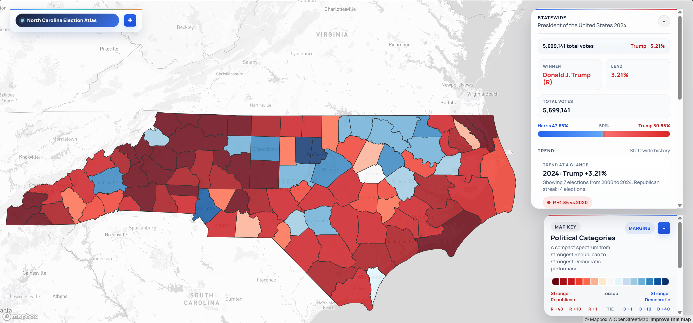
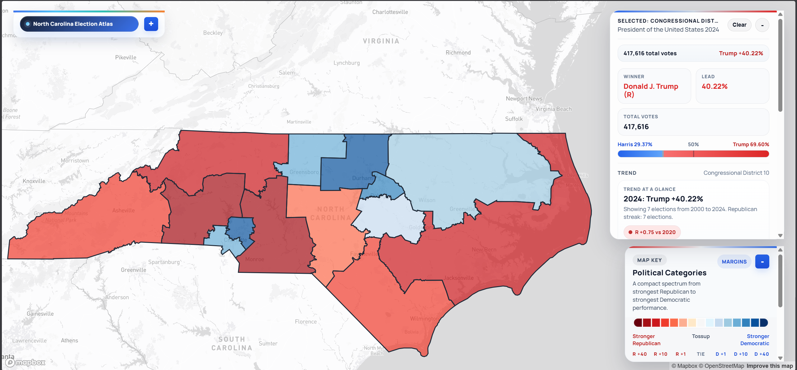
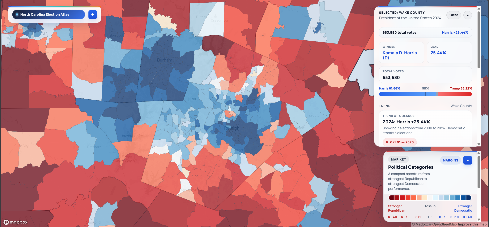
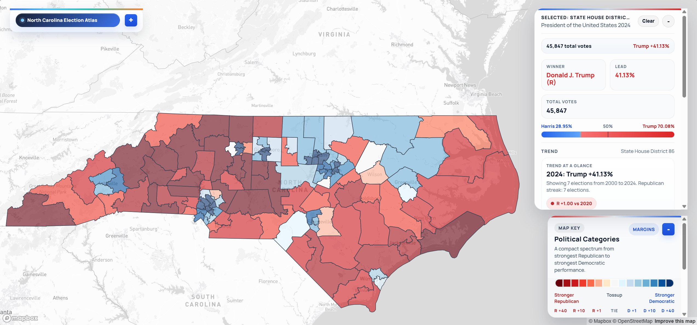
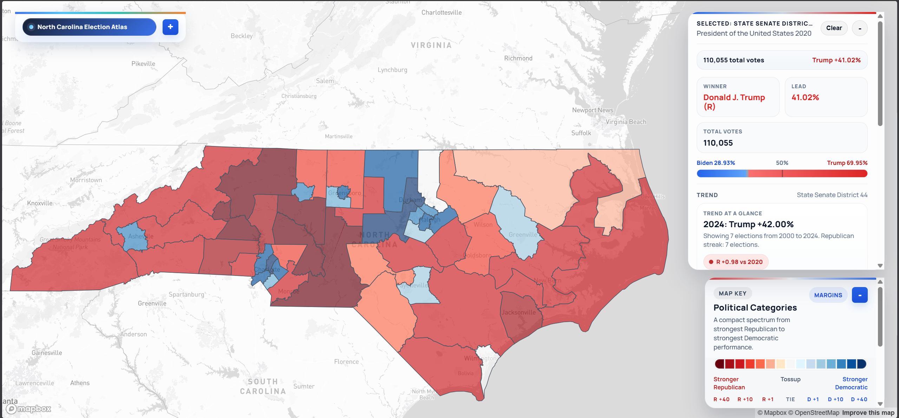

# NCPrecinctMap

**NCPrecinctMap** is an interactive web-based map for exploring North Carolina election results at the precinct and district level, covering general elections from **2000 through 2024**. It is designed for researchers, journalists, and citizens who want to understand how election results map onto changing precinct and district boundaries over time.

The live app is now presented as **North Carolina Election Atlas**, which is the public-facing name used in the current UI.

**Live site:** [https://tenjin25.github.io/NCElectionAtlas/](https://tenjin25.github.io/NCElectionAtlas/)

---

## Screenshots

**Counties view — 2024 Presidential**


**Congressional Districts — 2020 Presidential**


**Precinct view — Wake County zoomed in**


**State House — 2024 Presidential** 


**State Senate - 2022 US Senate**


---

## Project Overview

North Carolina's election data is complex: precinct boundaries and IDs change frequently, and non-geographic voting buckets (like early voting or absentee) do not map cleanly to physical locations. This project focuses on two hard problems:

- **Making historical precinct-level results usable with modern geometry** (handling precinct ID changes, splits, merges, and early-vote/absentee buckets that don't map to geography)
- **Showing district results on consistent district lines** — district views default to the court-ordered 2022 MQP lines (see below), with an optional toggle to 2024 lines for comparison; results are reallocated via block/VAP crosswalks where needed

The project is powered by prebuilt JSON data slices and raw [OpenElections](https://openelections.net/) precinct CSVs, with geometry from NCSBE and Census Bureau TIGER files.

## Who This Atlas Is For

- **General public:** See how your county or precinct voted without downloading data files or GIS tools.
- **Students and educators:** Explore long-run election trends (2000-2024) with map-first visuals that are easier to use in class projects.
- **Political junkies and campaign watchers:** Compare margins, flips, shifts, and district outcomes quickly across multiple election years.
- **Data journalists and researchers:** Use the map for rapid story discovery, then trace the underlying JSON/CSV inputs and coverage diagnostics in this repo.
- **Civic tech and redistricting users:** Inspect how statewide results look when reallocated to a consistent district baseline (2022 MQP), and compare against the 2024 line option.

### Quick Start by Audience

- **General public:** Open the live site, pick a contest/year, click a county or precinct, and read winner/margin/trend cards.
- **Students:** Start with Counties view, then switch to Congressional/State House/State Senate to compare the same contest across geographies.
- **Political junkies:** Use `Split-ticket`, `Shift`, `Flips`, and `Reset View` to scan for realignment and crossover patterns.
- **Data journalists:** Pin a county/precinct, use `Copy Link` for reproducible map state, and cross-check with files in `data/contests/` and `data/reports/`.

## Why the 2022 Court-Ordered (MQP) Lines?

District views (Congressional, State House, State Senate) default to the **court-ordered "MQP" remedial maps** drawn in 2022 by court-appointed Special Masters following the NC Supreme Court's ruling that the legislature's own maps were unconstitutional partisan gerrymanders.

These lines were chosen as the consistent historical baseline for two reasons:

1. **Neutrality** — they were drawn by independent experts under court supervision, not by either party, making them the most politically neutral set of modern statewide district lines available. Using party-drawn maps as a baseline would embed partisan intent into the geographic frame when comparing results across years.
2. **Practical coverage** — the 2022 remedial maps were actually used for a real election (the 2022 general), making them a grounded modern baseline for reallocating earlier results.

Historical results from 2000–2020 are reallocated to these lines using Census block-level crosswalks (block → precinct → district), with unmatched votes distributed by candidate share within the county. [NHGIS](https://www.nhgis.org/) block-to-block crosswalks are used to bridge across Census vintages, which significantly cut down on mismatches in older eras.  
As of the latest audit (`data/reports/precinct_match_year_summary_fresh_2026-03-19.csv`), geo-key match coverage is **99.42% across all years** and **99.28% for pre-2020 years**.

## Features

- **Multiple Views:** Counties, Precincts (zoomed in), Congressional Districts, State House, State Senate
- **District Lines Toggle (2022 vs 2024):** District views can switch between the 2022 MQP baseline and a 2024 line option; the first 2024 load can take longer while boundary GeoJSON downloads/parses
- **Contest Picker:** Only valid contests for the current view are shown, driven by manifest files
- **Atlas-Style Desktop UI:** Refined left/right control rails, statewide snapshot cards, and map-first layout inspired by modern election atlas interfaces
- **Mobile Dock + Sheet UI:** On phones, Search / Layers / Legend open as bottom sheets with snap states (collapsed, half, full) so controls stay reachable without covering the map
- **Regional Quick Jumps:** Preset regions (Triangle, Triad, Charlotte, Asheville, Mountains, Coast, Inner Banks, Sandhills, Fayetteville, Cape Fear, I-95, and Foothills) can zoom the map and pin an aggregated regional result summary
- **Unopposed Filtering (Counties):** Unopposed Council of State contests are hidden from the Counties picker
	- **Hover + Sidebar Details:** Margins, vote shares, flip/shift modes, statewide summaries, and trend history for each geography
	- **Trajectory / Status Card:** County/district/precinct trend panels include an edge-case-aware trajectory block with composite labels such as `Reinforcing Democratic (Stronghold)`, `Reinforcing Republican (Advantage)`, `Emerging Republican (Edge)`, or `Battleground`, with the category pill stacked under the `Trajectory Snapshot` title for more readable long labels
	- **Trajectory Snapshot Add-ons (Structured):** Appends a subtype line, a `Margin Category` line (Stronghold/Safe/Likely/Lean/Tilt/Tossup), and a `Growth Dynamic` note beneath the `Latest Result` row (`Votes vs last cycle: R +X, D +Y`)
	- **County Census Context:** County sidebar panels add qualitative Census-style growth context (`Urban anchor`, `Metro spillover`, `Coastal growth`, `Rural slowdown`, `Mixed growth`) to frame why local trajectories may be changing, and can now surface a supporting `Census check` inside the trajectory card when population growth clearly reinforces the electoral direction
	- **County Census Insight Growth Type Chip:** The in-popup `County Census Insight` block now appends a small growth-type chip (`🌊 Coastal Growth`, `🌆 Metro Spillover`, `🛣️ Corridor Growth`, `🏭 Stable / Local Growth`) derived from county heuristics
	- **Dynamic Competitiveness Tier Labels:** Focus headers and hover cards show tier labels (for example, `Safe Republican` / `Stronghold Democratic`) derived from the same margin thresholds used for map styling
	- **Comparative Controls:** One-click split-ticket overlay (`President` base with `Governor` overlay) plus a what-if swing slider for fast scenario exploration
- **Modeled 2026 Statewide Races:** Synthetic `US Senate Model (2026)` and `NC Supreme Court Model (2026)` entries use recent statewide baselines and respond to the same swing controls as real contests (Senate model uses `2022 US Senate` baseline, `2024 President` climate, and a `0.575` turnout calibration)
- **Layering Controls:** Turnout-intensity opacity mode and overlay opacity presets (`Reveal map`, `Balanced`, `Focus overlay`) for cleaner map readability
- **Demographics Mode:** County, district, and precinct overlays can be shaded by plurality race share (white / black / Hispanic, plus Native / Asian / Pacific / multiracial where available), with synchronized legend colors in both standard and colorblind palettes
- **High-Contrast Demographics Toggle:** Optional high-contrast demographic shading and chip styling for better visibility on dark tooltip surfaces
- **Demographic Hover Chips:** County and precinct hover/sidebar cards include race-share chips that are tuned for readability in normal, colorblind, and high-contrast combinations
- **Precinct Click-Zoom + Selection:** Clicking a precinct now zooms to it and applies a yellow selected highlight so selection is distinct from hover/overlay styling
- **Recount Radar Badge:** A live topbar badge appears at higher zoom when the active focus margin is under `0.5%`, showing vote margin and percent gap
- **Barometer Counties (Optional):** Click the `Barometer` legend chip to outline counties that mirror the statewide two-party margin most closely across the last 2–3 available cycles for the selected contest (purple outline; off by default)
- **Story Copy + Loading Skeletons:** Story cards can be copied to clipboard in one click, and trend/story panels show lightweight skeleton loaders while data is loading
- **Mobile "MapTalk" Actions:** `Find My Precinct` (GPS) and `Story Snapshot` (9:16 share export of current map view)
- **Share + Reset Actions:** `Copy Link` captures the current deep-linked map state; `Reset View` recenters/clears pinned focus; `Reset Swing` returns scenario shift to `0.0%`
- **Advanced Analytics Cards:** Realignment Index (`Top shifting precincts`) and Ghost Precinct tracker for unmatched-key transparency
- **Accessibility Support:** Colorblind palette toggle (`B`), live screen-reader summaries for hovered/selected results, and stronger map label halos for town/county labels
- **State URL Sync:** View/contest/mode/district-lines/focus are encoded in URL params so links reopen to the same map state
- **Compact Map Key:** Margins, winners, shift, and flips legends are presented in a cleaner visual key instead of long text lists
- **Margin Categories (Map Key):** Category chips are *absolute* two-party margin buckets (|Rep% − Dem%|), while the red/blue spectrum shows the signed margin (Rep% − Dem%).
- **Judicial Contests:** Supported in Counties view when corresponding JSON slices exist
- **Flexible Data Model:** Add new contests, years, or district lines by updating manifests and data files

## Recent Updates (March 2026)

**Last updated:** April 3, 2026

### Census Check + Legend Clarification (March 27, 2026)

- Added a short **Census check** callout in the Trends panel that cross-checks trajectory language against county population-growth patterns (Vintage 2025 estimates).
- Expanded the Census check trigger so fast-growth, outer-suburban counties (for example, Union) can still surface a growth/lean note even when the most recent cycle is a small bounce.
- Adjusted **Momentum** so fast-growth, outer-suburban counties can surface a `← Long-run Democratic drift` call at smaller long-run deltas when the county remains Republican-leaning but has clearly softened over time.
- Refined the `County Census Insight` buckets so transition counties read as `Small-metro / outer-suburban transition`, and military-hub counties (for example, Cumberland/Onslow/Wayne/Craven/Hoke) get a note that year-to-year estimates can be choppy.
- Restyled the Census check callout to match the compact “Meaning” card typography while remaining visually distinct.
- Clarified the **Margin Categories** legend language so it’s consistent everywhere: the color spectrum is the signed two-party margin (Rep% − Dem%), while category chips represent absolute margin thresholds (|Rep% − Dem%|).

### Trajectory Wording + 2024 Lines Loading Notice (March 27, 2026)

- Standardized the trajectory label format to `Origin Side (Position)` (for example: `Emerging Republican (Edge)`), with positions `Stronghold`, `Advantage`, `Edge`, `Tilt`, or `Battleground`.
- Refined `Emerging` descriptions to explicitly call out “closing the gap” cases (for example, Cabarrus: GOP still leads but trends Democratic over time).
- Added an inline loading hint when switching to 2024 district lines so the UI explains the first-time boundary load delay without a modal popup.
	- Trajectory Snapshot glossary (the `Meaning:` line and status chip are generated from the same rules everywhere):
	  - `Origin`:
	    - `Durable`: long-running lean with no sustained recent break (even if the margin narrows/widens over decades).
	    - `Reinforcing`: the county is moving further in the same direction as its current lean.
	    - `Emerging`: the county still leans one way, but the underlying movement points the other way (a “closing the gap” trajectory).
	    - `Realigned`: the county’s lean has flipped versus its longer-run baseline.
	  - `Side`: `Democratic` / `Republican` reflect the *current* lean (the most recent margin), not the direction of change.
	  - `Position`:
	    - `Stronghold`: very safe margin.
	    - `Advantage`: clear but not extreme margin.
	    - `Edge`: modest margin (close enough that a normal-swing cycle can narrow quickly).
	    - `Tilt`: very close margin.
	    - `Battleground`: essentially even / too close to call cleanly.
	  - `Momentum` (trend line):
	    - `↔ Stable`: little directional change.
	    - `← Democratic trend` / `→ Republican trend`: consistent shift over recent cycles.
	    - `←/→ Accelerating ... trend`: the most recent window is moving faster than the longer-run pace.
	    - `←/→ Long-run ... drift`: slow multi-decade movement that may not show up strongly in the last 1–2 cycles.
	  - `Subtype` (structured add-on line under the status pill):
	    - `Active Suburban Transition`: long-run Democratic movement with a still-Republican but narrower current margin.
	    - `Active Republican Transition`: long-run Republican movement with a still-Democratic but narrower current margin.
	    - `Suburbanizing (Lagging)`: long-run Democratic pressure, but the most recent cycle moved more Republican.
	    - `Counter-Suburbanizing (Lagging)`: long-run Republican pressure, but the most recent cycle moved more Democratic.
	    - `Softening Republican`: recent Democratic movement in a still-strong Republican county.
	    - `Softening Democratic`: recent Republican movement in a still-strong Democratic county.
	    - `Reinforcing Republican`: long-run and short-run movement both favor Republicans.
	    - `Reinforcing Democratic`: long-run and short-run movement both favor Democrats.
	    - `Realigning Republican` / `Realigning Democratic`: long-run movement is large enough to suggest a structural shift in coalition.
	    - `Stable / Mixed`: does not strongly match one of the above patterns.
	  - `Margin Category` (neutral add-on line, based only on the current margin):
	    - `Margin: Stronghold R/D` (20%+)
	    - `Margin: Safe R/D` (10%–20%)
	    - `Margin: Likely R/D` (5.5%–10%)
	    - `Margin: Lean R/D` (1%–5.5%)
	    - `Margin: Tilt R/D` (0.5%–1%)
	    - `Margin: Tossup R/D` (0%–0.5%)
	  - `Growth Dynamic` (appended under `Latest Result`):
	    - `Votes vs last cycle: R +X, D +Y` (raw two-party vote deltas vs the prior cycle).

### Trajectory Edge Cases + Census Context (March 26, 2026)

- Promoted the `index_nc_trajectory_edgecases.html` variant into the live `index.html`.
- Expanded the trajectory classifier so status labels are now composed from:
  - `origin`: `Durable`, `Reinforcing`, `Emerging`, or `Realigned`
  - `side`: `Democratic`, `Republican`, or fully neutral `Battleground`
  - `position`: `Stronghold`, `Advantage`, `Edge`, `Tilt`, or `Battleground`
- Example live statuses now include labels such as:
  - `Durable Democratic (Stronghold)`
  - `Reinforcing Democratic (Stronghold)`
  - `Reinforcing Republican (Advantage)`
  - `Reinforcing Republican (Stronghold)`
  - `Emerging Democratic (Edge)`
  - `Realigned Republican (Stronghold)`
  - `Battleground`
- Updated momentum wording to shorter directional calls:
  - `↔ Stable`
  - `→ Republican trend`
  - `→ Accelerating Republican trend`
  - `← Democratic trend`
  - `← Accelerating Democratic trend`
  - `← Long-run Democratic drift`
  - `→ Long-run Republican drift`
- Kept the shorter checkpoint rows in the trajectory card:
  - `Latest Result`
  - `Last Cycle` or `Since <year>`
  - optional `Since 2008`
- Added icon cues for trajectory origin states so the card can distinguish durable, reinforcing, emerging, and realigned paths at a glance.
- Moved the composite trajectory category pill beneath the `Trajectory Snapshot` heading so longer status labels have more horizontal room and wrap more cleanly.
- Added a `Census Context` county sidebar card with qualitative population/growth framing such as `Urban anchor county`, `Metro spillover`, `High-growth coastal county`, `Slow-growth or declining county`, and `Mixed-growth county`.
- The Census insight now reads from cleaned Vintage 2025 county population estimates in `data/CO-EST2025-POP-37-clean.csv`, released March 26, 2026, so it can reference actual 2020-2025 growth and the July 1, 2024 to July 1, 2025 change instead of only static county buckets.
- Added a trajectory-level `Census check` note when growth patterns strongly corroborate the election trend, including fast-growing suburban reinforcement cases and leftward drift in metro spillover counties.
- The Census card is intentionally qualitative; it summarizes recent population-pattern context rather than presenting a raw Census table.

### Modeled 2026 Statewide Contests (March 26, 2026)

- Added `US Senate Model (2026)` to the contest picker for counties and district views.
- Added `NC Supreme Court Model (2026)` to the contest picker for counties and district views.
- The modeled Senate race blends 2022 US Senate and 2024 President results (county/district-local), applies calibrated 55–60% turnout, and then applies a small “Cooper candidate” bonus in some county types before any user swing is applied.
- The modeled Supreme Court race blends 2022 Seat 03 + Seat 05, then blends that baseline with the 2024 Seat 06 results before any user swing is applied.
- The 2026 modeled candidate labels are currently `Roy Cooper` vs `Michael Whatley` for Senate and `Anita Earls` vs `Sarah Stevens` for Supreme Court.
- Both modeled contests reuse the normal `Dem swing` slider, so users can push the synthetic 2026 map further toward either party without leaving the standard contest workflow.

### County Precision + Hover Flip Fixes (March 22, 2026)

- Scoped the close-margin precision tweak to **county contexts only** so statewide formatting behavior stays unchanged.
- Updated county-facing result surfaces to use county precision for tight races (`0.02%` style instead of `0.020%` unless margins are sub-`0.005%`):
  - county sidebar margin + vote-share lines
  - county vote-counter lead/margin/share labels
  - county hover result-card margin label
- Restored county hover `Flip` badges outside Shift/Flips map mode by keeping prior-cycle county totals loaded in counties view.
- Preserved statewide candidate labels when switching from Counties view to Congressional/State House/State Senate views on statewide contests (candidate names now carry through district-view statewide summaries).

### Pipeline + Data Refresh (March 22, 2026)

- Hardened auto-generated precinct override logic in `scripts/build_district_contests_from_batch_shatter.py` to skip null/NaN precinct IDs before normalization.
- Updated `scripts/build_district_results_2024_lines.py` so district slices now preserve contest-wide Democratic/Republican candidate names (`dem_candidate`, `rep_candidate`) instead of writing blank placeholders.
- Added optional CLI arguments to `scripts/split_district_results_by_contest_year.py`:
  - `--src` to point at an alternate consolidated district-results JSON
  - `--out-dir` to write split outputs/manifests to a custom directory
- Refreshed precinct matching artifacts:
  - `data/mappings/precinct_variant_overrides.json`
  - `data/reports/unmatched_precinct_examples.csv`
  - `data/reports/unmatched_precinct_summary.csv`

### Desktop Controls, URL Share Flow, and Performance (March 21-22, 2026)

- Stabilized desktop contest picker behavior: contest controls stay at the top of the rail, dropdowns open downward more reliably, and desktop overflow clipping was removed.
- Reduced control-panel jitter while opening/selecting contests by tightening desktop topbar/control offset handling.
- Refined desktop atlas control colors/contrast for improved readability across long analysis sessions.
- Added share-only URL behavior: URL params (`view`, `contest`, `mode`, `lines`, `focus`, `democontrast`) are consumed on load, then cleared from the address bar.
- `Copy Link` now generates the current deep-link state on demand before copying (with clipboard fallback messaging).
- Added deferred hydration so counties/map shell render first while contest and district manifests load in the background.
- Added cache-buster-aware data loading with cached fetches to reduce stale static-file issues while keeping repeat requests fast.
- Deferred analytics card refresh (`Realignment Index`, `Ghost Precinct Tracker`) with debounced idle scheduling to improve contest-switch responsiveness.
- Tightened close-race margin formatting so extremely close contests retain higher precision consistently across focus/tooltip labels.
- Improved district candidate labeling in newer 2024-lines outputs so uncontested/edge slices are less likely to fall back to generic party labels.

### Demographics + Accessibility (March 21, 2026)

- Added a dedicated `Demographics` map mode across counties, congressional districts, state house, state senate, and precinct overlays.
- Added precinct-level demographic inputs (`data/precinct_demographics_2020_vap.csv`) and wired them into precinct hover/sidebar race chips.
- Expanded county/precinct demographic fields to include Native, Asian, Pacific, and multiracial shares in addition to white/black/Hispanic fields when available.
- Updated demographics legend + map coloring so plurality classes now include Native, Asian, Pacific, and multiracial categories where source fields exist.
- Synced legend swatches with the **active** map palette in colorblind mode so the legend now always matches on-map colors.
- Added `High contrast demographics` toggle in controls for stronger map fills and race-chip contrast when demographics mode is active.
- Added URL-state persistence for demographic contrast (`democontrast=high`, with `demo_contrast` accepted when parsing links).
- Increased baseline demographics visibility in map fills and hover chips for county + precinct contexts.
- Improved county and precinct demographics chip/card readability in hover surfaces.
- Fixed dark-tooltip-specific demographics contrast regressions so text/chips remain legible in pinned/hover cards.

### UI / UX

- Restored zoom-based precinct rendering behavior (centroids at statewide zoom, polygons at higher zoom) while keeping anti-stutter hover guards during map movement.
- Fixed pinned precinct side-panel trend syncing so `Trend at a glance` updates correctly when switching contests with a precinct selection pinned.
- Continued the atlas-style UI rollout with cleaner desktop rails, stronger statewide cards, and improved control hierarchy.
- Renamed the live presentation to **North Carolina Election Atlas** and carried consistent branding through normal/minimized control states.
- Updated the top-left atlas name badge with stronger NC blue/red split text coloring for clearer branding at a glance.
- Expanded mobile UX with a bottom dock (`Search`, `Layers`, `Legend`) and bottom-sheet snap states (`collapsed`, `half`, `full`).
- Added swipe/flick sheet gesture behavior so mobile panels feel native and settle into predictable snap states.
- Improved touch-first interactions: tap/pin behavior for precinct details, less hover churn on touch devices, and keyboard-aware sheet handling.
- Improved cross-browser behavior (including Vivaldi-targeted fixes) and refined placement/flow of top controls.
- Improved candidate label rendering and short-name logic (including better suffix handling like `Jr.` and Roman numerals).
- Reworked split-ticket controls into a `Pres-Gov` overlay mode: President remains the base contest while Governor colors are layered on top for crossover analysis.
- Added a topbar `Recount Radar` badge that activates at zoomed-in levels when focused margins are within the `0.5%` recount threshold.
- Added a `Barometer` overlay (legend chip) that surfaces counties closest to the statewide two-party margin across the last 2–3 available cycles (no winner-match requirement; click to enable/disable; off by default).
- Upgraded the county “At a glance” + “Story” blocks (April 2, 2026):
  - “At a glance” is a structured 1-line headline + max-3 bullets (+ optional momentum micro-line), with subtle red/blue/neutral tinting.
  - “Story” is an editorial card with a `Barometer` chip (partisan lean + strength), a short narrative summary, and a one-sentence “What to watch” line.
  - Improved `Democratic` barometer-chip contrast on the dark story card background for better visibility.
  - Added one-click `Copy` for story text, plus a small `Vs NC` line when the current statewide margin is available (helps users anchor “how state-like” a place is).
  - Standardized long-run and momentum shift formatting to `2` decimals in the story/at-a-glance surfaces.
  - Mobile keeps “At a glance” above the fold; supporting mini-cards are suppressed on smaller screens to avoid scrolling.
- Fixed precinct overlay geometry matching (April 3, 2026): modern contests (2014+) now default to `data/Voting_Precincts.geojson`, while legacy cycles (≤2012) use the Census `VTD20` fallback to reduce missing precinct fills (notably Union 2020 key variants).
- Added statewide what-if swing control and turnout-intensity opacity mode for comparative layering.
- Added a `Demographics` visualization mode and legend in the map mode controls, including county/district/precinct demographic shading.
- Added color-coded demographic chips in hover/sidebar details so race-share context is visible without switching panels.
- Added dynamic competitiveness tier labels across focus and hover surfaces, with compact tier chip styling that matches surrounding hover badges.
- Reordered hover meta badges so `Flip` now appears to the right of the competitiveness tier badge (winner -> tier -> flip) for more consistent reading order.
- Added a `High contrast demographics` control-path so demographic overlays and chips remain usable on low-contrast displays.
- Added overlay opacity presets and tuned county/district/precinct fills so more basemap detail stays visible underneath.
- Retuned overlay opacity presets again (slightly lower after live testing) to keep color fills readable while preserving roads and basemap context.
- Added stronger settlement/town and county label halos so labels stay legible over high-intensity precinct coloring.
- Added precinct click-to-zoom with persistent yellow highlight to reduce confusion between selected features and overlay styling.
- Added `Find My Precinct` GPS control and `Story Snapshot` export for vertical social sharing.
- Refined the `Story Snapshot` export layout (full-bleed map crop, clearer contest/focus labels, and stronger branding for social share readability).
- Added snapshot layout variants (`Balanced`, `Instagram`, `TikTok`) so 9:16 exports can be tuned for each platform's safe zones.
- Added stronger cross-browser styling for the snapshot layout selector so the selected value remains clearly readable (including Vivaldi/Chromium edge cases).
- Tuned pre-contest county/overlay styling so the basemap stays bright before a contest is selected, while keeping roads visible under active overlays.
- Normalized scenario/turnout vote displays to whole-number counts (no decimal vote totals in cards/counters).
- Added precinct-level trend retrieval using precinct alias/variant matching, with automatic county-history fallback if precinct history is unavailable.
- Added toolbar utility actions: `Copy Link`, `Reset View`, and `Reset Swing`.
- Expanded keyboard shortcuts for faster analyst workflow (`B` colorblind, `T` split-ticket, `G` GPS locate, `X` snapshot, `C` copy link, `R` reset view).
- Added ARIA/state semantics and stable `data-testid` hooks across key controls to improve accessibility and regression-test durability.
- Added URL-driven state restore/sync for deep-linkable map sessions (`view`, `contest`, `mode`, `lines`, `focus`, `barometer`).

### Precinct Matching and Outlier Cleanup

- Expanded legacy precinct variant handling so older tokens map to modern centroid/geometry IDs more reliably.
- Added evidence-based centroid bridge mappings for high-friction county outliers:
  - `PERSON`: `RCTL -> RCOB`
  - `IREDELL`: `BA -> BA-1`, `DV1-B -> DV1B-1`, `DV2-A -> DV2A-1`, `DV3-A/DV3 -> DV3A`
  - `SURRY`: `13 <-> 34`
  - `UNION`: `020A -> 0020A`
- Applied bridge matching consistently across search, contest key normalization, and active precinct hover/result lookup paths.
- Expanded `precinct_variant_overrides` coverage for additional counties and older naming patterns (including Haywood-focused shorthand fixes).
- Rebuilt legacy precinct crosswalk outputs for the 2022-line district scopes:
  - `data/crosswalks/precinct_to_2022_state_house.csv`
  - `data/crosswalks/precinct_to_2022_state_senate.csv`
  - `data/crosswalks/precinct_to_cd118.csv`

### District Data and Calibration

- Added DRA-aligned calibration workflow for 2022-line district slices, including congressional and legislative presidential benchmarks.
- Added support for dual district-line data modes (2022 and 2024 line contexts) and rebuilt/split supporting contest outputs.
- Rebuilt multiple 2020–2024 district contest slices with calibration passes from district-statistics CSV inputs.

### Diagnostics and Reporting

- Added/maintained county+contest match diagnostics in:
  - `data/reports/precinct_match_by_county_all_contests.csv`
  - `data/reports/precinct_match_top_unmatched_file_county.csv`
  - `data/reports/unmatched_precinct_examples.csv`
- Added fresh March 19, 2026 summary exports:
  - `data/reports/precinct_match_year_summary_fresh_2026-03-19.csv`
  - `data/reports/precinct_match_pre2020_county_outliers_fresh_2026-03-19.csv`
  - `data/reports/precinct_match_focus_counties_by_year_fresh_2026-03-19.csv`

## UI Performance Enhancements

The current `index.html` includes several speed-focused improvements that are already live in the app:

- **Manifest-first contest indexing:** Contest dropdowns are built from `data/contests/manifest.json` and `data/district_contests/manifest.json`, avoiding expensive full-data scans for availability.
- **Slice/result caching:** In-memory caches (`contestSliceCache`, `districtSliceCache`, `candidateNameCache`) reduce repeated fetch/parse work while switching contests or views.
- **Lazy precinct loading:** County/district layers load first; precinct polygons load on demand, while centroids are used for faster statewide interaction.
- **Centroid-first rendering path:** Precinct centroids are shown at lower zoom, then polygons take over at higher zoom to keep navigation responsive.
- **Missing-polygon fallback:** Centroids remain visible for precincts without polygon geometry so data stays interactive without blocking rendering.
- **RAF-throttled hover updates:** Hover handlers use `requestAnimationFrame` and feature-state highlighting to reduce pointer-move churn and flicker.
- **Worker-based CSV parsing fallback:** Historical presidential OpenElections CSVs are stream-parsed in a Web Worker (Papa Parse) when needed, reducing main-thread UI stalls.
- **Deferred trend loading:** County trend series are loaded asynchronously so contest application and map recoloring happen immediately.
- **Precinct trend matching fallback:** Selected precinct trend lookups now use precinct alias/variant matching across years, then fall back to county history when no valid precinct series is found.
- **Counties-mode contest switch optimization (March 3, 2026):** Contest changes with `Precincts Off` now avoid unnecessary precinct matching/index work, improving responsiveness and reducing main-thread churn.

## UI and Presentation Notes

- **Desktop atlas layout:** The main map now uses dedicated desktop rails instead of treating controls and summaries like generic floating cards.
- **Statewide snapshot focus:** The right-side summary stays visible while browsing counties, districts, and prior-election trend history.
- **Regional focus mode:** Quick-jump presets can pin multi-county regional summaries and use the same top-right module as statewide and county selections.
- **Trend display:** The top-right trend area now uses a more readable history/timeline layout rather than leaning on a compact line graph alone.
- **Selection clarity:** Selected precincts now keep a yellow highlight and zoomed focus so users can distinguish active selection from hover/other overlays.
- **Header language:** The control header and minimized state now use the full `North Carolina Election Atlas` title in pill form for stronger branding and consistency.
- **Responsive winner labels:** The winner pill keeps full candidate names on wider desktop widths and shortens them only when space is tighter.

## Demographics Mode Guide

### What Demographics Mode Displays

- **Primary signal:** Each geography is colored by the largest reported race share among available fields.
  - County/precinct overlays use white, black, Hispanic, Native, Asian, Pacific, and multiracial shares when present.
  - District overlays continue to use whichever race-share columns exist in the district CSV inputs.
- **Near-tie handling:** If the top two race shares are effectively tied, the map uses a mixed-color class (`Near tie / mixed`) rather than forcing one group.
- **No-data handling:** Geographies without usable fields render as `No demographic data`.

### Data Source by View

- **Counties:** `data/county_demographics_2020_dp1.json` (DP1 total-pop race/ethnicity shares + VAP 18+ shown in sidebar).
- **Congressional / State House / State Senate:** District demographic CSVs (`data/nc_congressional_districts.csv`, `data/nc_state_house_districts.csv`, `data/nc_state_senate_districts.csv`).
- **Precincts:** `data/precinct_demographics_2020_vap.csv` (block-aggregated precinct VAP race fields).

### Controls and URL State

- Switch map mode using the `Demographics` button in the visualization mode row.
- Use `High contrast demographics` to force stronger demographic fills/chips (especially useful over dark tooltips).
- Colorblind mode (`B` or the accessibility toggle) continues to apply in demographics mode; legend swatches stay synchronized with the active palette.
- Deep-link state is preserved in URL parameters:
  - `mode=demographics`
  - `democontrast=high` (parser also accepts `demo_contrast`)

### Hover/Sidebar Behavior

- County and precinct detail cards include race-share chips for quick demographic context.
- Hover cards include a compact competitiveness tier chip next to winner/shift/flip badges (instead of relying only on a small title badge).
- Recent styling passes specifically targeted county hover, precinct hover, and pinned tooltip readability on dark backgrounds.
- If a field is missing for a group, the chip can display `N/A` while the map still renders any available race shares.

## Regional Presets

The preset region buttons are more than camera shortcuts. They use curated North Carolina county groups so the app can calculate grouped results and trend history for commonly used regions.

- **Current presets:** Triangle, Triad, Charlotte Metro, Asheville Metro, Western Mountains, NC Coast, Inner Banks, Sandhills, Fayetteville Metro, Cape Fear, I-95 Corridor, and Foothills / Unifour
- **How they work:** Clicking a preset zooms the map and pins an aggregated multi-county summary in the top-right analysis panel
- **Definition note:** These are curated regional groupings for atlas use, so they may not match every economic-development, media-market, or commuting-region definition

## Current Limitations

- **District-only precinct coloring:** Precinct overlays on district maps work best for statewide contests. True precinct coloring for district-only races still depends on having precinct-level district results.
- **Non-geographic vote buckets:** Early vote, absentee, provisional, and similar buckets remain in totals but do not map to precinct shapes.
- **Regional definitions:** Region margins depend on the county set chosen for that preset, so broader or narrower definitions (for example Charlotte, Triad, Coast, or Sandhills) will change the result.

## What to Expect on the Live Site

Visit [https://tenjin25.github.io/NCElectionAtlas/](https://tenjin25.github.io/NCElectionAtlas/) — no installation or login required.

- **Interactive Map:** Zoom and pan across North Carolina, with overlays for counties, precincts, and legislative districts.
- **Contest Picker:** Select from available contests (President, US Senate, Governor, State House, etc.) and election years. Only contests with data will appear.
- **Dynamic Views:** Switch between Counties, Precincts, Congressional Districts, State House, and State Senate. The map and sidebar update to reflect your selection.
- **Regional Presets:** Use quick jumps like Triangle, Triad, Charlotte, Asheville, Mountains, Coast, Inner Banks, Sandhills, Fayetteville, Cape Fear, I-95, and Foothills to zoom and see grouped regional vote summaries.
- **Hover and Sidebar Details:** See candidate names, vote totals, margins, and trend lines for any geography.
- **Demographics Layering:** Use `Demographics` mode to shade geographies by plurality race share, with optional high-contrast rendering for better visibility.
- **Data Coverage:** Precinct-level results span **2000–2024**. Some contests or years may be incomplete depending on source data availability.
- **Judicial and Special Contests:** Appear in the Counties view contest picker where available.

**Navigation Tips:**
- Use the zoom controls or mouse wheel to zoom in/out.
- Click on a map feature for detail in the sidebar.
- If a contest or year is missing from the dropdown, it has not yet been processed into the data pipeline.

**Note:** This is a static site — all data loads directly from the repository's JSON and GeoJSON files. If you see stale results, try a hard refresh (Ctrl+Shift+R).

## Data Sources

| Data | Source |
|------|--------|
| Precinct-level election results | [OpenElections North Carolina](https://github.com/openelections/openelections-data-nc) |
| Precinct boundaries | NC State Board of Elections (NCSBE) shapefile |
| Census block geography | US Census Bureau TIGER/Line files |
| Block-to-precinct crosswalks | Derived from 2020 Census block assignments |
| Block-to-block crosswalks (cross-vintage) | [NHGIS Longitudinal Block Crosswalks](https://www.nhgis.org/documentation/tabular-data/crosswalks) |
| District lines (2022 MQP + optional 2024) | Court-ordered remedial maps (2022 MQP); US Census TIGER/Line 2024 (CD/SLDL/SLDU) |

## Getting Started

This project is deployed on GitHub Pages and requires no local setup to use. Simply visit the [live site](https://tenjin25.github.io/NCElectionAtlas/).

To build or modify data files locally, you will need Python 3.x and PowerShell. See the "Rebuilding Data" section below.

### Automated UI Regression (Playwright)

The repository now includes a focused Playwright suite that covers key interaction regressions:

- Load state with no contest selected (pre-contest defaults)
- Split-ticket overlay toggle (`President` base + `Governor` overlay)
- Precinct selection flow (search/jump, yellow selection target, zoom-in behavior)
- Story snapshot exports for all layout variants (`Balanced`, `Instagram`, `TikTok`)

Run locally:

```bash
npm install
npm test
```

Optional commands:

```bash
npm run test:headed
npm run test:ui
npm run test:report
```

### Directory Structure

- `index.html`, `NCMap.html` — Main web app entry points
- `data/` — All data files (see below)
- `scripts/` — Python scripts for building and processing data
- `_external/` — External data sources and raw files

## Data Layout

### 1. County/Precinct Contest Slices (Counties View)

- `data/contests/<contest_type>_<year>.json` — Precinct-level results for a contest/year
- `data/contests/manifest.json` — List of available contests for the Counties view (including contested metadata)

Each row is keyed as `"COUNTY - PRECINCT"` and includes candidate names and vote totals:

```json
{ "county": "WAKE - 01-07", "dem_votes": 123, "rep_votes": 456, "dem_candidate": "...", "rep_candidate": "..." }
```

The Counties view aggregates these rows to county totals and also uses them to power precinct hovers (where precinct geometry exists).

`data/contests/manifest.json` entries now include:

- `rows`
- `dem_total`
- `rep_total`
- `total_votes`
- `major_party_contested`

The Counties dropdown uses `major_party_contested` to suppress unopposed Council of State contests.

### 2. Precinct Geometry (Precincts Overlay)

- `data/Voting_Precincts.geojson` — Polygon boundaries for all precincts
- `data/precinct_centroids.geojson` — Point locations (used for high-zoom fallback/indexing)

To rebuild from the latest NCSBE shapefile:

```powershell
py scripts/build_voting_precincts_geojson.py
```

### 3. District Contest Slices (District Views)

- `data/district_contests/<scope>_<contest_type>_<year>.json` — Aggregated results for each district
- `data/district_contests/manifest.json` — List of available contests for district views

Where `scope` is one of: `congressional`, `state_house`, `state_senate`.

Each file contains already-aggregated results and coverage metadata.

### 4. Statewide County Results (Fallback)

- `data/nc_elections_aggregated.json` — Used as a fallback for some contests/years

### 5. District Descriptions (Optional)

- `data/district_descriptions.json` — Human-readable labels for districts (used in hovers/sidebars)

```json
{
  "congressional": { "13": "Wake County (Raleigh) + Johnston (partial)" },
  "state_house": { "037": "Cary + Apex (West Wake)" },
  "state_senate": { "019": "Sampson & Bladen Counties" }
}
```

### 6. Demographic Overlays (Optional)

- `data/county_demographics_2020_dp1.json` — County-level demographic shares used for county hover/sidebar and demographics mode
- `data/nc_congressional_districts.csv` — Congressional district demographic shares
- `data/nc_state_house_districts.csv` — State House district demographic shares
- `data/nc_state_senate_districts.csv` — State Senate district demographic shares
- `data/precinct_demographics_2020_vap.csv` — Precinct-level VAP demographics aggregated from 2020 blocks

## Precinct Matching and Non-Geographic Votes

Many precinct exports include buckets like Absentee by mail, One Stop/Early vote, Provisional, and Transfer. These do **not** map to precinct geometry, and treating them as real precincts will distort maps (especially in Wake/Meck).

The district-building pipeline and front-end treat these as **non-geographic** and either:

- keep them only in statewide/county totals, or
- allocate them using candidate shares / county weights (depending on mode)

## Rebuilding Data

### Rebuilding District Slices

Use `scripts/build_district_contests_from_batch_shatter.py` to process an OpenElections precinct CSV and generate district-level results.

**Example:** Rebuild president + US senate for 2008:

```powershell
py scripts/build_district_contests_from_batch_shatter.py `
  --year 2008 `
  --results-csv data/2008/20081104__nc__general__precinct.csv `
  --office-source auto `
  --contest-type-regex "^(president|us_senate)$"
```

This produces three district slice files (congressional, state_house, state_senate) and updates the manifest.

### Rebuilding Historical District Slices on 2024 Lines (2000-2022)

Use `scripts/build_historical_district_contests_2024_lines.py` to batch-build historical district slices against 2024 district assignments.

Before running, make sure the Python runtime has `pandas` installed:

```powershell
py -m pip install pandas
```

Run the historical build (parallel example):

```powershell
py scripts/build_historical_district_contests_2024_lines.py `
  --min-year 2000 `
  --max-year 2022 `
  --jobs 4
```

Outputs are written to:

- `data/district_contests_2024_lines/*.json`
- `data/district_contests_2024_lines/manifest.json`

If `py` points to the wrong interpreter, pass an explicit runtime:

```powershell
py scripts/build_historical_district_contests_2024_lines.py `
  --python-exe "C:\Users\Shama\AppData\Local\Programs\Python\Python314\python.exe" `
  --min-year 2000 `
  --max-year 2022 `
  --jobs 4
```

### Splitting Consolidated District Results JSON

Use `scripts/split_district_results_by_contest_year.py` to split a consolidated district-results file into per-scope/per-contest/per-year JSON slices.

Default input/output paths:

```powershell
py scripts/split_district_results_by_contest_year.py
```

Custom input/output paths (new optional flags):

```powershell
py scripts/split_district_results_by_contest_year.py `
  --src data/nc_district_results_2022_lines_hybrid.json `
  --out-dir data/district_contests_hybrid
```

### Rebuilding Demographic Layers

Rebuild county-level demographics (DP1 JSON used in county mode):

```powershell
py scripts/build_county_demographics_2020_dp1.py
```

Rebuild precinct-level demographics (2020 block VAP -> precinct CSV used by precinct overlays/tooltips):

```powershell
py scripts/build_precinct_demographics_2020.py
```

Rebuild district demographic CSVs for congressional/state-house/state-senate overlays:

```powershell
py scripts/build_district_demographics.py
```

### Improving Wake/Meck Pre-2010 Allocations

Older years have many precinct keys that don't match the modern block-to-precinct crosswalk. When that happens, the builder uses an **unmatched-vote fallback** at the `##-##` level (e.g. `01-07A` becomes `01-07`), reducing "vote smearing" in counties like Wake and Mecklenburg.

If you still see obvious issues:

1. Check `data/reports/unmatched_precinct_examples.csv` for the exact unmatched precinct keys.
2. Add targeted overrides in `data/mappings/precinct_key_overrides.csv`.
3. Rebuild the affected year(s).

### Adding Contests to the Counties Dropdown

The Counties view only shows contests in `data/contests/manifest.json`. If a contest exists in `data/district_contests/*` but not in `data/contests/*`, it won't load in Counties.

To write county/precinct contest slices from the same builder:

```powershell
py scripts/build_district_contests_from_batch_shatter.py `
  --year 2020 `
  --results-csv data/2020/20201103__nc__general__precinct.csv `
  --office-source auto `
  --contest-type-regex "^nc_" `
  --contests-only `
  --write-contests
```

To rebuild historical Council of State county slices (example: 2000/2004/2008/2012):

```powershell
$regex = "^(governor|lieutenant_governor|attorney_general|auditor|secretary_of_state|treasurer|labor_commissioner|insurance_commissioner|agriculture_commissioner|superintendent)$"

py scripts/build_district_contests_from_batch_shatter.py `
  --year 2000 `
  --results-csv data/2000/20001107__nc__general__precinct.csv `
  --office-source auto `
  --contest-type-regex $regex `
  --contests-only `
  --write-contests
```

## Known Limitations

### Crosswalk Coverage and Accuracy

Precinct match rates are tracked directly from generated county+contest diagnostics. Current audited geo-key match rates (March 19, 2026) are:

| Year | Geo Match % | Unmatched Geo Keys |
|------|-------------|--------------------|
| 2000 | 98.81% | 320 |
| 2002 | 98.79% | 33 |
| 2004 | 98.69% | 396 |
| 2008 | 99.04% | 292 |
| 2010 | 99.67% | 9 |
| 2012 | 99.75% | 70 |
| 2014 | 99.60% | 11 |
| 2016 | 99.74% | 119 |
| 2018 | 99.63% | 40 |
| 2020 | 99.51% | 260 |
| 2022 | 99.66% | 63 |
| 2024 | 99.81% | 75 |

Coverage is tracked per contest and per county. Remaining unmatched keys are handled via alias resolution, bridge mappings, and county-level fallback allocation paths.

### Other Limitations

- **Wake and Mecklenburg:** These large counties have complex precinct histories with frequent splits and renumbering. They benefit most from NHGIS crosswalks but may still have gaps in the earliest years.
- **Non-geographic votes:** Absentee and early-voting totals are distributed by county weight or candidate share, not mapped 1:1 to precincts. This can smooth precinct-level variation.
- **Reallocation approximation:** Block-to-district crosswalks use population-based weights, not actual voter rolls. Small precincts straddling district lines may have minor inaccuracies.
- **Boundary vintage:** The 2022 MQP lines are modern — applying them retroactively to 2000–2020 results is an approximation of what those contests would have looked like under current districts.

## Troubleshooting

- **Contest shows but hover displays just `D`/`R`:** Candidate names are missing in that slice. Newly generated 2024-lines district slices now carry `dem_candidate`/`rep_candidate`; older slices may still need fallback from `data/contests/<contest>_<year>.json`.
- **New contests don't show in dropdown:** Ensure the correct manifest is updated:
  - Counties view → `data/contests/manifest.json`
  - District views → `data/district_contests/manifest.json`
- **A Council of State contest/year is missing in Counties view:** Check `major_party_contested` in `data/contests/manifest.json`. Unopposed contests are intentionally hidden.
- **Demographics chips are hard to read in hover cards:** Turn on `High contrast demographics` in controls, then hard refresh (`Ctrl+Shift+R`) to ensure latest CSS/JS assets are loaded.
- **Legend colors do not appear to match map colors in colorblind mode:** Refresh once to clear cached assets; the latest build ties legend swatches to the same palette functions used for map fills.
- **Wake/Meck district accuracy looks off in older years:** Check unmatched precinct reports and add overrides; rebuild slices.

## Contributing

Contributions are welcome! Please open an issue or pull request for bug fixes, new features, or data improvements.

## Notes / Disclaimer

- This is a personal/data engineering project. Treat results as **best-effort** until validated against official canvass totals.
- Precinct and district boundary vintages vary by year; reallocation is an approximation that depends on crosswalk coverage.
- Always verify results against official sources before using for analysis or reporting.
