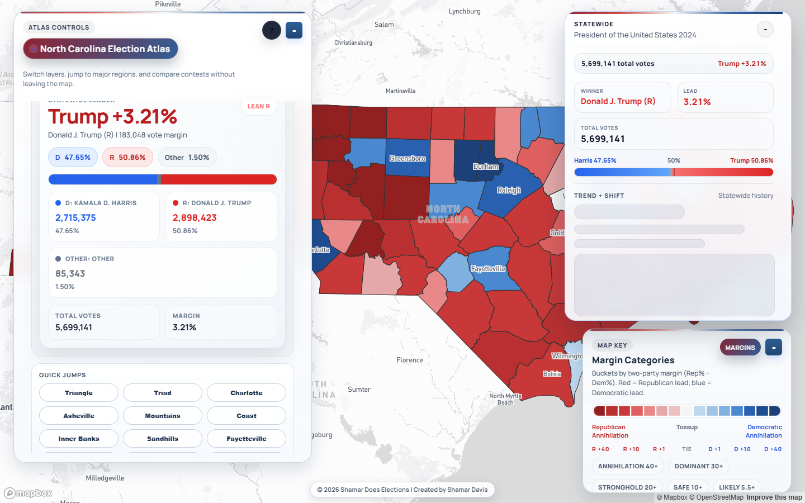
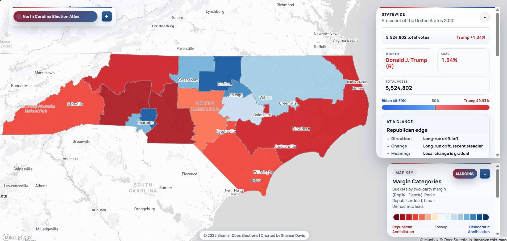
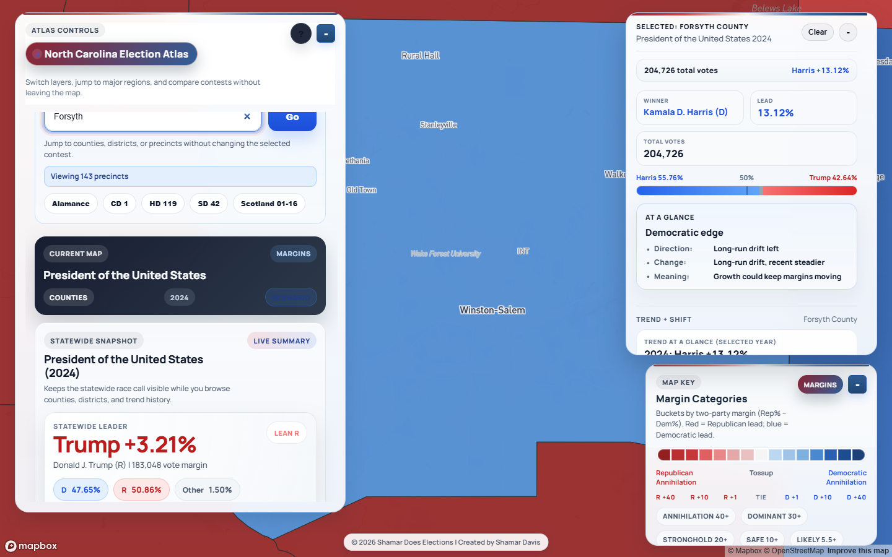
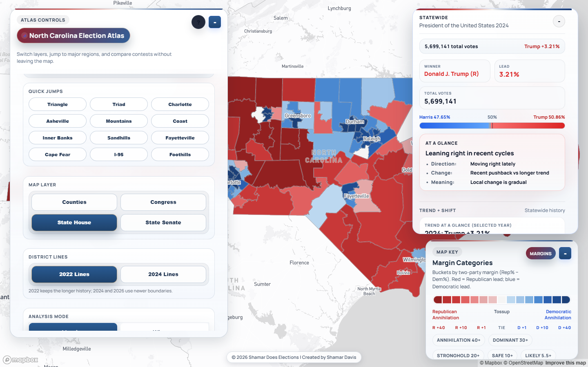
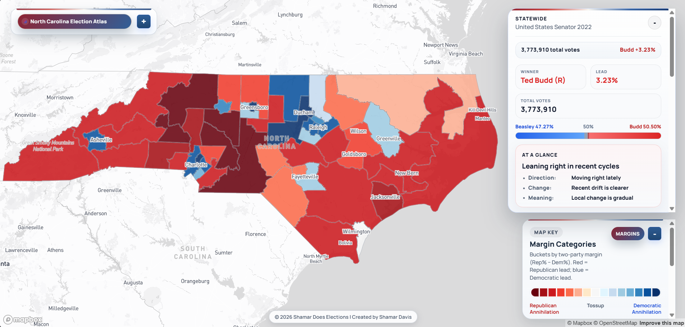

# NCPrecinctMap
[](LICENSE)


**NCPrecinctMap** is an interactive web-based map for exploring North Carolina election results at the precinct and district level, covering general elections from **2000 through 2024**. It is designed for researchers, journalists, and citizens who want to understand how election results map onto changing precinct and district boundaries over time.

The live app is now presented as **North Carolina Election Atlas**, which is the public-facing name used in the current UI.

**Live site:** [https://tenjin25.github.io/NCElectionAtlas/](https://tenjin25.github.io/NCElectionAtlas/)

---

## Screenshots

**Counties view — 2024 Presidential**


**Congressional Districts — 2020 Presidential**


**Precinct view — Forsyth County zoomed in**


**State House — 2024 Presidential** 


**State Senate - 2022 US Senate**


---

## Project Overview

North Carolina's election data is complex: precinct boundaries and IDs change frequently, and non-geographic voting buckets (like early voting or absentee) do not map cleanly to physical locations. This project focuses on two hard problems:

- **Making historical precinct-level results usable with modern geometry** (handling precinct ID changes, splits, merges, and early-vote/absentee buckets that don't map to geography)
- **Showing district results on consistent district lines** — district views default to the court-ordered 2022 MQP lines (see below), with an optional toggle to 2024 lines for comparison; results are reallocated via block/VAP crosswalks where needed

The project is powered by prebuilt JSON data slices and raw [OpenElections](https://openelections.net/) precinct CSVs, with geometry from NC OneMap / NCSBE and Census Bureau TIGER files.

## Who This Atlas Is For

- **General public:** See how your county or precinct voted without downloading data files or GIS tools.
- **Students and educators:** Explore long-run election trends (2000-2024) with map-first visuals that are easier to use in class projects.
- **Political junkies and campaign watchers:** Compare margins, flips, shifts, and district outcomes quickly across multiple election years.
- **Data journalists and researchers:** Use the map for rapid story discovery, then trace the underlying JSON/CSV inputs and coverage diagnostics in this repo.
- **Civic tech and redistricting users:** Inspect how statewide results look when reallocated to a consistent district baseline (2022 MQP), and compare against the 2024 line option.

### Quick Start by Audience

- **General public:** Open the live site, pick a contest/year, click a county or precinct, and read winner/margin/trend cards.
- **Students:** Start with Counties view, then switch to Congressional/State House/State Senate to compare the same contest across geographies.
- **Political junkies:** Use `Split-ticket`, `Shift`, `Flips`, and `Reset View` to scan for realignment and crossover patterns.
- **Data journalists:** Pin a county/precinct/district, use `Copy Link` for reproducible map state, use the pinned hover tooltip `Copy` button for quick labels, and cross-check with files in `data/contests/` and `data/reports/`.

## Why the 2022 Court-Ordered (MQP) Lines?

District views (Congressional, State House, State Senate) default to the **court-ordered "MQP" remedial maps** drawn in 2022 by court-appointed Special Masters following the NC Supreme Court's ruling that the legislature's own maps were unconstitutional partisan gerrymanders.

These lines were chosen as the consistent historical baseline for two reasons:

1. **Neutrality** — they were drawn by independent experts under court supervision, not by either party, making them the most politically neutral set of modern statewide district lines available. Using party-drawn maps as a baseline would embed partisan intent into the geographic frame when comparing results across years.
2. **Practical coverage** — the 2022 remedial maps were actually used for a real election (the 2022 general), making them a grounded modern baseline for reallocating earlier results.

Historical district views are still presented on the selected modern district line set (default 2022 MQP), but the current precinct target is now the **December 2025 OneMap/SBE precinct basis** at `data/census/SBE_PRECINCTS_20251212/SBE_PRECINCTS_20251212.shp`, with 2020-block assignments in `data/crosswalks/block20_to_onemap_2025_12.csv`.

The current bridge chain has two main branches. Modern SBE precinct vintages for **2020, 2022, and 2024** are VAP-weighted to the December 2025 OneMap basis. Early-era SBE 2006 is reached through [NHGIS](https://www.nhgis.org/) block-to-block crosswalks: `2000 tabblocks -> NHGIS 2000-to-2010 -> NHGIS 2010-to-2020 -> SBE 2006 precincts -> Dec 2025 OneMap / modern districts`. Early-year district and precinct outputs are approximate VAP-weighted shatter/apportionment estimates, not exact historical precinct geometry.

## Features

- **Multiple Views:** Counties, Precincts (zoomed in), Congressional Districts, State House, State Senate
- **District Lines Toggle (2022 vs 2024):** District views can switch between the 2022 MQP baseline and a 2024 line option; the first 2024 load can take longer while boundary GeoJSON downloads/parses
- **Progressive District Linework (DRA-style):** Congressional/State House/State Senate boundaries use a bright halo + crisp charcoal inner stroke with smooth zoom interpolation, stronger statewide readability, and a close hierarchy (Congress strongest, Senate very close, House only slightly thinner)
- **Contest Picker:** Only valid contests for the current view are shown, driven by manifest files
- **Atlas-Style Desktop UI:** Refined left/right control rails, statewide snapshot cards, and map-first layout inspired by modern election atlas interfaces
- **Mobile Dock + Sheet UI:** On phones, Search / Layers / Legend open as bottom sheets with snap states (collapsed, half, full) so controls stay reachable without covering the map
- **Regional Quick Jumps:** Preset regions (Triangle, Triad, Charlotte, Asheville, Mountains, Coast, Inner Banks, Sandhills, Fayetteville, Cape Fear, I-95, and Foothills) can zoom the map and pin an aggregated regional result summary
- **Unopposed Filtering (Counties):** Unopposed Council of State contests and uncontested / same-party-only judicial contests are hidden from the Counties picker
	- **Hover + Sidebar Details:** Margins, vote shares, flip/shift modes, statewide summaries, and trend history for each geography
	- **County Focus Panel (Newsroom-style):** Clicking a county gives a dominant **At a glance** summary (winner, margin strength, vote split, story, “what to watch”), plus a short **Why it votes this way** explainer, a **Confidence** meter, and a one-line **Compared with North Carolina** context sentence; deeper detail stays behind expandable sections
	- **Trajectory / Status Card:** County/district/precinct trend panels include an edge-case-aware trajectory block with composite labels such as `Stable Republican (Stronghold)`, `Strengthening Democratic (Edge)`, `Emerging Republican (Tilt)`, or `Battleground`, with the category pill stacked under the trajectory header for more readable long labels
	- **Trajectory Snapshot Add-ons (Structured):** Appends a subtype line, a `Margin Category` line (Stronghold/Safe/Likely/Lean/Tilt/Tossup), and a `Growth Dynamic` note beneath the `Latest Result` row (`R +X · D +Y`); `Latest Result` is styled as the dominant headline, with long-term and vote-change lines de-emphasized and a softer (reduced-motion-respecting) shift arrow pulse
	- **County Census Context:** County sidebar panels add qualitative Census-style growth context (`Urban anchor`, `Metro spillover`, `Coastal growth`, `Rural slowdown`, `Mixed growth`) to frame why local trajectories may be changing, and can now surface a supporting `Census check` inside the trajectory card when population growth clearly reinforces the electoral direction
	- **County Census Insight Growth Type Chip:** The in-popup `County Census Insight` block now appends a small growth-type chip (`🌊 Coastal Growth`, `🌆 Metro Spillover`, `🛣️ Corridor Growth`, `🏭 Stable / Local Growth`) derived from county heuristics
	- **Dynamic Competitiveness Tier Labels:** Focus headers and hover cards show tier labels (for example, `Safe Republican` / `Stronghold Democratic`) derived from the same margin thresholds used for map styling
	- **Comparative Controls:** One-click split-ticket overlay (`President` base with `Governor` overlay) plus a what-if swing slider for fast scenario exploration
- **Modeled 2026 Statewide Races:** Synthetic `US Senate (2026) model` and `NC Supreme Court Associate Justice Seat 1 (2026) Model` entries use recent statewide baselines and respond to the same swing controls as real contests. The Senate model uses `2022 + 2020 US Senate` anchors and the `2024 President` climate, all loaded from the production precinct slices. County and statewide comparisons are derived in memory from those precinct rows; files in `data/county_contests/` and attached county-total sidecars are not frontend authorities for modeled output. Reliability, repeatability, anomaly, federalization, and candidate-coalition brakes allow realistic ticket splitting without turning the race into a presidential clone. A precinct reconciliation step preserves each calibrated county target without flattening precinct ordering. The current calibration gives Cooper stronger Guilford, Pitt, Northampton, and App State-centered Watauga performance, gives Chatham and Granville softer Triangle-adjacent treatment, and allows Whatley to approach Budd-like margins in selected rural areas. A Senate-only turnout-composition layer keeps the raw precinct and **Congressional / State House / State Senate** statewide aggregates near one another. In modeled mode, the statewide summary includes a compact methodology indicator, while **What-if & overlays** exposes light model-tuning sliders and `Copy Link` preserves non-default tuning.
- **Layering Controls:** Turnout-intensity opacity mode and overlay opacity presets (`Reveal map`, `Balanced`, `Focus overlay`) for cleaner map readability
- **Demographics Mode:** County, district, and precinct overlays can be shaded by plurality race share (white / black / Hispanic, plus Native / Asian / Pacific / multiracial / other where available), with synchronized legend colors in both standard and colorblind palettes
- **High-Contrast Demographics Toggle:** Optional high-contrast demographic shading and chip styling for better visibility on dark tooltip surfaces
- **Demographic Hover Chips:** County and precinct hover/sidebar cards include race-share chips that are tuned for readability in normal, colorblind, and high-contrast combinations
- **Precinct Click Behavior (Precincts On):** Clicking a precinct is passive (no selection/highlight, no pinned tooltip, no zoom). Hover remains the primary interaction.
- **CVAP Hover Totals (Optional):** When available, hover cards prefer RDH `CVAP_TOT24` (citizen voting-age population, 18+) for “total” metrics; otherwise they fall back to VAP/total population (this does not change election calculations)
- **Recount Radar Badge:** A live topbar badge appears at higher zoom when the active focus margin is under `0.5%`, showing vote margin and percent gap
- **Barometer Counties (Optional):** Click the `Barometer` legend chip to outline counties that mirror the statewide two-party margin most closely across the last 2–3 available cycles for the selected contest (purple outline; off by default)
- **Story Copy + Loading Skeletons:** Story cards can be copied to clipboard in one click, and trend/story panels show lightweight skeleton loaders while data is loading
- **Mobile "MapTalk" Actions:** `Find My Precinct` (GPS) and `Story Snapshot` (9:16 share export of current map view)
- **Share + Reset Actions:** `Copy Link` captures the current deep-linked map state (view/contest/mode/lines/focus plus scenario swing/scope and any model tuning); `Reset View` recenters/clears pinned focus; `Reset Swing` returns scenario shift to `0.0%`
- **Advanced Analytics Cards:** Realignment Index (`Top shifting precincts`) and Ghost Precinct tracker for unmatched-key transparency
- **Accessibility Support:** Colorblind palette toggle (`B`), live screen-reader summaries for hovered/selected results, keyboard focus rings (`:focus-visible`), reduced-motion support, and stronger map label halos for town/county labels
- **State URL Sync:** View/contest/mode/district-lines/focus are encoded in URL params so links reopen to the same map state
- **County Population Change Mode:** Counties view includes a `Pop Change` visualization mode for 2020-2025 Census Vintage population change, with percent/absolute metric toggle and a dedicated legend badge/subtitle
- **Compact Map Key:** Margins, winners, shift, and flips legends are presented in a cleaner visual key instead of long text lists
- **Margin Categories (Map Key):** Category chips are *absolute* two-party margin buckets (|Rep% − Dem%|), while the red/blue spectrum shows the signed margin (Rep% − Dem%).
- **Judicial Contests:** NC Supreme Court and Court of Appeals seats in Counties / Precincts (and district overlays) when contested two-party margins can be shown. Coverage includes **seat-numbered** comparable races for **2000–2006** plus named-seat / seat-numbered contests from **2008 onward**. Ballots were nonpartisan in **2004–2016**; DEM/REP display parties come from `data/mappings/judicial_candidate_party_overrides.csv` (for example 2004 Orr vacancy: James A. Wynn, Jr. → DEM, Paul Martin Newby → REP; remaining plurality field → OTHER). Seat lineages use Wikipedia seat numbers via `data/mappings/judicial_seat_crosswalk.csv`. Tooltips and panels prefer OpenElections nicknames in parentheses when present (for example, `Mike Morgan`, `Bob Edmunds`)
- **Flexible Data Model:** Add new contests, years, or district lines by updating manifests and data files

## Recent Updates (March–July 2026)

**Last updated:** July 17, 2026

### 2022-Lines NC-13 Presidential Snapshot Alignment (July 17, 2026)

- Corrected the 2016 presidential result in NC-13 under the 2022 congressional lines from `R+2.12` to the trusted snapshot margin of `R+2.34`.
- Preserved the existing `325,627` total and `14,033` other votes; only the Democratic/Republican split was reallocated (`151,987 D` / `159,607 R`).

### Precinct-First US Senate Calibration (July 17, 2026)

- Removed `data/county_contests/` from the 2026 Senate calibration and validation path; county-level comparisons are now aggregated directly from `loadContestSlice` precinct rows.
- Calibrated the production precinct aggregate and all three district scopes to a competitive Whatley lead in the `R+1.5–1.9` range.
- Added metro coalition floors so Cooper improves on Harris and Beasley's urban benchmarks without washing out Whatley's rural strength.
- Added softer Chatham- and Granville-specific Triangle-adjacent floors, keeping both between a core-metro treatment and a generic rural/suburban county.
- Routed modeled county view through `loadContestSlice` so statewide and county cards follow the rebuilt precinct rows and model controls even when the precinct overlay is off; the compact modeled county path is no longer a frontend authority.
- Reconciled modeled precinct rows to their calibrated county targets, correcting the broad red drift in counties such as Pitt and Northampton while retaining precinct-level ordering.
- Set restrained Cooper-over-Harris targets in Guilford, App State-centered Watauga, Fayetteville/Fort Bragg bedroom-community Hoke, and the growing Harnett corridor; kept realigning Anson between its 2022 Senate and 2024 presidential margins; then aligned the default statewide result near the `R+1.5–1.9` band through rural turnout composition rather than redder county margins.
- Added explicit raw-precinct regression diagnostics so an unused county sidecar cannot silently become the statewide calibration target again.

### Demographics + Accessibility (March 21, 2026)

- Added a dedicated `Demographics` map mode across counties, congressional districts, state house, state senate, and precinct overlays.
- Added precinct-level demographic inputs (`data/precinct_demographics_2020_vap.csv`) and wired them into precinct hover/sidebar race chips.
- Expanded county/precinct demographic fields to include Native, Asian, Pacific, and multiracial shares in addition to white/black/Hispanic fields when available.
- Updated demographics legend + map coloring so plurality classes now include Native, Asian, Pacific, and multiracial categories where source fields exist.
- Synced legend swatches with the **active** map palette in colorblind mode so the legend now always matches on-map colors.
- Added `High contrast demographics` toggle in controls for stronger map fills and race-chip contrast when demographics mode is active.
- Added URL-state persistence for demographic contrast (`democontrast=high`, with `demo_contrast` accepted when parsing links).
- Increased baseline demographics visibility in map fills and hover chips for county + precinct contexts.
- Improved county and precinct demographics chip/card readability in hover surfaces.
- Fixed dark-tooltip-specific demographics contrast regressions so text/chips remain legible in pinned/hover cards.

### Desktop Controls, URL Share Flow, and Performance (March 21-22, 2026)

- Stabilized desktop contest picker behavior: contest controls stay at the top of the rail, dropdowns open downward more reliably, and desktop overflow clipping was removed.
- Reduced control-panel jitter while opening/selecting contests by tightening desktop topbar/control offset handling.
- Refined desktop atlas control colors/contrast for improved readability across long analysis sessions.
- Added share-only URL behavior: URL params (`view`, `contest`, `mode`, `lines`, `focus`, `democontrast`) are consumed on load, then cleared from the address bar.
- `Copy Link` now generates the current deep-link state on demand before copying (with clipboard fallback messaging).
- Added deferred hydration so counties/map shell render first while contest and district manifests load in the background.
- Added cache-buster-aware data loading with cached fetches to reduce stale static-file issues while keeping repeat requests fast.
- Deferred analytics card refresh (`Realignment Index`, `Ghost Precinct Tracker`) with debounced idle scheduling to improve contest-switch responsiveness.
- Tightened close-race margin formatting so extremely close contests retain higher precision consistently across focus/tooltip labels.
- Improved district candidate labeling in newer 2024-lines outputs so uncontested/edge slices are less likely to fall back to generic party labels.


### County Precision + Hover Flip Fixes (March 22, 2026)

- Scoped the close-margin precision tweak to **county contexts only** so statewide formatting behavior stays unchanged.
- Updated county-facing result surfaces to use county precision for tight races (`0.02%` style instead of `0.020%` unless margins are sub-`0.005%`):
  - county sidebar margin + vote-share lines
  - county vote-counter lead/margin/share labels
  - county hover result-card margin label
- Restored county hover `Flip` badges outside Shift/Flips map mode by keeping prior-cycle county totals loaded in counties view.
- Preserved statewide candidate labels when switching from Counties view to Congressional/State House/State Senate views on statewide contests (candidate names now carry through district-view statewide summaries).


### Pipeline + Data Refresh (March 22, 2026)

- Hardened auto-generated precinct override logic in `scripts/build_district_contests_from_batch_shatter.py` to skip null/NaN precinct IDs before normalization.
- Updated `scripts/build_district_results_2024_lines.py` so district slices now preserve contest-wide Democratic/Republican candidate names (`dem_candidate`, `rep_candidate`) instead of writing blank placeholders.
- Added optional CLI arguments to `scripts/split_district_results_by_contest_year.py`:
  - `--src` to point at an alternate consolidated district-results JSON
  - `--out-dir` to write split outputs/manifests to a custom directory
- Refreshed precinct matching artifacts:
  - `data/mappings/precinct_variant_overrides.json`
  - `data/reports/unmatched_precinct_examples.csv`
  - `data/reports/unmatched_precinct_summary.csv`


### Modeled 2026 Statewide Contests (March 26, 2026)

- Added `US Senate Model (2026)` to the contest picker for counties and district views.
- Added `NC Supreme Court Model (2026)` to the contest picker for counties and district views.
- The modeled Senate race blends 2022 US Senate and 2024 President results (county/district-local), applies calibrated 55–60% turnout, and then applies a small “Cooper candidate” bonus calibrated from county-level `Governor vs President` overperformance (2016/2020) before any user swing is applied.
- The modeled Supreme Court race blends 2022 Seat 03 + Seat 05, then blends that baseline with the 2024 Seat 06 results before any user swing is applied.
- The 2026 modeled candidate labels are currently `Roy Cooper` vs `Michael Whatley` for Senate and `Anita Earls` vs `Sarah Stevens` for Supreme Court.
- Both modeled contests reuse the normal `Dem swing` slider, so users can push the synthetic 2026 map further toward either party without leaving the standard contest workflow.


### Trajectory Edge Cases + Census Context (March 26, 2026)

- Promoted the `index_nc_trajectory_edgecases.html` variant into the live `index.html`.
- Expanded the trajectory classifier so status labels are now composed from:
  - `origin` (internal): `Durable`, `Reinforcing`, `Emerging`, or `Realigned` (displayed as `Stable`, `Strengthening`, `Emerging`, or `Shifted`)
  - `side`: `Democratic`, `Republican`, or fully neutral `Battleground`
  - `position`: `Stronghold`, `Advantage`, `Edge`, `Tilt`, or `Battleground`
- Example live statuses now include labels such as:
  - `Stable Democratic (Stronghold)`
  - `Strengthening Democratic (Stronghold)`
  - `Strengthening Republican (Advantage)`
  - `Strengthening Republican (Stronghold)`
  - `Emerging Democratic (Edge)`
  - `Shifted Republican (Stronghold)`
  - `Battleground`
- Updated momentum wording to shorter directional calls:
  - `↔ Stable`
  - `→ Moving right`
  - `→ Moving right faster`
  - `← Moving left`
  - `← Moving left faster`
  - `← Long-run move left`
  - `→ Long-run move right`
- Kept the shorter checkpoint rows in the trajectory card:
  - `Latest Result`
  - `Last Cycle` or `Since <year>`
  - optional `Since 2008`
- Added icon cues for trajectory origin states so the card can distinguish stable/strengthening/emerging/shifted paths at a glance.
- Moved the composite trajectory category pill beneath the `Trajectory Snapshot` heading so longer status labels have more horizontal room and wrap more cleanly.
- Added a `Census Context` county sidebar card with qualitative population/growth framing such as `Urban anchor county`, `Metro spillover`, `High-growth coastal county`, `Slow-growth or declining county`, and `Mixed-growth county`.
- The Census insight now reads from cleaned Vintage 2025 county population estimates in `data/CO-EST2025-POP-37-clean.csv`, released March 26, 2026, so it can reference actual 2020-2025 growth and the July 1, 2024 to July 1, 2025 change instead of only static county buckets.
- Added a trajectory-level `Census check` note when growth patterns strongly corroborate the election trend, including fast-growing suburban strengthening cases and leftward drift in metro spillover counties.
- The Census card is intentionally qualitative; it summarizes recent population-pattern context rather than presenting a raw Census table.


### Census Check + Legend Clarification (March 27, 2026)

- Added a short **Census check** callout in the Trends panel that cross-checks trajectory language against county population-growth patterns (Vintage 2025 estimates).
- Expanded the Census check trigger so fast-growth, outer-suburban counties (for example, Union) can still surface a growth/lean note even when the most recent cycle is a small bounce.
- Adjusted **Momentum** so fast-growth, outer-suburban counties can surface a `← Long-run move left` call at smaller long-run deltas when the county remains Republican-leaning but has clearly softened over time.
- Refined the `County Census Insight` buckets so transition counties read as `Small-metro / outer-suburban transition`, and military-hub counties (for example, Cumberland/Onslow/Wayne/Craven/Hoke) get a note that year-to-year estimates can be choppy.
- Restyled the Census check callout to match the compact “Meaning” card typography while remaining visually distinct.
- Clarified the **Margin Categories** legend language so it’s consistent everywhere: the color spectrum is the signed two-party margin (Rep% − Dem%), while category chips represent absolute margin thresholds (|Rep% − Dem%|).


### Trajectory Wording + 2024 Lines Loading Notice (March 27, 2026)

- Standardized the trajectory label format to `Origin Side (Position)` (for example: `Emerging Republican (Edge)`), with positions `Stronghold`, `Advantage`, `Edge`, `Tilt`, or `Battleground`.
- Refined `Emerging` descriptions to explicitly call out “closing the gap” cases (for example, Cabarrus: GOP still leads but trends Democratic over time).
- Added an inline loading hint when switching to 2024 district lines so the UI explains the first-time boundary load delay without a modal popup.
	- Trajectory Snapshot glossary (the `Meaning:` line and status chip are generated from the same rules everywhere):
	  - `Origin`:
	    - `Stable` (formerly `Durable`): long-running lean with no sustained recent break (even if the margin narrows/widens over decades).
	    - `Strengthening` (formerly `Reinforcing`): the county is moving further in the same direction as its current lean.
	    - `Emerging`: the county still leans one way, but the underlying movement points the other way (a “closing the gap” trajectory).
	    - `Shifted` (formerly `Realigned`): the county’s lean has flipped versus its longer-run baseline.
	  - `Side`: `Democratic` / `Republican` reflect the *current* lean (the most recent margin), not the direction of change.
	  - `Position`:
	    - `Stronghold`: very safe margin.
	    - `Advantage`: clear but not extreme margin.
	    - `Edge`: modest margin (close enough that a normal-swing cycle can narrow quickly).
	    - `Tilt`: very close margin.
	    - `Battleground`: essentially even / too close to call cleanly.
	  - `Momentum` (trend line):
	    - `↔ Stable`: little directional change.
	    - `← Moving left` / `→ Moving right`: consistent shift over recent cycles.
	    - `← Moving left faster` / `→ Moving right faster`: the most recent window is moving faster than the longer-run pace.
	    - `← Long-run move left` / `→ Long-run move right`: slow multi-decade movement that may not show up strongly in the last 1–2 cycles.
	  - `Subtype` (structured add-on line under the status pill):
	    - `Active Suburban Transition`: long-run Democratic movement with a still-Republican but narrower current margin.
	    - `Active Republican Transition`: long-run Republican movement with a still-Democratic but narrower current margin.
	    - `Suburbanizing (Lagging)`: long-run Democratic pressure, but the most recent cycle moved more Republican.
	    - `Counter-Suburbanizing (Lagging)`: long-run Republican pressure, but the most recent cycle moved more Democratic.
	    - `Red-leaning, cooling`: still Republican-leaning, but Democrats have gained ground lately.
	    - `Blue-leaning, cooling`: still Democratic-leaning, but Republicans have gained ground lately.
	    - `Moving right` / `Moving left`: long-run and recent movement both point the same way.
	    - `Breaking right` / `Breaking left`: movement large enough to suggest a structural shift is underway.
	    - `Stable / Mixed`: does not strongly match one of the above patterns.
	  - `Margin Category` (neutral add-on line, based only on the current margin):
	    - `Margin: Stronghold R/D` (20%+)
	    - `Margin: Safe R/D` (10%–20%)
	    - `Margin: Likely R/D` (5.5%–10%)
	    - `Margin: Lean R/D` (1%–5.5%)
	    - `Margin: Tilt R/D` (0.5%–1%)
	    - `Margin: Tossup R/D` (0%–0.5%)
	  - `Growth Dynamic` (appended under `Latest Result`):
	    - `Votes vs last cycle: R +X, D +Y` (raw two-party vote deltas vs the prior cycle).


### Hover Tooltip Crash Course (April 2026)

The Atlas uses a split hover-tooltip system so the map stays fast on desktop while remaining readable and touch-friendly on mobile.

**Desktop (min-width: 769px)**
- **Hover** a county/district/precinct to see a **collapsed** quick card (winner/margin + rating, plus compact deltas when available).
- **Click the hover card** to **pin + expand** it (shows full details, additional stat lines, and extra chips).
- When pinned, use **Close** to dismiss. Some pinned tooltips also show a **Copy** button for quick label copying.
- Shortcut polish: press `Esc` to clear pinned hover/selection, and press `?`/`H` to open Help.

**Mobile (max-width: 768px)**
- Hover behaves like a **docked card** (bottom-safe placement) designed for scrolling + tapping.
- Tap to pin details (and use **Close** to dismiss).
- Optional: enable **More → Auto Hover** to refresh the docked hover card after pan/zoom (samples the map center so you can “browse” without re-tapping).

**What you’re seeing**
- **Winner / margin line:** e.g. `Trump +25.19%` (signed two-party margin).
- **Rating / tier label:** e.g. `Stronghold Republican` (bucketed margin category for quick scanning).
- **Flip indicator:** shows when the current result switches party versus the previous comparable cycle (e.g. `Flip: D→R (20→24)`), when prior data exists.
- **Delta block (only when data exists):**
  - **Population deltas:** `20→25`, `20→24`, and `24→25` using Census county estimates (Vintage 2025).
  - **Raw vote deltas:** `R`, `D`, and `Total` vote change across the most relevant prior cycle-pairs for the selected contest (for example `08→12` for President 2012, or `10→16` for US Senate 2016).
  - These load asynchronously for some contests; if deltas are missing, the block stays hidden instead of showing placeholders.


### US Senate Model Correctness + Contest Controls (April 3, 2026)

- Fixed the `US Senate Model (2026)` pipeline so county modeled winners are based on the correct `2022 US Senate` county baseline before blending with `2024 President` climate.
- Hardened county normalization/join logic by moving the blend step to county aggregates (prevents climate-only buckets from skewing or flipping county totals).
- Improved modeled turnout redistribution so when the climate slice contains extra buckets (for example, `COUNTY - BOE`), those votes are redistributed into the modeled county total while keeping the blended county margin consistent.
- Promoted the contest selector into the primary controls, added a polished loading indicator on contest switches, and reduced tool clutter via clearer grouping (no features removed).


### Senate Deviation Calibration + Precinct Labeling (April 8, 2026)

- Upgraded `US Senate Model (2026)` so it is not a simple presidential clone: it now computes a county-level `senateDeviation = senateMargin - presidentialBaselineMargin` (using the closest prior presidential result) and applies that deviation on top of the model’s presidential baseline year with light smoothing/guardrails.
- Applied the same deviation calibration logic to modeled **district** slices so district view behaves consistently with county view.
- Precinct hover/selection now prefers full precinct names (when available in precinct geometry or `data/precinct_friendly_names.json`) instead of only short codes.
- Rebuilt 2024-on-2024-lines district slices (including midterm years) with an SBE-precinct-based block→precinct crosswalk to reduce misallocation in edge-case counties (notably Gaston HD-108/109/110).


### CVAP Aggregate Robustness (April 9, 2026)

- Hardened CVAP aggregate parsing so the atlas accepts both legacy `CVAP_TOT24` and newer `cvap_total_24` column naming without breaking any UI blocks.


### Premium UI + District Linework + CVAP Totals (April 9, 2026)

- Restyled congressional/state house/state senate boundary strokes to a calmer SCMap-style system: rounded joins/caps, subdued slate color, multi-stop zoom interpolation for opacity/width/blur, and stronger-but-tasteful hover/selection outlines.
- Preserved the district-line toggle behavior (2022 vs 2024) exactly, including existing source switching and contest re-application logic.
- Updated hover “total” metrics to prefer Redistricting Data Hub CVAP totals when available (ACS 2020–2024 special tabulation; `CVAP_TOT24`), without changing any election computations or contest logic.
- Added a pinned-tooltip `Copy` button so analysts/reporters can quickly copy the active geography label (county/precinct/district).
- Split hover tooltip presentation by viewport: mobile keeps the current docked/touch-first card, while desktop uses a collapsed hover card that expands (pins) on click.
- Added a compact hover “delta block” showing population-change mechanics (2020→2025 and 2024→2025) plus raw vote deltas (R/D/Total) for the most recent available cycle pairs (formatted like `+11.9k`).
- Tightened the desktop hover tooltip width cap so hover cards stay compact (mobile dock/sheet layout unchanged).
- Standardized camera padding so search clicks, district clicks, and other zoom-to-feature flows don’t hide the target under the sidebar/bottom sheet.
- Added keyboard focus rings and `prefers-reduced-motion` support (no feature changes, just safer UX defaults).


### District Demographics Breakdown Expansion (April 10, 2026)

- Expanded the district demographic CSV outputs to include additional VAP race breakdown fields (Native / Asian / Pacific / Multiracial / Other).
- Updated district sidebar/hover demographic breakdowns to surface those additional lines when a group is a large share (≥ 30%) to keep the card readable while still calling out heavily Native or multiracial districts.


### 2022 Lines District Results Fix (April 11, 2026)

District views on the **2022 MQP lines** now read from the primary district contest folder, `data/district_contests/`, for legislative slices. The source-of-truth patch for the highest-confidence state house fixes has been moved into that main folder so the live atlas and the checked-in JSON agree.

Why this matters:
- The live app no longer depends on an alternate hybrid district-contest directory for these state house corrections.
- The main source-of-truth files now contain the targeted HD-108 / HD-109 / HD-110 replacements directly.

Concrete example (what you should see now on 2022 lines):
- **Governor 2024, State House:** **HD-109 = Stein (D)** in `data/district_contests/state_house_governor_2024.json`.

Implementation note:
- `index.html` now points legislative 2022-line district rendering at the primary `district_contests` folder without hybrid-folder preference logic.
- Deployment targets `index.html` only (no `index.prefix.html` deployment).


### Margin Precision Consistency (April 11, 2026)

- Standardized very-close margin formatting so the atlas keeps **two decimals whenever the margin of victory is `0.02` points or greater**.
- Refined the edge-case rule so values that **round to `0.02` at two decimals** (for example, a raw margin like `0.0196`) also stay on the two-decimal path instead of rendering as `0.020`.
- Applied the same threshold across the main focus cards, county sidebar labels, and hover tooltip/hover-summary paths so close-race formatting no longer disagrees between views.
- Added the standard CSS `line-clamp` property alongside existing `-webkit-line-clamp` rules in `index.html`, clearing the compatibility warnings that were showing in the editor.


### HD-52 Governor Benchmark Alignment (April 13, 2026)

- Patched **State House District 52** in the live `Governor 2024` district slices to match the DRA district-statistics benchmark used for review.
- Updated both live source folders so the atlas and checked-in JSON stay aligned:
  - `data/district_contests_2024_lines/state_house_governor_2024.json`
  - `data/district_contests/state_house_governor_2024.json`
- The corrected HD-52 values are **20,180 DEM / 20,430 REP / 2,259 OTH** (`42,869` total; REP +`0.58%`).
- Kept separate review artifacts for audit work:
  - `data/district_contests_shapefile_overlap/` for the VTD-overlap-with-legislative-shapefile output
  - `data/district_contests_dra_review/` for DRA benchmark review copies
- Only the primary live folders above are used by the atlas unless code is explicitly rewired to an alternate output directory.


### HD-68 Governor 2024 Lines Correction (April 13, 2026)

- Corrected **State House District 68** in the live `Governor 2024` file for the **2024 district lines**.
- Updated live source:
  - `data/district_contests_2024_lines/state_house_governor_2024.json`
- The corrected HD-68 values are **25,832 DEM / 25,847 REP / 3,418 OTH** (`55,097` total; REP +`0.03%`).
- Verified the live 2024-lines geography against the authoritative block assignment input:
  - `data/tmp/block_assign_extract_2024/SL_2024_4.csv`
- That live allocator path confirms **HD-68 is entirely in Union County**. A Mecklenburg sliver may appear in precinct-overlay review artifacts, but it is not part of the block-level source used to build the live 2024-lines district slice.


### SD-18 President 2024 Lines Correction (April 13, 2026)

- Corrected **State Senate District 18** in the live `President 2024` file for the **2024 district lines**.
- Updated live source:
  - `data/district_contests_2024_lines/state_senate_president_2024.json`
- The corrected SD-18 values are **61,654 DEM / 62,266 REP / 1,969 OTH** (`125,889` total; REP +`0.49%`).
- This updates the live 2024-lines SD-18 presidential entry to the requested vote totals.


### SD-26 Governor 2024 Lines Correction (April 13, 2026)

- Corrected **State Senate District 26** in the live `Governor 2024` file for the **2024 district lines**.
- Updated live source:
  - `data/district_contests_2024_lines/state_senate_governor_2024.json`
- The corrected SD-26 values are **58,375 DEM / 60,243 REP / 6,222 OTH** (`124,840` total; REP +`1.5%`).
- This promotes the validated temporary senate calibration result into the live 2024-lines senate governor slice.


### SD-43 and SD-44 Senate 2024 Contest Sync To 2022 Lines (April 13, 2026)

- Synced the live **State Senate Districts 43 and 44** entries in the **2022-lines live senate 2024 contest slices** to the current **2024-lines live senate 2024 slices**.
- Updated live source folder:
  - `data/district_contests/`
- Applied across the affected 2024 senate statewide/judicial contest files, including `Governor 2024`.
- This keeps SD-43 and SD-44 aligned across 2022-lines and 2024-lines where those districts did not materially change.


### SD-44 President 2024 Lines Transfer (April 13, 2026)

- Transferred the live **State Senate District 44** `President 2024` result from the **2022-lines live senate slice** into the **2024-lines live senate slice**.
- Updated live source:
  - `data/district_contests_2024_lines/state_senate_president_2024.json`
- The corrected SD-44 values are **35,233 DEM / 79,448 REP / 1,089 OTH** (`115,770` total; REP +`38.19%`).
- This makes the live 2024-lines SD-44 presidential entry match the current live 2022-lines senate district result, per the requested transfer.


### SD-43 and SD-44 President Reversion To Earlier 2024-Lines Values (April 14, 2026)

- Restored the earlier **State Senate District 43 and 44** `President 2024` results in the live **2024-lines senate slice**.
- Transferred the same restored values into the live **2022-lines senate slice** so both line sets match.
- Updated live sources:
  - `data/district_contests_2024_lines/state_senate_president_2024.json`
  - `data/district_contests/state_senate_president_2024.json`
- Restored values:
  - **SD-43:** **42,342 DEM / 66,690 REP / 1,311 OTH** (`110,343` total; REP +`22.07%`)
  - **SD-44:** **33,165 DEM / 81,975 REP / 1,061 OTH** (`116,201` total; REP +`42.0%`)


### District/County Badge Polish (April 15, 2026)

- Normalized district hover badge sizing so the rating/tier chip matches the winner chip visual scale.
- Updated shift formatting to compact party notation (`R+5.40`, `D+1.00`) for cleaner county summaries.
- Added party-color emphasis for shift values (red for Republican-leaning movement, blue for Democratic-leaning movement) while keeping years/range text muted.
- Introduced a county-only shift chip variant with slightly stronger type weight/size so county mode reads clearly without changing precinct or district chip styling.


### Modeled Baseline + Naming Refresh (April 16, 2026)

- Updated user-facing modeled contest labels to clearer names in picker and context surfaces:
  - `US Senate (2026) model`
  - `NC Supreme Court Associate Justice Seat 1 (2026) Model`
- Added modeled-slice cache invalidation when model tuning overrides change, so blend/turnout/bonus control updates recalculate county and district modeled slices immediately instead of showing stale cached values.
- Verified modeled continuity, share URL restore (`contest`, `swing`, `mblend`, `mturnout`, `mbonus`), and full Playwright regression coverage.


### UI/UX Refinement + Mobile Overlap Verification (April 16, 2026)

- Refined the atlas control hierarchy in `index.html` to reduce control-rail visual weight while preserving map interactions, contest loading, listener wiring, and existing tooltip behavior.
- Clarified modeling controls and summary language (what-if/model/overlay grouping, updated preset labels, compact modeled/scenario status signaling in control summaries).
- Cleaned conflicting/duplicate style paths and added safer sidebar-disabled hooks without changing feature behavior.
- Ran functional smoke checks for contest loading and map interaction flow using `US President (2024)` as a validation baseline.
- Ran true Playwright mobile viewport overlap checks at **390x844** and **430x932** in baseline and legend-open states; overlap checks for vote card, legend, and mobile dock all passed.


### Modeled Contest Calibration + Conservative Trend Narratives (April 17, 2026)

- Calibrated modeled statewide contests so they behave more conservatively and predictably in both county and district views (no UI interaction changes).
- Fixed a modeled-contest turnout-default bug: models that do **not** specify `turnoutFactor` now default to a neutral baseline (prevents accidental large swings from an implicit `0` turnout factor).
- Refined the `US Senate (2026) model`:
  - Slightly more shrinkage toward the `2024 President` climate baseline.
  - Tighter caps + stronger damping on county ticket-splitting deviations (especially in low-vote and deep-partisan counties).
  - Reduced “trend nudge” noise and strengthened statewide recentering so statewide totals stay anchored.
  - Toned down candidate bonus magnitude (kept the feature, made it less aggressive).
- Refined the `NC Supreme Court Associate Justice Seat 1 (2026) Model` blend defaults and reliability/brake settings to reduce overreaction in noisier judicial baselines.
- Tightened trend/trajectory narrative thresholds so “moving/accelerating” language triggers less often on small shifts; Census context is presented as contextual confirmation only when the political signal is strong.


### US Senate County Calibration + District Parity (April 19, 2026)

- Further refined the `US Senate (2026) model` to better separate **durable crossover** vs **personal candidate** effects by county class, with stronger realignment/federalization fade where portability is weaker.
- Added explicit handling for **Robeson / Bladen / Scotland** as a distinct realigned former-D federal county class, using a deliberate blend of Senate anchors and presidential climate plus a reduced-but-nonzero Cooper residual.
- Reduced context-specific overdependence on the `2022 US Senate` anchor in unstable counties by shifting modestly toward `2024 President` climate and `2020 US Senate` where volatility is higher.
- Tightened the Senate-vs-President overperformance guardrail so generic Senate R results are less likely to outrun the presidential baseline in strongly realigning eastern/southeastern counties.
- Strengthened suburban rebound elasticity modestly (including fast-growth suburban/exurban clusters) while keeping effects bounded by reliability and federalization brakes.
- Added county-class turnout sensitivity multipliers (urban core, Black Belt, suburban growth, realigning rural, rural white) while keeping turnout baseline inputs unchanged (`president`, `2024`, `0.575`).
- Unified district-scope Senate calibration knobs so modeled **Congressional / State House / State Senate** layers use the same district blend multipliers, deviation brakes, and district bonus points for closer cross-layer alignment.


### US Senate Model Balance Tuning (April 19, 2026)

- Refined the `US Senate (2026) model` toward a more balanced statewide profile after a stronger rural-Cooper calibration pass.
- Kept the Cooper overperformance signal active, but reduced its most aggressive rural/exurban multipliers to avoid overstating crossover in already federalized counties.
- Rebalanced opposing rural GOP-overperformance and Cooper-personal carry floors so the model remains competitive in crossover counties while staying anchored to statewide behavior.
- Preserved all existing guardrails (realignment caps, anomaly clamps, and federalization brakes) and kept modeled UI behavior unchanged.


### Modeled SD-43/44 Harmonization For 2022 Lines (April 20, 2026)

- Added a targeted harmonization step for **State Senate Districts 43 and 44** in **2022-lines mode** so modeled district outputs stay aligned with the 2024-line modeled equivalents where those districts are expected to track together.
- Applied to both modeled statewide contest paths:
  - `NC Supreme Court Associate Justice Seat 1 (2026) Model` (`nc_supreme_court_model`)
  - `US Senate (2026) model` (`us_senate_model`)
- Scope is intentionally narrow (only SD-43/44 in the modeled state senate district builder for 2022-lines mode) to avoid altering unrelated districts or non-modeled contests.


### Modeled Senate UX — Analog Scoring Tuning (April 20, 2026)

- Tightened the **Historical Analog** "High" confidence threshold from `≤1.35` to `≤1.1` to reduce false high-confidence labels when the closest historical year is only a moderate structural match.
- Rebalanced **county-level** analog scoring weights to give more emphasis to structural county pattern (deviation from statewide) relative to raw margin distance: `0.62/0.26/0.12` → `0.58/0.30/0.12` (countyDiff / countyPatternDiff / stateDiff).
- Rebalanced **statewide** analog scoring weights to raise county distribution pattern sensitivity: `0.72/0.28` → `0.68/0.32` (stateDiff / patternRMS).
- Added **Forsyth** (Winston-Salem) to the metro county set used for statewide analog metro-delta computation, bringing the tracked metro county count from 7 to 8.
- Smoke-verified via Playwright that "Baseline", "With candidates", and "Historical analog" sections all render correctly in the modeled Senate contest statewide card after async data load completes.


### US Senate Model Balanced Recalibration (April 20, 2026)

- Applied a balanced follow-up calibration pass to the `US Senate (2026) model` after the redward overcorrection fix, using midpoint values for the four core statewide-balance levers.
- Updated calibration values to:
  - `baselineReliabilityFloor: 0.41`
  - `urbanDemElasticityWeight: 0.27`
  - `trendCarryoverWeight: 0.32`
  - `demNomineeStrengthPts: 1.6`
  - `repNomineeStrengthPts: 0.0`
- Extended the same balanced pass to modeled district scopes (Congressional, State House, State Senate) so district layers track the statewide recalibration more consistently:
  - `districtBlendMul* : 0.94`
  - `districtDeviationBrake* : 0.92`
  - `candidateBonusDistrictPts* : 0.27`
- Kept the newer structural refinements intact, including the **Robeson / Bladen / Scotland** special bucket, the Scotland-specific Senate-over-President cap, and restrained turnout-family multipliers.
- Kept the newer explanatory modeled-contest features intact (historical analog framing and baseline-vs-candidate comparison controls), with no UI layout or interaction changes.


### US Senate Model Calibration Cleanup (April 20, 2026)

- Refined the `US Senate (2026) model` calibration stack so each correction system has a clearer role: long-run realignment adjustment, Senate-over-President cap, candidate portability brakes, turnout family sensitivity, and final statewide recentering.
- Strengthened confidence-based county shrinkage using reliability, stability, volatility, and outlier-brake signals so low-confidence counties shrink more toward baseline while high-confidence counties retain more local character.
- Updated special residual crossover / realigned former-D handling to **Robeson / Bladen / Scotland** (Scotland replacing Hoke in this class).
- Forced **Wake** through urban-core routing in Senate family handling so it does not use suburban rebound/growth-exurban logic.
- Retuned Senate turnout family multipliers (urban core, Black Belt, suburban, growth exurban, realigning rural, rural white) to reduce hidden statewide load-bearing from realigning-rural turnout.
- Added clearer internal Senate diagnostics for attribution by county (baseline blend, turnout contribution, realignment adjustment, overperformance cap effect, candidate bonus effect, confidence/shrinkage) without changing any UI panels.


### US Senate Model Refinement Pass (April 20, 2026)

- Refined the `US Senate (2026) model` to split candidate portability into two distinct channels: a **durable crossover baseline** and a **personal candidate bonus**, each with separate county-level handling.
- Updated the special realigned former-D federal crossover bucket to **Robeson / Bladen / Scotland** (Scotland replacing Hoke for this modeling pass).
- Kept **Wake** hard-routed through urban-core Senate family handling to prevent suburban/growth-exurban logic from applying in Wake.
- Reduced overlap between correction systems by disabling the extra residual-elasticity side channel in this model path and lowering overlapping residual/trend weights.
- Tuned durable-vs-personal fade behavior so durable crossover effects remain partially preserved in realigning counties while personal portability fades much more aggressively, with explicit personal caps in the Robeson/Bladen/Scotland class.
- Rebalanced turnout-family sensitivity (especially suburban vs growth-exurban distinctions) while keeping swings moderate.
- Slightly increased confidence-based shrinkage in low-confidence counties without flattening high-confidence county variation.
- Preserved strong Senate-over-President GOP guardrails and statewide recentering so statewide behavior remains anchored while allowing realistic county differentiation.


### US Senate Model Robeson Micro-Adjustment (April 20, 2026)

- Applied a narrowly scoped `US Senate (2026) model` calibration tweak to reduce **Robeson** over-suppression without broad statewide reweighting.
- Softened Robeson-specific personal realignment fade in both model paths: `score * 1.14 -> 1.10 -> 1.08`.
- Kept the global candidate bonus split and strength fixed at the current settings:
  - `candidateBonusWeight: 0.27`
  - `candidateBonusDurableShare: 0.70`
  - `candidateBonusPersonalShare: 0.30`
- Made only subtle companion guardrail changes for the special residual-crossover class:
  - `candidateBonusRealignedFormerDemFederalResidualFloor: 0.28 -> 0.30`
  - `senateMaxOverPresRobesonCapPts: 0.15 -> 0.20`
- Left **Scotland** and **Bladen** county-specific handling mostly unchanged while preserving the same overall statewide Lean-R result band.
- No UI, map interaction, tooltip, legend, control, mobile, Mapbox, or unrelated contest logic changes.


### 2024 Lines Margin Rounding Stability Fix (April 21, 2026)

- Fixed a floating-point display drift in district margin labels so edge values now round consistently at two decimals in 2024 district-line views (for example, `Trump +6.665` now displays as `Trump +6.67` instead of occasionally rendering as `Trump +6.66`).
- Added centralized display-rounding helpers in `index.html` and routed shared close-race percent/margin formatting through that path to keep winner-margin pills, hover labels, and sidebar margin text aligned.
- Added a follow-up consistency pass so hover quicklines and selected county summary chips use the same signed-margin display path (including canonical margin fields when available) instead of recomputing independent `toFixed(2)` values.
- Kept the change scoped to formatting only (no vote totals, modeled outputs, map styling, or interaction behavior changed).


### District Boundary Readability Refresh (April 21, 2026)

- Refined centralized district stroke styling in `index.html` (`DISTRICT_LINE_STYLE` + `applyDistrictStrokeStyle` usage) so all district types remain readable at default statewide zooms and over dark partisan fills.
- Increased low-zoom (`z4`/`z6`) halo and inner-stroke opacity/width values for congressional, state senate, and state house boundaries while preserving smooth `interpolate` zoom expressions.
- Removed legislative dashed styling from district boundaries so all three district families render as solid lines in the same visual system.
- Kept hierarchy intentionally tight: congressional remains strongest, state senate is very close, and state house is only slightly thinner rather than substantially fainter.


### Vote Counter Layout + Mobile Positioning Fixes (April 21, 2026)

- Fixed context-title overlap with `Clear` / `Reset` controls in the vote counter by updating the shared header layout so long labels (for example, county and district names) keep readable space instead of being covered.
- Added a desktop two-line clamp for the vote-counter context title so longer labels such as `Selected: Mecklenburg County` and longer district names remain legible.
- Raised vote-counter placement on mobile in both expanded and minimized states so it sits higher above the dock and covers less of the map when open or collapsed.
- Kept these changes scoped to layout/positioning only (no election calculations, contest data, or map interaction logic changes).


### Modeled Tooltip Cache + Mapbox Telemetry Cleanup (April 22, 2026)

- Stopped county tooltip vote-delta prefetch from requesting nonexistent historical JSON files for synthetic contest types such as `us_senate_model`, eliminating noisy `404` console errors during modeled-contest selection.
- Kept modeled tooltip delta behavior intentionally disabled for synthetic contest histories instead of trying to infer fake prior-cycle deltas from non-existent files.
- Disabled Mapbox `performanceMetricsCollection` at map creation in addition to the existing telemetry toggle, reducing ad-blocker-driven `events.mapbox.com` console noise without changing map rendering behavior.


### US Senate District-Layer Calibration Parity (April 22, 2026)

- Updated modeled Senate district layers so **Congressional**, **State House**, and **State Senate** slices use the same `2022 + 2020 US Senate` anchor structure as the county model instead of relying on a pure `2022` Senate district baseline.
- Added light district-level repeatability and anomaly damping so one unusual cycle is less likely to overdrive modeled district crossover, while keeping the district contest architecture unchanged.
- Retuned district-only restraint knobs to keep scopes differentiated but aligned with the new county calibration:
  - `districtBlendMulCongressional: 0.93`
  - `districtBlendMulStateHouse: 0.91`
  - `districtBlendMulStateSenate: 0.92`
  - `districtDeviationBrakeCongressional: 0.90`
  - `districtDeviationBrakeStateHouse: 0.88`
  - `districtDeviationBrakeStateSenate: 0.89`
  - `candidateBonusDistrictPtsCongressional: 0.26`
  - `candidateBonusDistrictPtsStateHouse: 0.24`
  - `candidateBonusDistrictPtsStateSenate: 0.25`
- Kept the current Senate-first model, district UI, and contest architecture intact; this pass only tightens how the existing modeled district layers inherit statewide Senate calibration.


### Atlas Performance + Senate Guardrails + Explainability (April 24, 2026)

- Added a fast per-`${contestType}_${year}` county aggregate cache (totals + signed margin) with in-flight promise reuse, so trend panels and cross-year comparisons don’t repeatedly rescan full precinct-row arrays.
- Parallelized and deduped the heaviest historical/analog loaders (modeled Senate analog history + county vote-delta caches) using `Promise.all`, while preserving chronological ordering in rendered series.
- Implemented Senate-model calibration guardrails that apply **only to extra modeled movement** (not the baseline blend):
  - Anchor disagreement spread across `2022 Senate`, `2024 President`, and `2020 Senate` with `low/medium/high` flags.
  - Disagreement dampener: `medium → 0.85`, `high → 0.70` (extra movement only).
  - Rural crossover brake: if all federal anchors are Republican, cap Dem crossover effect to roughly `D+1.0…D+1.8` unless real Senate Dem strength exists.
  - Metro/suburb elasticity caps (Wake/Meck/Durham/Orange; Cabarrus/Union/Johnston) plus a soft sanity clamp on extreme swings unless multiple anchors support the direction.
- Added lightweight explainability metadata (spread, confidence label/band, influence components, explanation tags) stored on modeled rows and surfaced as text in the existing **Historical Analog** area (no layout/behavior changes).
- No new datasets, no additional network fetches, and modeled outputs remain numerically very close; these changes focus on speed + stability for edge-case counties (e.g., Robeson/Bladen/Columbus, Hoke/Scotland, Wake/Mecklenburg, Cabarrus/Union/Johnston).


### Statewide Margin Precision Consistency (April 26, 2026)

- Fixed a rounding/formatting drift in the “Statewide leader” label so it always matches the main margin display and authoritative sources (e.g., Wikipedia).
- The statewide leader label (e.g., “Trump +1.34%”) now always uses two decimal places, matching the “Margin” line and ensuring consistency throughout the app.
- This resolves the previous issue where the label could show “1.35%” while the margin line showed “1.34%” for the same result.

### Precinct Spotlight + County Opacity Fix (April 28, 2026)

- Added a VoteHub-style **precinct spotlight** effect: selecting a precinct darkens all other precinct polygons while keeping the selected precinct fully visible/highlighted.
- Ensured the spotlight dim overlay only appears when precinct polygons are actually visible (precincts enabled **and** zoom ≥ precinct minZoom), preventing stale dimming on mode switches/clears.
- Fixed unintended **county dimming**: county fill opacity no longer drops just because precincts are toggled on; it now only reduces when precinct polygons are visible at the current zoom.


### Focus Mode Map Dimming Fix (April 29, 2026)

- Disabled the `body.focus-active` brightness/saturation filter on `#map` so clicking/selecting a county no longer dims the base map.
- Kept `focus-active` for the stronger panel/tooltip shadow behavior (no selection/hover/tooltip logic changes).


### Precinct Click Auto-Pin Disabled (April 29, 2026)

- Disabled precinct click selection/pinning/zoom while `Precincts On` is enabled (VoteHub-style hover-only interaction).
- Clicking a precinct now clears any existing pinned/selected precinct state and does not lock the tooltip.
- Hover tooltip and county click behavior remain unchanged.


### Trend Labels + Trajectory De-dupe (April 29, 2026)

- Fixed missing candidate surnames in some county trend/timeline outputs (most visible in pre-2016 county timelines) by making trend candidate resolution manifest-aware (`getContestCandidates()` now reuses the same contest-slice loader used elsewhere, instead of guessing `${contestType}_${year}.json`).
- Fixed a long-term trend/trajectory UI bug where identical “Since 2020 → …” shift blocks could be appended twice; the trajectory details list now has a defensive de-duplication guard.


### Trends Panel Calculation Refresh (April 29, 2026)

- Updated the Trends panel shift math to suppress tiny/noisy cycle-to-cycle moves so “Shift” and “No shift” labels behave consistently across county/precinct/history views.
- Removed premature rounding of county trend `margin_pct` in the trend-series cache so the Trends panel always uses the current display-precision logic (instead of freezing margins at a legacy 2-decimal value).


### Change/Shift Language + Timeline Label Cleanup (April 30, 2026)

- Standardized user-facing `Shift` wording to clearer `Change` terminology in the main controls and help copy, while keeping the underlying `shift` mode key unchanged in code/URL params.
- Reworded trend/timeline shift text into short first-time-user-friendly phrases that explicitly preserve percentages and direction (for example, `Shifted 2.50% toward Republicans vs 2020`).
- Clarified legend-axis language so direction labels read as explicit movement (`Shift toward Democrats` / `Shift toward Republicans`).
- Kept trajectory `Votes vs last cycle` in compact party-letter form (`R` / `D`) for scan speed, but updated `Latest Result` to show the winning candidate name with margin when available (for example, `2024: Trump +2.50%`).
- Kept all changes scoped to presentation text/labels only; no vote math, map-color logic, contest datasets, or modeled calculation paths were changed.


### State House 2024-Line Data Fixes + Uncontested Labels (May 5, 2026)

- Corrected selected unchanged State House districts in the `2024 lines` district-contest JSON slices by copying the matching non-legislative results onto the 2024-line files where those districts did not change.
- Kept the actual `state_house_state_house_2024.json` legislative contest file out of that transfer so placeholder uncontested candidate labels remain intact.
- Updated shared result-label formatting so races with a missing major-party nominee now render as `Uncontested D` or `Uncontested R` instead of a normal winner-margin string.
- Kept the UI change scoped to presentation text; no vote totals, contest math, or map-color thresholds were altered by the uncontested-label update.


### 2022→2024 Lines HD Result Sync (May 6, 2026)

- Added `scripts/transfer_hd_results_2022_to_2024_lines.py` to copy selected **State House district** (`HD-xx`) `general.results` entries from `data/district_contests/` (2022 lines) into the matching `data/district_contests_2024_lines/` `state_house_*.json` slices.
- Used to force identical results for districts that are expected to be unchanged across the two line sets (for example, a targeted sync for **HD-23** where values should match).
- Note: `data/nc_district_results_2024_lines.json` uses **zero-padded district keys** (e.g., `"012"`), while the per-contest slices in `data/district_contests_2024_lines/` use unpadded keys (e.g., `"12"`).


### Precinct Clear + Uncontested Labels (May 6, 2026)

- Fixed a regression where clicking **Clear** in the vote counter could leave the precinct spotlight/highlight visible on the map.
- Updated winner/margin display labeling so **uncontested races show `Uncontested R` / `Uncontested D`** on the front end (even when the underlying data omits explicit “no candidate” text, by also detecting 0-vote major-party opponents).
- Improved the vote-counter header layout so long context titles (for example, `Mecklenburg County`) don’t get covered by the `Clear` / `Reset` actions (actions stay on the same row on desktop; the layout now uses a 2-column grid).
- Tweaked the context title to stay on a single line with ellipsis (avoids awkward wraps like `Mecklenburg` / `County` on separate lines).
- For `State House` / `State Senate` contests, the statewide winner label now uses chamber leadership names:
  - `2022 State House`: Speaker Tim Moore
  - `2024 State House`: Speaker Destin Hall
  - `2022/2024 State Senate`: Phil Berger


### First-Time UX Polish Pass (May 7, 2026)

- Improved the default county-focus empty state with a compact `Start exploring` onboarding card (clear first steps and plain-language guidance).
- Updated contest onboarding hint copy to `New here? Start with President 2024, then click a county.` and wired it to hide after the first contest selection via existing localStorage onboarding memory.
- Added lightweight analysis-mode helper text:
  - `Margins`: `Winner's lead`
  - `Winners`: `Party carried`
  - `Shift`: `Change vs prior election`
- Renamed disclosure labels for clarity:
  - `History` -> `Trend history`
  - Tooltip disclosure `Details` -> `Vote details`
  - `Non-geographic votes` -> `Absentee / provisional votes`
- Added legend microcopy: `Darker colors mean larger margins; lighter colors are more competitive.`
- Reworded tooltip pin/action hints in plain language:
  - Desktop: `Click to lock this result open`
  - Mobile/touch: `Tap to lock this card open`
  - Pinned: `Pinned · use Close to dismiss`
- Kept scope limited to UX copy/hierarchy/hints and subtle card styling only. No election math, data loading paths, layer behavior, or mobile layout structure changes.


### Precinct Auto-Sync After Zoom-In (May 8, 2026)

- Fixed a precinct-overlay sync issue where, after zooming into precinct range, users could still see centroid/full-county presentation until toggling `Precincts` off/on.
- Added a post-load precinct sync pass so when precinct geometry finishes loading asynchronously, visibility/opacity state is recomputed immediately.
- Applied cached precinct **dot** colors at geometry-load completion (not just polygon fill colors) to avoid stale mixed rendering.
- Added a one-time active-contest refresh fallback when cached precinct paint expressions are missing, so precinct mode initializes correctly without manual retoggle.
- Scope is strictly interaction/render sync behavior for precinct mode; no election math, datasets, or contest calculations changed.


### VoteHub Hover Card Refresh + Precision Alignment (May 12, 2026)

- Updated precinct and district hover cards to a compact VoteHub-style results layout, while keeping county hover on the richer atlas tooltip path.
- Added winner-line + margin labels to compact precinct/district cards and added optional flip callouts (`Flipped R→D` / `Flipped D→R`) with party-color emphasis for quick scan readability.
- Kept hover routing scoped: `Precinct`, `Congressional`, `State House`, and `State Senate` use the compact card; county hover behavior and county card structure are unchanged.
- Added a centralized VoteHub tooltip renderer path and formatting helpers for cleaner reuse across hover contexts.
- Re-aligned compact-card decimal behavior with the existing front-end display pipeline to reduce rounding drift:
  - winner line uses the same stabilized winner/margin label path as the rest of the app
  - row-share percentages follow the same two-decimal share presentation behavior used by the existing result-card output
- Kept all map coloring logic, selected panel layout, trend/timeline structure, and mobile docking behavior unchanged.


### Mobile Tooltip "More details" Content Refresh (May 18, 2026)

- Updated county mobile tooltip `More details` behavior so modern detail content remains visible in more data-availability cases, instead of collapsing into legacy-feeling fallback content.
- Kept demographics chips in the expanded detail area, while ensuring vote-change lines can still render even when population-estimate fields are missing for a county.
- Added a concise Census insight line to the county tooltip details path so the same growth-context framing is surfaced directly in mobile hover details.
- Scope is tooltip detail rendering only; no election math, county totals, or map-color logic changed.


### Contest JSON Formatting + Cache Refresh (May 25, 2026)

- Restored `data/contests/*.json` output to human-readable multi-line formatting (no one-line minified rows).
- Updated `scripts/split_elections_by_contest_year.py` to write pretty-printed JSON by default.
- Bumped front-end cache-buster tokens in `index.html` so browsers fetch refreshed contest JSON after data pushes.
- Scope is data-delivery/readability behavior only; no contest math or category threshold logic changed.


### Mobile Tooltip Action-Button Aesthetic Alignment (May 31, 2026)

- Aligned the pinned tooltip `Copy` and `Close` button styling on mobile with the `SCprecinctmap-gh` visual treatment (dark glass surface, lighter text, and matching hover state).
- Kept scope limited to tooltip action-button presentation only; no tooltip behavior, election math, contest data, map interactions, or mobile sheet mechanics changed.


### County Population Change Mode + Legend Cleanup (June 1, 2026)

- Added a county-only `Pop Change` visualization mode that uses Census Vintage 2025 population estimates for 2020-2025 change.
- Added a percent vs absolute metric toggle, plus a dedicated legend badge/subtitle so the active metric is obvious at a glance.
- Simplified the population-change legend copy in a follow-up pass so the labels read more cleanly in the UI.
- Kept scope limited to population display and legend presentation; no election totals, contest math, or district logic changed.


### VoteHub Tooltip Winner Layout + Contrast Polish (June 2, 2026)

- Tuned the VoteHub-style tooltip winner row to better match the existing color/layout treatment after the recent contrast pass.
- Kept the change limited to tooltip presentation details only; no election math, contest data, or interaction behavior changed.


### Desktop Pop Change Hover Summary + District Label Cleanup (June 19, 2026)

- Updated county hover behavior in `Pop Change` mode so desktop users now see the population-change summary in the main hover card instead of having to open `More details`.
- Kept mobile behavior intentionally unchanged: population-change detail still lives under `More details` on smaller/touch layouts.
- Pulled in the latest district hover/selection label cleanup from `main`, including more consistent zero-padded State House / State Senate labels and clearer congressional copy text.
- Kept scope limited to hover/label presentation; no election totals, contest math, district allocation logic, or map-color calculations changed.


### County Margin Threshold Consistency + Contest Switch Performance (June 23-24, 2026)

- Fixed a county-threshold consistency bug where some county-facing surfaces could display a rounded county margin like `20.00%` while the county fill bucket still behaved as if the raw unrounded value were below that threshold.
- Unified the county-facing margin/tier/color path so county labels, county hover/focus summaries, county map fills, and county split-ticket county overlays all use the same county display-precision logic.
- This was most visible in edge cases like **Henderson County, US Senate 2020**, where the underlying aggregate is about `19.9988%` but the intended county-facing display rounds to `20.00%`.
- Kept the fix scoped to front-end county presentation and bucket consistency; the underlying contest JSON and county vote totals were not changed.

- Reduced avoidable contest-switch overhead by making the strict background contest loader manifest-aware, so tooltip/history warmups stop guessing nonexistent contest JSON paths when the normal loader already knows the correct manifest or OpenElections source.
- Eliminated noisy background `404` fetches for older presidential warmups (for example, historical `president_2004` / `2008` / `2012` strict JSON probes) and extended the same manifest-aware strict-path benefit to other contest types.
- Deferred county vote-delta tooltip warmup until after the visible contest render completes so the first on-screen map update is less likely to compete with non-essential background work.
- Made the contest dropdown switch less eager: it now reacts to committed selection changes instead of intermediate navigation/input events, and waits one frame before starting the heavier contest-load path so the native select can close cleanly.
- Bumped front-end build/cache tokens after these pushes so GitHub Pages and browser caches fetch the latest contest-switch behavior instead of serving stale HTML.


### Lincoln County-Equivalent District Fallback + Cache Refresh (June 25, 2026)

- Added a county-equivalent fallback path for the Lincoln-backed State House edge case so district hover cards, sidebar summaries, trend history, flip/shift comparisons, and statewide district totals can still resolve from county aggregate data when that special-case district row is missing or needs canonical county values.
- Reused county-facing margin precision for this edge case so winner labels, margin calls, and trend displays stay aligned with the same rounded county presentation logic used elsewhere in the atlas.
- Bumped the app/data cache-buster tokens in index.html so GitHub Pages and browser caches pick up the latest district-fallback behavior promptly.
- Kept scope limited to front-end fallback/rendering behavior for this special case; underlying contest JSON, district slice files, and vote totals were not changed.


### Early District Contest Recalibration + Whole-County Sync (July 8, 2026)

- Recalibrated the `2004 president` and `2008 governor` district contest JSON slices for both the 2022 legislative lines and 2024 legislative lines using refreshed district-statistics CSV shares.
- Updated the affected files in both `data/district_contests/` and `data/district_contests_2024_lines/` for:
  - `state_house_governor_2008.json`
  - `state_house_president_2004.json`
  - `state_senate_governor_2008.json`
  - `state_senate_president_2004.json`
- Enforced exact county-level vote breakdowns for whole-county districts so county-equivalent districts no longer drift slightly from canonical county totals in these early contests.
- The whole-county district sync now covers:
  - State House: `HD-65` Rockingham, `HD-86` Burke, `HD-97` Lincoln
  - State Senate: `SD-6` Onslow, `SD-10` Johnston
- Added `scripts/enforce_whole_county_district_totals.py` so the whole-county override is reproducible from the raw precinct election exports plus the precinct-to-district crosswalks.
- Bumped the front-end build/cache-buster tokens in `index.html` so refreshed district JSON files are fetched promptly after deploys.
- Restyled the minimized atlas title pill in follow-up passes so the collapsed control state now matches the expanded atlas title treatment instead of using a separate blue-heavy variant.

### Precinct Label De-Duplication (July 9, 2026)

- Fixed front-end precinct label rendering so code-prefixed full names that simply repeat the same friendly name no longer display duplicated text after normalization.
- Exact duplicate patterns like `PROV PROVIDENCE` now collapse to `Providence` instead of surfacing a redundant code/name pairing in hover cards and other precinct-facing UI.
- Applied the same cleanup across abbreviated friendly-name prefixes more broadly, so labels like `Caswell - Prov Providence`, `Caswell - Pros Prospect Hill`, and similar county-specific variants now reduce cleanly to just the expanded precinct name.
- Regenerated `data/precinct_friendly_names.json` with targeted overrides for the remaining malformed county/precinct labels, cleaning up examples like `Mars Hill`, `Andrews North Ward`, `Boiling Spring Lakes`, `Longwood`, `Garysburg/Pleasant Hill`, the Wilson County short-form labels, and `Sylva South Ward`.
- Standardized saint-style precinct names so labels like `St Stephens`, `St John`, and `St Pauls` now render with punctuation as `St. Stephens`, `St. John`, and `St. Pauls`.
- Kept the existing `Friendly (CODE)` behavior for genuinely code-heavy precinct labels that still need disambiguation.
- Removed a duplicate flip badge from the mobile county tooltip `More details` panel so touch users only see the flip callout once in the results card.

### Follow-Up Precinct Friendly-Name Cleanup + County Controls (July 9, 2026)

- Hid district-line toggles entirely while the atlas is in Counties mode so county workflows no longer show irrelevant 2022/2024 line controls.
- Expanded the precinct-friendly-name cleanup pass with additional source-backed overrides and alias-preference logic so compacted labels resolve cleanly across more counties instead of keeping stray code fragments in front of the human-readable name.
- Regenerated `data/precinct_friendly_names.json` again after this follow-up pass, cleaning up `80` changed county/code labels relative to the prior committed atlas build.
- This pass specifically fixed additional malformed labels in counties such as Alleghany, Beaufort, Bertie, Carteret, Chowan, Columbus, Currituck, Dare, Davie, Haywood, Jones, Martin, McDowell, Nash, Orange, Stanly, and Surry.
- Clean examples from this pass include `Gap Civil`, `Roxobel`, `Broad Creek`, `Wardville`, `NW Whiteville`, `Jamesville`, `West Marion`, `Red Oak`, `Carrboro`, and numbered `Mt Airy` precinct labels.
- Bumped the front-end build/cache-buster tokens again so precinct-mode label changes and county-control cleanup are fetched immediately after deployment.

### NCOneMap Precinct Geometry Refresh + Friendly-Name Recovery (July 9, 2026)

- Replaced the atlas precinct geometry with a normalized build of the latest NCOneMap `Voting_Precincts.geojson`, preserving `prec_id`, `county_nam`, `enr_desc`, and atlas-style `precinct_norm` keys so existing precinct result JSON continues to join against the live geometry.
- Regenerated `data/Voting_Precincts.geojson`, `data/precinct_centroids.geojson`, `data/precinct_alias_index.json`, and `data/precinct_friendly_names.json` from that newer source so precinct hover/search/selection all read from the same refreshed geometry set.
- Added reproducible helper scripts for this precinct-geometry refresh workflow:
  - `scripts/normalize_voting_precincts_geojson.py`
  - `scripts/build_precinct_alias_index.py`
  - `scripts/compare_precinct_geojsons.py`
- Updated `scripts/build_precinct_friendly_names.js` to merge usable `enr_desc` labels directly from the refreshed precinct GeoJSON, instead of relying only on older alias inference.
- Restored additional source-backed friendly names that were degraded or missing after the NCOneMap swap, including recoveries in Ashe, Greene, and Granville plus follow-up punctuation cleanup for `St.` and `Mt.` patterns such as `St. Stephens` and `Mt. Airy`.
- Simplified front-end precinct display behavior so when a real friendly precinct name is available the atlas shows just that name, rather than defaulting to `Friendly Name (CODE)` in normal precinct-facing UI.
- Reduced the remaining precincts with still-textual-but-unresolved labels to a much smaller residual group, leaving mostly source-limited code-style placeholders rather than duplicated name/code strings.
- Recalibrated `data/district_contests/congressional_governor_2008.json` for the affected congressional slices so the checked-in district results stay aligned with the latest correction pass.
- Added NCOneMap comparison diagnostics in:
  - `data/reports/voting_precincts_nconemap_2026-07-09_diff_summary.json`
  - `data/reports/voting_precincts_nconemap_2026-07-09_diff_details.csv`
- Bumped the front-end cache-buster token again so browsers fetch the refreshed precinct geometry, alias/friendly-name data, and calibrated contest JSON immediately after deploy.

### Precinct Crosswalk Repair + Friendly-Name Source Pass (July 10, 2026)

- Added reproducible precinct-geometry repair tooling for the latest NCOneMap precinct refresh:
  - `scripts/export_git_geojson.py`
  - `scripts/build_precinct_geometry_crosswalks.py`
  - `scripts/apply_precinct_crosswalk_to_2024_contests.js`
  - `scripts/apply_weighted_precinct_crosswalk_to_2024_contests.js`
  - `scripts/restore_2024_county_contests_from_raw.js`
  - `scripts/merge_noncanonical_suffix_precincts_2024.js`
- Generated overlap diagnostics and best-match outputs in `data/crosswalks/precinct_stable_to_nconemap_2026_07_*` so the atlas now has an auditable bridge between the prior precinct keyspace and the refreshed NCOneMap geometry.
- Repaired 2024 precinct contest key drift with a conservative two-step workflow: safe one-to-one renames where geometry matches cleanly, then weighted overlap redistribution only for the remaining split/merged cases.
- Restored affected 2024 statewide county slices directly from the raw OpenElections precinct export where overlap-only remaps were not trustworthy enough on their own, preventing bad remaps in counties such as Gaston and Wake.
- Added a targeted Wake suffix-merge cleanup so canonical precincts absorb `A`-suffix variants like `01-07A` and `07-07A` after county restoration, matching the refreshed geometry more cleanly.
- Left Wake, Mecklenburg, and Cabarrus out of the more aggressive county-by-county official-name backfill pass on purpose as a maintenance tradeoff: Wake and Mecklenburg are the two most populous counties in North Carolina, and Cabarrus is a major Charlotte spillover county. Because all three change and re-precinct quickly, a fully hand-maintained source-backed naming layer there would need much more frequent refreshes than in slower-changing counties.
- Updated `scripts/build_precinct_friendly_names.js` so explicit county overrides now take final precedence over raw `enr_desc` text from the GeoJSON, preventing confirmed names from being overwritten during regeneration.
- Expanded source-backed Cleveland County friendly names to the current preferred labels, including `Bethware`, `Lawn Dale`, `Mooresboro-Young`, `Shelby North`, `Shelby East`, `Shelby Central`, and `Shelby South`.
- Spot-checked current Union County precinct naming against the official Union County Board of Elections precinct map page: [Union County Precinct Maps](https://unioncountyncelections.gov/voting/precinct-maps). This was one verification pass within a broader refresh that also updated other counties, rather than the only county changed in that round.
- Bumped the atlas build/cache-buster tokens again so refreshed contest JSON, precinct crosswalk outputs, and friendly-name labels are fetched immediately after deploy.

### Follow-Up Precinct Label + Centroid Cleanup (July 10, 2026)

- Pretty-printed the checked-in atlas JSON artifacts with stable nested formatting so large contest, mapping, and district-result files are easier to inspect and diff by hand.
- Filled remaining Greene County friendly-name gaps for `ARBA` and `SUGG`, then regenerated the precinct friendly-name index so those labels no longer fall back to opaque code-only names in the front end.
- Repaired the current Vance County precinct label path for the refreshed NCOneMap geometry, mapping the live split keys (`EH1`, `HTOP`, `NH1`, `SH1`, `SH2`, etc.) to readable display names so compact abbreviations no longer leak into precinct-mode UI.
- Synced both Vance and Greene `enr_desc` labels in `data/Voting_Precincts.geojson` and regenerated `data/precinct_centroids.geojson`, removing stale centroid IDs and ensuring the centroid layer carries readable `enr_desc` / `name` / `label` values instead of old or placeholder code strings.
- Tightened shared precinct display-name formatting for `Mc...` names as well, so labels such as Rockingham's `McCoy` no longer flatten to `Mccoy` during regeneration.
- Bumped the atlas build/cache-buster tokens again so browsers fetch the refreshed precinct geometry, centroid labels, friendly-name data, and reformatted JSON outputs immediately after deploy.

### Official County Precinct Name Pass + Acronym Preservation (July 10, 2026)

- Expanded `scripts/build_precinct_friendly_names.js` with additional source-backed county overrides and regenerated `data/precinct_friendly_names.json`.
- Added official current-name mappings for:
  - Gates County precinct labels from the county polling-place list
  - New Hanover County precinct labels from the county polling-place list
  - Guilford County precinct labels from the county polling-place table/export
  - Swain County recoveries such as `Bryson City 1`, `Bryson City 2`, and `Whittier/Cherokee`
  - Onslow County `NE22A` / `NE22B` church-based labels
  - Perquimans County fixes for `East Hertford`, `New Hope`, and `West Hertford`
- Hardened shared friendly-name formatting so common institutional acronyms and suffixes survive regeneration instead of being flattened by title-casing, including `NC A&T`, `UNCG`, `GTCC`, `CFCC`, `UNCW`, `UMC`, `AME`, `CME`, `VFD`, `PCA`, `PLC`, plus apostrophes and roman numerals such as `II`.
- This keeps source-backed labels like `GTCC Ceasar Cone II Aviation Bldg`, `UNCG-Elliot University Center`, `CFCC-North Campus-McKeithan Center`, and `Allen's Crossroads VFD` readable in the live precinct UI rather than degrading back to over-normalized text.
- Bumped the atlas build/cache-buster token again so browsers fetch the refreshed friendly-name data immediately after deploy.

### Mobile Precinct Focus + Additional County Name Passes (July 10, 2026)

- Added additional source-backed precinct friendly-name overrides and regenerated `data/precinct_friendly_names.json` for:
  - Lee County (`Southern Lee High School`, `BT Bullock Elementary School`, `JR Ingram Elementary School`, and related current polling-place labels)
  - Wayne County (`Fremont Town Hall`, `Eureka Methodist Church`, `Little River Fire Station`, `Steele Memorial Library`, and the rest of the current Wayne precinct polling-place set)
  - Scotland County (`Scotland County Annex`, `South Johnson Elementary School Gym`, `Scotland Place`, `National Guard Armory`, `Gibson Fire Station`, `Laurel Hill Community Center`, and `Wagram Recreation Center`)
- Added a Transylvania-specific legacy precinct bridge in the front end so historical contest rows keyed as `CC` / `RE` correctly match current geometry keyed as `CC.1` / `RE.1`.
- Fixed a Cleveland County precinct-matching regression where short spaced Shelby codes such as `S C`, `S S`, and `S 4A` could collapse to the same base token during variant expansion, causing `Shelby Central`, `Shelby South`, and `Shelby North` to inherit the same results.
- Refined mobile precinct-mode onboarding and focus behavior so touch guidance now follows the active geography target (`county`, `precinct`, or `district`) and pinned selections automatically promote the vote counter instead of leaving details buried behind open mobile sheets.
- Kept `scripts/build_precinct_friendly_names.js` output pretty-printed and preserved acronym casing like `BT`, `JR`, `CFCC`, `GTCC`, `UNCG`, `UNCW`, `UMC`, `AME`, `CME`, `VFD`, `PCA`, and `PLC` during regeneration so county-sourced official names remain readable after rebuilds.

### Mobile Precinct Search + Sheet Layout Follow-Up (July 10, 2026)

- Added exact-match auto-resolve behavior for precinct fly-to searches so valid precinct queries can jump without requiring an extra manual submit tap on mobile, including county-first friendly-name inputs from the newer front-end precinct naming system instead of only legacy code-style queries.
- Updated precinct search selection flow so choosing a valid precinct automatically returns the atlas to `Counties` view and turns the precinct overlay on before zooming/highlighting the selected precinct.
- Added a dedicated mobile precinct-mode sheet treatment for the Search panel: when precincts are on, the mobile search sheet now uses a tighter layout, compact context cards, and a live mode hint so the panel reads as a precinct workspace instead of generic county search.
- Refined the collapsed mobile Search sheet in precinct mode so it keeps useful mode/coverage status visible while hiding the full search form until the sheet is expanded again.
- Reworked the toolbar/toggle control palette to use a more restrained North Carolina red/blue accent treatment, replacing the older green-heavy precinct/control styling with shared NC-themed idle and active states.
- Bumped the atlas build/cache-buster tokens again so browsers fetch the refreshed mobile precinct search flow and NC-themed control styling immediately after deploy.

### Legacy Precinct-Mode Follow-Up (July 10, 2026)

- Removed the separate early-year polygon geometry swap so precinct polygons and centroids stay on the same NCOneMap precinct keyspace instead of splitting old contests across two incompatible join paths.
- Added a defensive front-end fallback for years before `2016`: older precinct-mode statewide contests now stay on centroids at all zoom levels rather than switching into a partially broken polygon view.
- This keeps historical precinct mode usable while the remaining pre-2016 polygon-join edge cases are revisited more carefully.

### Mobile Precinct Pinning Restore + Smoke-Test Refresh (July 11, 2026)

- Restored precinct click/search selection behavior to mirror the county tooltip-pinning flow instead of forcing the newer always-open desktop precinct tooltip behavior.
- On touch/mobile, selecting a precinct still opens and pins the tooltip; on desktop, the selection/highlight path now stays cleaner and avoids leaving a forced pinned-style tooltip behind after search or map clicks.
- Tightened the collapsed mobile precinct Search sheet again so the compact precinct workspace keeps the useful status hints while dropping extra visual bulk.
- Updated the Playwright regression expectations to match the current atlas defaults and the restored county-style precinct-selection behavior.
- Re-ran the full smoke/regression suite with Playwright after the restore; all `9` tests passed.
- Bumped the front-end data cache-buster token again so browsers fetch the refreshed mobile precinct behavior and updated regression-aligned build promptly after deploy.

### Legacy Precinct-to-NCOneMap Live Bridge (July 11, 2026)

- Compared the current precinct resolver against the earlier `69fe6c0` restore-point baseline and confirmed the larger regression risk came from the NCOneMap precinct keyspace swap rather than from the top-level modeled-race tuning constants.
- Wired the live front end to `data/crosswalks/precinct_stable_to_nconemap_2026_07_best_old_to_new.csv` so older stable precinct IDs and names can resolve onto the refreshed NCOneMap precinct geometry without rolling back the newer source.
- Extended that bridge into the main precinct result matcher, the prior-cycle precinct margin cache, the precinct fly-to search path, and the canonical precinct-code resolver so older contest/model slices have a better chance of joining to the active NCOneMap geometry.
- Bumped the front-end cache-buster again after the bridge hookup so browsers do not keep serving the pre-bridge precinct resolver.

### Tooltip / Model / Precinct Label Follow-Up (July 11, 2026)

- Nudged the default `US Senate (2026) model` turnout factor from `0.575` to `0.58` and synced the neutral preset plus turnout slider default to that same value so the statewide model can be tightened slightly without reworking the broader Senate blend logic.
- Added county-aware display-name overrides for `Craven` and `Lincoln` precinct labels so `Van-EP Vanceboro`, `Lincolnton North`, and `Lincolnton South` render cleanly in the current front-end naming layer instead of keeping the raw compact/slash-coded forms.
- Re-aligned the county and precinct mobile pin/tooltip flow toward the older `index (14).html` behavior by removing the newer pre-pinned tooltip-shell shortcut and restoring the older render-first, pin-second sequence for county/precinct selections.
- Bumped the front-end data cache-buster again so browsers pull the latest tooltip-behavior and precinct-label refinements immediately after deploy.

### Latest Index Sync (July 12, 2026)

- Pulled the latest upstream `index.html` changes from `origin/main` into the local workspace.
- Synced the hover/mobile tooltip work that followed the earlier NC/WI tooltip comparisons, including the newer upstream positioning and interaction cleanup now present in the live index source.
- Carried forward the upstream cache-buster / app build token bumps that shipped with those tooltip updates, so the checked-in local index now matches the latest remote front-end file.
- Followed up on the Columbus precinct drift fix after the first pass missed some frontend lookup paths: `P117`/`P245` now also resolve consistently as `P11`/`P24` in the variant overrides, demographics/CVAP tables, and 2024 district crosswalk files.
- Rebuilt the 2024 Columbus county contest slices directly from the raw `20241105` precinct export after confirming the presidential slice had still dropped `COLUMBUS - P11` despite the earlier remap cleanup; the refreshed 2024 statewide contest JSONs now carry the raw Columbus precinct rows again.
- Tightened the `SL 2025-95` congressional reaggregation pass for `NC-01` and `NC-03` so older `2026_lines` slices now use shapefile-derived county membership, recognize legacy `COUNTY - CODE_NAME` precinct aliases, preserve untouched years when no aggregate exists, and skip uncontested partisan outputs such as `congressional_attorney_general_2012.json`.
- Removed the stale hardcoded Columbus `P117`/`P245` bridge from the live front end and added a geometry-aware guard to the stable-to-OneMap resolver so only precinct codes that actually exist in the loaded NCOneMap geometry are accepted during precinct lookup.
- Rebuilt the targeted `data/district_contests_2026_lines/congressional_*.json` files plus `data/crosswalks/precinct_to_cd2026_sl2025_95.csv` with the updated reaggregator, adding county-level fallback weighting for unresolved absentee/provisional/one-stop style buckets instead of dropping those votes outright.
- That follow-up rebuild pushed the targeted historical `NC-01` / `NC-03` congressional slices from roughly `70%` matched precinct coverage to `100%` matched keys in files such as `congressional_us_senate_2010.json` and `congressional_governor_2012.json`, with the refreshed files now recording `county_fallback_precinct_keys` in `meta` for auditability.
- Bumped the front-end data cache-buster token again so browsers fetch the refreshed `2026_lines` congressional outputs and precinct-resolver fix immediately after deploy.
- Corrected the follow-up Davie precinct naming regression so `North Mocks City` and `North Mocks County` no longer collapse into the same label: the front end now preserves `North Mocksville City` for the city precinct and `North Mocksville County` for the county precinct.
- Bumped the front-end data cache-buster token once more so browsers stop serving the over-normalized Davie label pair after deploy.

### Pre-2018 Judicial County/Precinct Layers + Nickname Labels (July 14, 2026)

- Reaggregated contested NC Supreme Court and Court of Appeals seats for **2008–2016** into `data/contests/` (same precinct-row layout already used by Counties and Precincts), and refreshed `data/contests/manifest.json`.
- Added `data/mappings/judicial_candidate_party_overrides.csv` and wired it through `scripts/build_district_contests_from_batch_shatter.py` so blank / nonpartisan OE party labels map to DEM/REP leans for displayable margins.
- Added `scripts/reaggregate_pre2018_judicial_contests.py` to rebuild those judicial county/precinct slices for selected years, applying the override map and **skipping uncontested** seats (unopposed, same-party-only generals, or missing DEM/REP totals after overrides).
- 25 contested pre-2018 judicial slices are now live in the Counties picker (plus existing 2016 Court of Appeals seats and the remapped 2016 Edmunds/Morgan Supreme Court race). Intentionally skipped examples include Stroud 2014 (unopposed), Martin 2008 (unopposed), Steelman 2010 (unopposed), Tyson 2008 (both general candidates Democratic), Elmore 2010 (both Republican), and the 2010 multi-candidate IRV vacancy.
- Extended office-key inference for older OE labels (`NC … - Name Seat`, unseated 2016 Supreme Court associate justice) and named-seat display names in the contest picker.
- Removed the front-end `year < 2018` judicial hide rule; Counties now filters judicial contests with the same `major_party_contested` gate used for Council of State.
- Candidate tooltips / focus panels / vote-counter labels now prefer ballot nicknames from parentheses when OE provides them (`Michael R. (Mike) Morgan` → `Mike Morgan`, `Robert H. (Bob) Edmunds, Jr.` → `Bob Edmunds, Jr.`).
- Switched the live atlas precinct geometry / choropleth remaps / VAP bridges onto `data/2025Voting_Precincts.geojson`, repaired selected 2020 precinct contest joins (including OE-backed county rebuilds), and pointed `scripts/build_precinct_friendly_names.js` at that geometry.
- Regenerated `data/precinct_friendly_names.json` with fixes for mangled OneMap labels such as Cleveland `S E` / `S N` (`Shelby East` / `Shelby North`), Orange `HE` (`Hillsborough East`), and Iredell code-prefixed seats (`Sh A Shiloh A` → `Shiloh A`, `Ch A Chambersburg A` → `Chambersburg A`), while preserving already-good names (for example `McMannen`, `Scuppernong`, `H.J. Macdonald`, `Wittenburg`).
- Bumped the front-end data cache-buster / app build tokens to `2026-07-14-4` so Pages clients fetch the new contest slices, friendly names, and nickname labeling promptly after deploy.

### December 2025 OneMap/SBE Crosswalk Chain (July 15, 2026)

- Documented the current modern precinct target: `data/census/SBE_PRECINCTS_20251212/SBE_PRECINCTS_20251212.shp` plus `data/crosswalks/block20_to_onemap_2025_12.csv`.
- The production bridge chain now includes SBE 2020/2022/2024 precinct vintages to the December 2025 OneMap basis, and early-era SBE 2006 via 2000 tabblocks plus the NHGIS 2000-to-2010-to-2020 chain.
- Production bridge artifacts include `data/mappings/sbe2006_to_onemap_precinct_bridge.json`, `data/mappings/sbe2006_to_onemap_precinct_weights.json`, and `data/mappings/sbe2006_to_modern_district_weights.json`.
- Early-year district/precinct outputs are documented as VAP-weighted shatter/apportionment estimates. For 2000-2006, rebuilt outputs stay as shatter estimates unless there is an explicit trusted calibration target.

### Canonical County Totals + Lazy Precinct Modeling (July 15, 2026)

- **Root fix (July 16):** Dec 2025 OneMap VAP bridges are clamped so shares never cross county lines (`python scripts/clamp_precinct_bridge_to_source_county.py --write`; default in the SBE/VTD bridge builders). Rebuild statewide contests with `node scripts/rebuild_statewide_contests_from_sbe_bridge.js`. After that, precinct-row county sums match OE again — no separate `county_contests` accuracy workaround needed.
- County mode loads full `data/contests/` slices (compact `data/county_contests/` is unused). `county_totals` on those payloads remain available as an optional paint override. Modeled county mode still emits a compact 100-county slice from calibrated county targets.
- **2026 Senate model:** After the clamp rebuild, retuned `statewideTargetAdjustmentPts` to `2.85` so county official totals stay near Whatley +1.6 (with district layers). Regional shape uses stronger Cooper urban/suburban elasticity and type boosts (`urban` / `suburban` / `rural`), a softer rural GOP overperformance weight, and Nash/Wilson home-region locals near pre-clamp values (`5.10` / `1.60`).
- **2024 congressional on 2022 lines:** Reallocate live `data/district_contests/congressional_*_2024.json` DEM/REP votes to `data/district_contests_existing_snapshot` margins while preserving each district's live `total_votes` via `python scripts/reallocate_live_district_votes_to_snapshot_margins.py --scope congressional --years 2024 --write`.
- The newer December 2025 OneMap/SBE crosswalks drive precinct-level detail. Within-county precinct splits can still differ from pre–Dec 2025 layouts; county polygons should not.
- Modeled contests follow the same contract. The model calculates and attaches authoritative 100-county totals from its calibrated county targets; full turnout-reweighted precinct rows are preserved separately for precinct mode.
- County-mode model inputs and idle prefetches use compact county files. Full precinct JSON loading and precinct synthesis are deferred until precinct detail is enabled, reducing background transfer/parsing without sacrificing the newer crosswalk work.
- The Senate model's 15% long-run presidential component uses the two most recent pre-2020 cycles (2012 and 2016), avoiding slower and less comparable 2004/2008 fallback sources while retaining a multi-cycle baseline.
- The 2026 US Senate model now uses canonical county anchors, a `0.96` statewide recenter strength, and an explicit statewide calibration adjustment. The default county-layer result remains approximately `Whatley +1.9`, while Hoke follows the Democratic county target instead of being flipped by precinct turnout reweighting.
- Regression coverage verifies that the compact modeled slice contains 100 counties, the full modeled slice retains precinct rows, and Hoke's county total remains Democratic even though the underlying crosswalked precinct aggregation is preserved.

### Early Comparable Judicial Seats 2000–2006 (July 16, 2026)

- Added **25** create-only precinct contest slices under `data/contests/` for early Supreme Court / Court of Appeals races keyed by Wikipedia **seat numbers** (`…_seat_NN_YYYY.json`), so 2000–2006 races can be compared to later numbered seats without regenerating existing files.
- Aggregated the same 25 races into **75** district overlays (`congressional` / `state_house` / `state_senate`) in `data/district_contests/` on the live 2022-lines / SBE2006 weight path.
- Refreshed `data/contests/manifest.json` and `data/district_contests/manifest.json` (precinct manifest includes the 25 early seats; district manifest 415 → 490 entries).
- Added `data/mappings/judicial_seat_crosswalk.csv` (OE office ↔ seat ↔ `contest_type`) and create-only builders:
  - `node scripts/add_early_comparable_judicial_contests.js`
  - `python scripts/add_early_comparable_judicial_district_contests.py`
- Extended `scripts/rebuild_statewide_contests_from_sbe_bridge.js` with 2006 year config and seat-number OE office aliases (named-seat aliases retained for older files).
- Expanded `data/mappings/judicial_candidate_party_overrides.csv` for early nonpartisan cycles, including the 2004 Orr 8-way plurality (track only Newby/Wynn as major-party).
- Bumped front-end cache-buster / app build tokens to `2026-07-16-18`.

### UI / UX

- Restored zoom-based precinct rendering behavior (centroids at statewide zoom, polygons at higher zoom) while keeping anti-stutter hover guards during map movement.
- Fixed pinned precinct side-panel trend syncing so `Trend at a glance` updates correctly when switching contests with a precinct selection pinned.
- Continued the atlas-style UI rollout with cleaner desktop rails, stronger statewide cards, and improved control hierarchy.
- Renamed the live presentation to **North Carolina Election Atlas** and carried consistent branding through normal/minimized control states.
- Updated the top-left atlas name badge with stronger NC blue/red split text coloring for clearer branding at a glance.
- Expanded mobile UX with a bottom dock (`Search`, `Layers`, `Legend`) and bottom-sheet snap states (`collapsed`, `half`, `full`).
- Added swipe/flick sheet gesture behavior so mobile panels feel native and settle into predictable snap states.
- Improved touch-first interactions: tap/pin behavior for precinct details, less hover churn on touch devices, and keyboard-aware sheet handling.
- Improved cross-browser behavior (including Vivaldi-targeted fixes) and refined placement/flow of top controls.
- Improved candidate label rendering and short-name logic (including better suffix handling like `Jr.` and Roman numerals).
- Reworked split-ticket controls into a `Pres-Gov` overlay mode: President remains the base contest while Governor colors are layered on top for crossover analysis.
- Added a topbar `Recount Radar` badge that activates at zoomed-in levels when focused margins are within the `0.5%` recount threshold.
- Added a `Barometer` overlay (legend chip) that surfaces counties closest to the statewide two-party margin across the last 2–3 available cycles (no winner-match requirement; click to enable/disable; off by default).
- Upgraded the county focus experience (April 2–3, 2026):
  - “At a glance” is now the dominant summary in the county panel: **who won**, **how strong**, and a short analyst-style **story** + **what to watch next**.
  - Added a newsroom-style **Why it votes this way** block (trend + population context) so the panel answers “why,” not just “what.”
  - Added a **Confidence** meter (Low/Medium/High) based on margin size plus trend consistency/volatility (updates once history loads).
  - Added a one-line **Compared with North Carolina** sentence for immediate statewide context.
  - Added one-click **Copy** for the county summary, and kept the darker “Story details” card available as a subordinate expand/collapse block.
  - Remembered disclosure open/closed state (Vote details / History / Demographics / Non-geographic votes) per browser to reduce repeated cognitive load.
- Fixed precinct overlay geometry matching (April 3, 2026): modern contests (2014+) now default to `data/Voting_Precincts.geojson`, while legacy cycles (≤2012) use the Census `VTD20` fallback to reduce missing precinct fills (notably Union 2020 key variants).
- Added statewide what-if swing control and turnout-intensity opacity mode for comparative layering.
- Added a `Demographics` visualization mode and legend in the map mode controls, including county/district/precinct demographic shading.
- Added color-coded demographic chips in hover/sidebar details so race-share context is visible without switching panels.
- Added dynamic competitiveness tier labels across focus and hover surfaces, with compact tier chip styling that matches surrounding hover badges.
- Reordered hover meta badges so `Flip` now appears to the right of the competitiveness tier badge (winner -> tier -> flip) for more consistent reading order.
- Added a `High contrast demographics` control-path so demographic overlays and chips remain usable on low-contrast displays.
- Added overlay opacity presets and tuned county/district/precinct fills so more basemap detail stays visible underneath.
- Retuned overlay opacity presets again (slightly lower after live testing) to keep color fills readable while preserving roads and basemap context.
- Added stronger settlement/town and county label halos so labels stay legible over high-intensity precinct coloring.
- Added precinct hover tooltips and a clear selected-vs-hover visual treatment (selection is now reserved for explicit actions like search/GPS, not precinct clicks in precinct mode).
- Added `Find My Precinct` GPS control and `Story Snapshot` export for vertical social sharing.
- Refined the `Story Snapshot` export layout (full-bleed map crop, clearer contest/focus labels, and stronger branding for social share readability).
- Added snapshot layout variants (`Balanced`, `Instagram`, `TikTok`) so 9:16 exports can be tuned for each platform's safe zones.
- Added stronger cross-browser styling for the snapshot layout selector so the selected value remains clearly readable (including Vivaldi/Chromium edge cases).
- Tuned pre-contest county/overlay styling so the basemap stays bright before a contest is selected, while keeping roads visible under active overlays.
- Normalized scenario/turnout vote displays to whole-number counts (no decimal vote totals in cards/counters).
- Added precinct-level trend retrieval using precinct alias/variant matching, with automatic county-history fallback if precinct history is unavailable.
- Added toolbar utility actions: `Copy Link`, `Reset View`, and `Reset Swing`.
- Expanded keyboard shortcuts for faster analyst workflow (`B` colorblind, `T` split-ticket, `G` GPS locate, `X` snapshot, `C` copy link, `R` reset view).
- Added ARIA/state semantics and stable `data-testid` hooks across key controls to improve accessibility and regression-test durability.
- Added URL-driven state restore/sync for deep-linkable map sessions (`view`, `contest`, `mode`, `lines`, `focus`, `barometer`).

### Precinct Matching and Outlier Cleanup

- Expanded legacy precinct variant handling so older tokens map to modern centroid/geometry IDs more reliably.
- Added evidence-based centroid bridge mappings for high-friction county outliers:
  - `PERSON`: `RCTL -> RCOB`
  - `IREDELL`: `BA -> BA-1`, `DV1-B -> DV1B-1`, `DV2-A -> DV2A-1`, `DV3-A/DV3 -> DV3A`
  - `SURRY`: `13 <-> 34`
  - `UNION`: `020A -> 0020A`
- Applied bridge matching consistently across search, contest key normalization, and active precinct hover/result lookup paths.
- Expanded `precinct_variant_overrides` coverage for additional counties and older naming patterns (including Haywood-focused shorthand fixes).
- Rebuilt legacy precinct crosswalk outputs for the 2022-line district scopes:
  - `data/crosswalks/precinct_to_2022_state_house.csv`
  - `data/crosswalks/precinct_to_2022_state_senate.csv`
  - `data/crosswalks/precinct_to_cd118.csv`

### District Data and Calibration

- Added DRA-aligned calibration workflow for 2022-line district slices, including congressional and legislative presidential benchmarks.
- Added support for dual district-line data modes (2022 and 2024 line contexts) and rebuilt/split supporting contest outputs.
- Rebuilt multiple 2020–2024 district contest slices with calibration passes from district-statistics CSV inputs.

### Diagnostics and Reporting

- Added/maintained county+contest match diagnostics in:
  - `data/reports/precinct_match_by_county_all_contests.csv`
  - `data/reports/precinct_match_top_unmatched_file_county.csv`
  - `data/reports/unmatched_precinct_examples.csv`
- Added fresh March 19, 2026 summary exports:
  - `data/reports/precinct_match_year_summary_fresh_2026-03-19.csv`
  - `data/reports/precinct_match_pre2020_county_outliers_fresh_2026-03-19.csv`
  - `data/reports/precinct_match_focus_counties_by_year_fresh_2026-03-19.csv`

## UI Performance Enhancements

The current `index.html` includes several speed-focused improvements that are already live in the app:

- **Manifest-first contest indexing:** Contest dropdowns are built from `data/contests/manifest.json` and `data/district_contests/manifest.json`, avoiding expensive full-data scans for availability.
- **Slice/result caching:** In-memory caches (`contestSliceCache`, `districtSliceCache`, `candidateNameCache`) reduce repeated fetch/parse work while switching contests or views.
- **In-flight request dedupe:** Promise-based in-flight maps (`jsonInflightByPath`, `csvInflightByPath`, `contestSliceInflight`, `districtSliceInflight`) prevent duplicate concurrent loads during rapid switching.
- **Warm caches across normal use:** Contest/district slice caches stay warm across view switches and hydration, rather than being reset unnecessarily.
- **Lazy precinct loading:** County/district layers load first; precinct polygons load on demand, while centroids are used for faster statewide interaction.
- **Centroid-first rendering path:** Precinct centroids are shown at lower zoom, then polygons take over at higher zoom to keep navigation responsive.
- **Missing-polygon fallback:** Centroids remain visible for precincts without polygon geometry so data stays interactive without blocking rendering.
- **RAF-throttled hover updates:** Hover handlers use `requestAnimationFrame` and feature-state highlighting to reduce pointer-move churn and flicker.
- **Worker-based CSV parsing fallback:** Historical presidential OpenElections CSVs are stream-parsed in a Web Worker (Papa Parse) when needed, reducing main-thread UI stalls.
- **Deferred trend loading:** County trend series are loaded asynchronously so contest application and map recoloring happen immediately.
- **County trend series caching:** Aggregated county history is cached in-session (`countyTrendSeriesCache`) so re-selecting counties is snappier.
- **Precinct trend matching fallback:** Selected precinct trend lookups now use precinct alias/variant matching across years, then fall back to county history when no valid precinct series is found.
- **Counties-mode contest switch optimization (March 3, 2026):** Contest changes with `Precincts Off` now avoid unnecessary precinct matching/index work, improving responsiveness and reducing main-thread churn.
- **Cached derived aggregates:** County rollups + statewide totals are cached per contest/year/modeled signature + scenario inputs (`countyAggregateBundleCache`) to avoid re-looping the full row arrays.
- **Cached Mapbox color expressions:** County and precinct color expressions are cached per contest/year/mode/toggles and reused on re-apply, reducing repeated `setPaintProperty` churn.
- **Lazy legacy district fallback:** The large `district_election` fallback payload is deferred until users actually need district fallback lookups.
- **Optional pipeline timings:** Set `localStorage.setItem('atlasPerfDebug','1')` to log `[atlas] ...ms` timings (slice loads, aggregate builds, etc.).

## UI and Presentation Notes

- **Desktop atlas layout:** The main map now uses dedicated desktop rails instead of treating controls and summaries like generic floating cards.
- **Statewide snapshot focus:** The right-side summary stays visible while browsing counties, districts, and prior-election trend history.
- **Regional focus mode:** Quick-jump presets can pin multi-county regional summaries and use the same top-right module as statewide and county selections.
- **Trend display:** The top-right trend area now uses a more readable history/timeline layout rather than leaning on a compact line graph alone.
- **Selection clarity:** Selected precincts (via search/GPS/deep links) keep a yellow highlight and zoomed focus so selection is distinct from hover/overlay styling.
- **Header language:** The control header and minimized state now use the full `North Carolina Election Atlas` title in pill form for stronger branding and consistency.
- **Responsive winner labels:** The winner pill keeps full candidate names on wider desktop widths and shortens them only when space is tighter.

## Demographics Mode Guide

### What Demographics Mode Displays

- **Primary signal:** Each geography is colored by the largest reported race share among available fields.
  - County/precinct overlays use white, black, Hispanic, Native, Asian, Pacific, and multiracial shares when present.
  - District overlays use the district CSV race-share columns (white/black/Hispanic, plus Native/Asian/Pacific/Multiracial/Other where present).
- **Near-tie handling:** If the top two race shares are effectively tied, the map uses a mixed-color class (`Near tie / mixed`) rather than forcing one group.
- **No-data handling:** Geographies without usable fields render as `No demographic data`.

### Data Source by View

- **Counties:** `data/county_demographics_2020_dp1.json` (DP1 total-pop race/ethnicity shares + VAP 18+ shown in sidebar).
- **Congressional / State House / State Senate:** District demographic CSVs (`data/nc_congressional_districts.csv`, `data/nc_state_house_districts.csv`, `data/nc_state_senate_districts.csv`).
- **Precincts:** `data/precinct_demographics_2020_vap.csv` (block-aggregated precinct VAP race fields).

### Controls and URL State

- Switch map mode using the `Demographics` button in the visualization mode row.
- Use `High contrast demographics` to force stronger demographic fills/chips (especially useful over dark tooltips).
- Colorblind mode (`B` or the accessibility toggle) continues to apply in demographics mode; legend swatches stay synchronized with the active palette.
- Deep-link state is preserved in URL parameters:
  - `mode=demographics`
  - `democontrast=high` (parser also accepts `demo_contrast`)

### Hover/Sidebar Behavior

- County and precinct detail cards include race-share chips for quick demographic context.
- District detail cards show additional race lines (Native / Asian / Pacific / Multiracial / Other) when a group is ≥ 30%.
- Hover cards include a compact competitiveness tier chip next to winner/shift/flip badges (instead of relying only on a small title badge).
- Recent styling passes specifically targeted county hover, precinct hover, and pinned tooltip readability on dark backgrounds.
- If a field is missing for a group, the chip can display `N/A` while the map still renders any available race shares.

## Regional Presets

The preset region buttons are more than camera shortcuts. They use curated North Carolina county groups so the app can calculate grouped results and trend history for commonly used regions.

- **Current presets:** Triangle, Triad, Charlotte Metro, Asheville Metro, Western Mountains, NC Coast, Inner Banks, Sandhills, Fayetteville Metro, Cape Fear, I-95 Corridor, and Foothills / Unifour
- **How they work:** Clicking a preset zooms the map and pins an aggregated multi-county summary in the top-right analysis panel
- **Definition note:** These are curated regional groupings for atlas use, so they may not match every economic-development, media-market, or commuting-region definition

## Current Limitations

- **District-only precinct coloring:** Precinct overlays on district maps work best for statewide contests. True precinct coloring for district-only races still depends on having precinct-level district results.
- **Non-geographic vote buckets:** Early vote, absentee, provisional, and similar buckets remain in totals but do not map to precinct shapes.
- **Regional definitions:** Region margins depend on the county set chosen for that preset, so broader or narrower definitions (for example Charlotte, Triad, Coast, or Sandhills) will change the result.

## What to Expect on the Live Site

Visit [https://tenjin25.github.io/NCElectionAtlas/](https://tenjin25.github.io/NCElectionAtlas/) — no installation or login required.

- **Interactive Map:** Zoom and pan across North Carolina, with overlays for counties, precincts, and legislative districts.
- **Contest Picker:** Select from available contests (President, US Senate, Governor, State House, etc.) and election years. Only contests with data will appear.
- **Dynamic Views:** Switch between Counties, Precincts, Congressional Districts, State House, and State Senate. The map and sidebar update to reflect your selection.
- **Regional Presets:** Use quick jumps like Triangle, Triad, Charlotte, Asheville, Mountains, Coast, Inner Banks, Sandhills, Fayetteville, Cape Fear, I-95, and Foothills to zoom and see grouped regional vote summaries.
- **Hover and Sidebar Details:** See candidate names, vote totals, margins, and trend lines for any geography.
- **Demographics Layering:** Use `Demographics` mode to shade geographies by plurality race share, with optional high-contrast rendering for better visibility.
- **Data Coverage:** Precinct-level results span **2000–2024**. Some contests or years may be incomplete depending on source data availability.
- **Judicial and Special Contests:** Appear in the Counties view contest picker where available.

**Navigation Tips:**
- Use the zoom controls or mouse wheel to zoom in/out.
- Click on a map feature for detail in the sidebar.
- If a contest or year is missing from the dropdown, it has not yet been processed into the data pipeline.

**Note:** This is a static site — all data loads directly from the repository's JSON and GeoJSON files. If you see stale results, try a hard refresh (Ctrl+Shift+R).

## Data Sources

| Data | Source |
|------|--------|
| Precinct-level election results | [OpenElections North Carolina](https://github.com/openelections/openelections-data-nc) |
| Precinct boundaries | December 2025 OneMap/SBE precinct shapefile (`data/census/SBE_PRECINCTS_20251212/SBE_PRECINCTS_20251212.shp`) plus older SBE vintage precinct sources |
| Census block geography | US Census Bureau TIGER/Line files |
| Block-to-precinct crosswalks | Current target: `data/crosswalks/block20_to_onemap_2025_12.csv`; older SBE vintage maps remain in `data/crosswalks/` |
| Block-to-block crosswalks (cross-vintage) | [NHGIS Longitudinal Block Crosswalks](https://www.nhgis.org/documentation/tabular-data/crosswalks) |
| Precinct-to-precinct bridges | VAP-weighted SBE vintage / SBE 2006 bridges in `data/crosswalks/` and `data/mappings/` |
| District lines (2022 MQP + optional 2024) | Court-ordered remedial maps (2022 MQP); US Census TIGER/Line 2024 (CD/SLDL/SLDU) |

### Crosswalk Coverage Audit

The current production target is the December 2025 OneMap/SBE precinct layer. Coverage below is read from the existing CSV/JSON bridge artifacts rather than recomputed contest outputs.

| Chain | Main artifact(s) | Current coverage | Keys / notes |
|-------|------------------|------------------|--------------|
| December 2025 OneMap target | `block20_to_onemap_2025_12.csv` | 236,633 / 236,638 NC 2020 blocks (99.9979%) | 2,632 target precinct keys |
| Early era / SBE 2006 | `block20_to_sbe_2006_via_block00_nhgis_filled.csv`; `sbe2006_to_onemap_precinct_*.json`; `sbe2006_to_modern_district_weights.json` | 236,638 / 236,638 blocks in the filled SBE 2006 map (100.0000%); district bridge report covers 2,715 / 2,715 SBE 2006 precincts in each modern district scope | 2,715 SBE 2006 precincts; 2,632 Dec 2025 target precincts |
| 2020 SBE precincts -> Dec 2025 OneMap | `precinct_sbe_2020_to_onemap_2025_12_vap.csv` | 8,155,075 / 8,155,075 source VAP assigned (100.0000%) | 2,658 source precincts -> 2,632 target precincts |
| 2022 SBE precincts -> Dec 2025 OneMap | `precinct_sbe_2022_to_onemap_2025_12_vap.csv` | 8,155,080 / 8,155,080 source VAP assigned (100.0000%) | 2,663 source precincts -> 2,632 target precincts |
| 2024 SBE precincts -> Dec 2025 OneMap | `precinct_sbe_2024_to_onemap_2025_12_vap.csv` | 8,155,075 / 8,155,075 source VAP assigned (100.0000%) | 2,656 source precincts -> 2,632 target precincts |

Production SBE 2006 bridge artifacts include `data/mappings/sbe2006_to_onemap_precinct_bridge.json` (17,673 county-scoped alias rows), `data/mappings/sbe2006_to_onemap_precinct_weights.json` (VAP-weighted precinct shares), and `data/mappings/sbe2006_to_modern_district_weights.json` (seven modern district scopes across 2022, 2024, and 2026 line sets). Debug overlays for inspecting the SBE 2006 bridge against current precinct geometry live in `data/reports/`.

## Getting Started

This project is deployed on GitHub Pages and requires no local setup to use. Simply visit the [live site](https://tenjin25.github.io/NCElectionAtlas/).

To build or modify data files locally, you will need Python 3.x and PowerShell. See the "Rebuilding Data" section below.

For GIS rebuilds, use the repo's virtual environment so `geopandas`, `shapely`, `pyproj`, `pyogrio`, and `rtree` resolve consistently:

```powershell
.\.venv\Scripts\activate
python scripts\build_block_crosswalk_to_current_onemap.py
```

If you prefer not to activate the shell, call the venv interpreter directly:

```powershell
.\.venv\Scripts\python.exe scripts\reaggregate_cd2026_lines.py
```

### Automated UI Regression (Playwright)

The repository now includes a focused Playwright suite that covers key interaction regressions:

- Load state with no contest selected (pre-contest defaults)
- Split-ticket overlay toggle (`President` base + `Governor` overlay)
- Precinct selection flow (search/jump, yellow selection target, zoom-in behavior)
- Story snapshot exports for all layout variants (`Balanced`, `Instagram`, `TikTok`)

Run locally:

```bash
npm install
npm test
```

Optional commands:

```bash
npm run test:headed
npm run test:ui
npm run test:report
```

### Directory Structure

- `index.html`, `NCMap.html` — Main web app entry points
- `data/` — All data files (see below)
- `scripts/` — Python scripts for building and processing data
- `_external/` — External data sources and raw files

## Data Layout

### 1. County/Precinct Contest Slices (Counties View)

- `data/contests/<contest_type>_<year>.json` — Precinct-level results for a contest/year
- `data/contests/manifest.json` — List of available contests for the Counties view (including contested metadata)

Each row is keyed as `"COUNTY - PRECINCT"` and includes candidate names and vote totals:

```json
{ "county": "WAKE - 01-07", "dem_votes": 123, "rep_votes": 456, "dem_candidate": "...", "rep_candidate": "..." }
```

The Counties view aggregates these rows to county totals and also uses them to power precinct hovers (where precinct geometry exists).

`data/contests/manifest.json` entries now include:

- `rows`
- `dem_total`
- `rep_total`
- `total_votes`
- `major_party_contested`

The Counties dropdown uses `major_party_contested` to suppress unopposed Council of State contests and uncontested judicial contests.

### 2. Precinct Geometry (Precincts Overlay)

- `data/2025Voting_Precincts.geojson` — Live polygon boundaries for the atlas precinct overlay (current NCOneMap 2025 keyspace)
- `data/Voting_Precincts.geojson` — Earlier precinct geometry retained for scripts/comparisons that still reference it
- `data/precinct_centroids.geojson` — Point locations (used for high-zoom fallback/indexing)
- `data/precinct_alias_index.json` — County-scoped alias index for resolving variant precinct keys (code/name combos, spacing/underscore variants, etc.)
- `data/precinct_friendly_names.json` — County-scoped `precinct_code → display_name` labels used to show human-readable precinct names in hover/selection UI
- `data/mappings/judicial_candidate_party_overrides.csv` — Nonpartisan / blank-party judicial candidate → DEM/REP/OTHER affiliations used when building county/precinct contest slices (2004–2016 and selected later blanks)
- `data/mappings/judicial_seat_crosswalk.csv` — OE office labels for early appellate races ↔ Wikipedia seat number ↔ atlas `contest_type` (used by the create-only early judicial builders)

To rebuild from the latest NCSBE shapefile:

```powershell
py scripts/build_voting_precincts_geojson.py
```

To (re)generate friendly precinct display names from the alias index + live geometry:

```powershell
node scripts/build_precinct_friendly_names.js
```

Notes:
- This mapping is intentionally **county-scoped**: the same short code can mean different things in different counties.
- If a code has no known friendly name, the UI falls back to showing the raw code.
- The friendly-name builder defaults to `data/2025Voting_Precincts.geojson` and applies county overrides last so confirmed labels (for example, Cleveland Shelby seats) are not overwritten by smash tokens.
### 3. District Contest Slices (District Views)

- `data/district_contests/<scope>_<contest_type>_<year>.json` — Aggregated results for each district
- `data/district_contests/manifest.json` — List of available contests for district views
- `data/district_contests_2024_lines/<scope>_<contest_type>_<year>.json` — Parallel district slices for the 2024 district-line mode

Where `scope` is one of: `congressional`, `state_house`, `state_senate`.

Each file contains already-aggregated results and coverage metadata.

Review-only audit folders may also appear in `data/` (for example `data/district_contests_shapefile_overlap/` or `data/district_contests_dra_review/`). Those are comparison artifacts and are not read by the live atlas unless the front end is changed to point at them.

### 4. Statewide County Results (Fallback)

- `data/nc_elections_aggregated.json` — Used as a fallback for some contests/years

### 5. District Descriptions (Optional)

- `data/district_descriptions.json` — Human-readable labels for districts (used in hovers/sidebars)

```json
{
  "congressional": { "13": "Wake County (Raleigh) + Johnston (partial)" },
  "state_house": { "037": "Cary + Apex (West Wake)" },
  "state_senate": { "019": "Sampson & Bladen Counties" }
}
```

### 6. Demographic Overlays (Optional)

- `data/county_demographics_2020_dp1.json` — County-level demographic shares used for county hover/sidebar and demographics mode
- `data/nc_congressional_districts.csv` — Congressional district demographic shares
- `data/nc_state_house_districts.csv` — State House district demographic shares
- `data/nc_state_senate_districts.csv` — State Senate district demographic shares
- `data/precinct_demographics_2020_vap.csv` — Precinct-level VAP demographics aggregated from 2020 blocks

## Precinct Matching and Non-Geographic Votes

Many precinct exports include buckets like Absentee by mail, One Stop/Early vote, Provisional, and Transfer. These do **not** map to precinct geometry, and treating them as real precincts will distort maps (especially in Wake/Meck).

The district-building pipeline and front-end treat these as **non-geographic** and either:

- keep them only in statewide/county totals, or
- allocate them using candidate shares / county weights (depending on mode)

## Rebuilding Data

### Rebuilding District Slices

Use `scripts/build_district_contests_from_batch_shatter.py` to process an OpenElections precinct CSV and generate district-level results.

**Example:** Rebuild president + US senate for 2008:

```powershell
py scripts/build_district_contests_from_batch_shatter.py `
  --year 2008 `
  --results-csv data/2008/20081104__nc__general__precinct.csv `
  --office-source auto `
  --contest-type-regex "^(president|us_senate)$"
```

This produces three district slice files (congressional, state_house, state_senate) and updates the manifest.

**Note (2024 lines accuracy):** If you see obvious district misallocation in modern precinct-coded counties (for example, Gaston precinct numeric codes vs `A`-suffix geometry codes), rebuild using a block→precinct crosswalk derived from the official SBE precinct geometry for the same era. This improves precinct-key match coverage and reduces unmatched-vote smearing.

### Rebuilding Historical District Slices on 2024 Lines (2000-2022)

Use `scripts/build_historical_district_contests_2024_lines.py` to batch-build historical district slices against 2024 district assignments.

Before running, make sure the Python runtime has `pandas` installed:

```powershell
py -m pip install pandas
```

Run the historical build (parallel example):

```powershell
py scripts/build_historical_district_contests_2024_lines.py `
  --min-year 2000 `
  --max-year 2022 `
  --jobs 4
```

Outputs are written to:

- `data/district_contests_2024_lines/*.json`
- `data/district_contests_2024_lines/manifest.json`

If `py` points to the wrong interpreter, pass an explicit runtime:

```powershell
py scripts/build_historical_district_contests_2024_lines.py `
  --python-exe "C:\Users\Shama\AppData\Local\Programs\Python\Python314\python.exe" `
  --min-year 2000 `
  --max-year 2022 `
  --jobs 4
```

### Reaggregating CD-01/CD-03 on 2026 Lines (SL 2025-95)

Use `scripts/reaggregate_cd2026_lines.py` to build a precinct-to-2026 congressional crosswalk from `SL 2025-95` geometry and patch only selected CDs (default: `1,3`) in copied congressional slice files.

Current app wiring for `2026 Lines`:

- `congressional` scope reads `data/district_contests_2026_lines/`
- `state_house` and `state_senate` scopes intentionally reuse `2024` slices

Recommended run (project venv):

```powershell
.\.venv\Scripts\python.exe scripts/reaggregate_cd2026_lines.py --district-col DISTRICT
```

Optional district override:

```powershell
.\.venv\Scripts\python.exe scripts/reaggregate_cd2026_lines.py --district-col DISTRICT --target-districts 1,3
```

Outputs:

- `data/crosswalks/precinct_to_cd2026_sl2025_95.csv`
- `data/district_contests_2026_lines/congressional_*.json`
- `data/district_contests_2026_lines/manifest.json`

Important: the 2026 congressional geometry file must be WGS84 (`EPSG:4326`) or the overlay will not render in Mapbox.

### Splitting Consolidated District Results JSON

Use `scripts/split_district_results_by_contest_year.py` to split a consolidated district-results file into per-scope/per-contest/per-year JSON slices.

Default input/output paths:

```powershell
py scripts/split_district_results_by_contest_year.py
```

Custom input/output paths (new optional flags):

```powershell
py scripts/split_district_results_by_contest_year.py `
  --src data/nc_district_results_2022_lines.json `
  --out-dir data/tmp_district_contests
```

### 2022-Lines District Slices

The atlas reads 2022-line legislative district slices from:

- `data/district_contests/*.json`
- `data/district_contests/manifest.json`

If you generate alternate output folders for experiments or audits, they are not referenced by the live app unless you wire them in explicitly.

### Rebuilding Demographic Layers

Rebuild county-level demographics (DP1 JSON used in county mode):

```powershell
py scripts/build_county_demographics_2020_dp1.py
```

Rebuild precinct-level demographics (2020 block VAP -> precinct CSV used by precinct overlays/tooltips):

```powershell
py scripts/build_precinct_demographics_2020.py
```

Rebuild district demographic CSVs for congressional/state-house/state-senate overlays:

```powershell
py scripts/build_district_demographics.py
```

Outputs include `*_vap_pct` fields for white/black/Hispanic plus Native/Asian/Pacific/Multiracial/Other (when available in the underlying VTD demographics file).

### Building CVAP Aggregates (Redistricting Data Hub)

The atlas can optionally use **Citizen Voting Age Population (CVAP, 18+)** totals from Redistricting Data Hub (ACS 2020–2024 special tabulation) for hover “total” metrics.

These aggregates are built from a **block-level CVAP CSV keyed by 2020 Census block GEOID** and aggregated onto atlas geographies via 2020 block crosswalks.

**Inputs (defaults):**

- Block CVAP CSV: `data/nc_cvap_2024_2020_b_csv/nc_cvap_2024_2020_b.csv` (one row per `GEOID20`)
- Crosswalks (if present):
  - `data/crosswalks/block20_to_precinct.csv`
  - `data/crosswalks/block20_to_cd118.csv`
  - `data/crosswalks/block20_to_cd119.csv`
  - `data/crosswalks/block20_to_2022_state_house.csv`
  - `data/crosswalks/block20_to_2024_state_house.csv`
  - `data/crosswalks/block20_to_2022_state_senate.csv`
  - `data/crosswalks/block20_to_2024_state_senate.csv`

**Outputs (default directory):** `data/cvap_aggregates/`

Run the builder (all outputs):

```powershell
py scripts/build_cvap_aggregates.py
```

If you only want the totals used by the current UI, you can limit fields:

```powershell
py scripts/build_cvap_aggregates.py --fields CVAP_TOT24
```

If some crosswalks are not available yet (for example, `block20_to_cd119.csv`), skip missing crosswalks:

```powershell
py scripts/build_cvap_aggregates.py --skip-missing-crosswalks
```

**Important:** CVAP is used only for hover “total” display metrics when available; it does **not** change election totals, margins, trend logic, or contest allocation math.

### Improving Wake/Meck Pre-2010 Allocations

Older years have many precinct keys that don't match the modern block-to-precinct crosswalk. When that happens, the builder uses an **unmatched-vote fallback** at the `##-##` level (e.g. `01-07A` becomes `01-07`), reducing "vote smearing" in counties like Wake and Mecklenburg.

If you still see obvious issues:

1. Check `data/reports/unmatched_precinct_examples.csv` for the exact unmatched precinct keys.
2. Add targeted overrides in `data/mappings/precinct_key_overrides.csv`.
3. Rebuild the affected year(s).

### Precinct Match Workflow (Recommended)

Use this loop to improve match rates safely:

1. Run diagnostics:

```powershell
.\.venv\Scripts\python.exe scripts\report_unmatched_precincts.py
```

2. Review year-level progress in:
   - `data/reports/unmatched_precinct_summary.csv`
   - `data/reports/precinct_match_health_summary_latest.csv`

3. Generate suggestion candidates for a single year:

```powershell
.\.venv\Scripts\python.exe scripts\suggest_precinct_overrides_2020.py --year 2016
```

4. Prefer county-guarded batches over global fuzzy applies:
   - Use county packets in `data/reports/` (for example `county_source_backed_packet_2016_top10.csv`).
   - Apply only counties that pass anti-collapse guardrails (avoid mapping most keys to one target).

5. Re-run diagnostics after every batch and keep only batches that improve:
   - `matched` increases
   - `unmatched` and/or `ambiguous` decreases

### New Scripts and Artifacts

- `scripts/suggest_precinct_overrides_2020.py`  
  Tiered suggestion builder (`AUTO_ACCEPT`, `AUTO_REVIEW`, `MANUAL_REQUIRED`) with county rule packs.
- `scripts/check_precinct_override_gold_cases.py`  
  Regression checks for known difficult keys.
- `scripts/block_assisted_disambiguate_year.py`  
  County profile-assisted disambiguation helper for ambiguous keys.
- `data/mappings/precinct_county_rule_pack.json`  
  County-specific tiering and guardrail policy.
- `data/reports/precinct_match_health_summary_latest.csv`  
  Consolidated before/after match-rate summary by year.

### What You Should Do With These Files

1. `data/mappings/precinct_key_overrides.csv`
   - This is your durable fix ledger.
   - Keep entries that repeatedly improve diagnostics.
   - Add a short source note in commit messages (county board doc, precinct list, etc.).

2. `data/reports/manual_review_pack_*.csv` and `data/reports/county_source_backed_packet_*.csv`
   - Treat these as review queues, not truth.
   - Fill approvals in batches (10-25), apply, then measure impact.

3. `data/reports/qa_*_added_overrides_*.csv`
   - Use these for spot audits after large rewrite passes.
   - Prioritize checking non-self-maps first.

4. `data/reports/unmatched_precinct_summary*.csv`
   - Keep dated snapshots before/after major passes.
   - This gives you an audit trail and rollback confidence.

### Adding Contests to the Counties Dropdown

The Counties view only shows contests in `data/contests/manifest.json`. If a contest exists in `data/district_contests/*` but not in `data/contests/*`, it won't load in Counties.

To write county/precinct contest slices from the same builder:

```powershell
py scripts/build_district_contests_from_batch_shatter.py `
  --year 2020 `
  --results-csv data/2020/20201103__nc__general__precinct.csv `
  --office-source auto `
  --contest-type-regex "^nc_" `
  --contests-only `
  --write-contests
```

To rebuild historical Council of State county slices (example: 2000/2004/2008/2012):

```powershell
$regex = "^(governor|lieutenant_governor|attorney_general|auditor|secretary_of_state|treasurer|labor_commissioner|insurance_commissioner|agriculture_commissioner|superintendent)$"

py scripts/build_district_contests_from_batch_shatter.py `
  --year 2000 `
  --results-csv data/2000/20001107__nc__general__precinct.csv `
  --office-source auto `
  --contest-type-regex $regex `
  --contests-only `
  --write-contests
```

To rebuild contested pre-2018 judicial county/precinct slices (overrides + uncontested skip):

```powershell
py scripts/reaggregate_pre2018_judicial_contests.py --years 2008,2010,2012,2014,2016
```

To add missing early (2000–2006) seat-numbered judicial contests without overwriting existing files:

```powershell
node scripts/add_early_comparable_judicial_contests.js
python scripts/add_early_comparable_judicial_district_contests.py
```

## Known Limitations

### Crosswalk Coverage and Accuracy

Current block/VAP bridge coverage is summarized in the Crosswalk Coverage Audit above. Contest-level match rates still vary by office, county, and year, and generated district contest JSON may include per-file metadata such as `match_coverage_pct`, `matched_precinct_keys`, and the target crosswalk used.

Early-year district and precinct layers are approximate shatter/apportionment estimates. The SBE 2006 bridge gives the 2000-2006 era a reproducible cross-vintage path into the December 2025 OneMap basis, but it does not recreate exact historical precinct geometry. Those outputs stay as shatter estimates unless an explicit trusted calibration target exists.

### Other Limitations

- **Wake and Mecklenburg:** These large counties have complex precinct histories with frequent splits and renumbering. They benefit most from NHGIS crosswalks but may still have gaps in the earliest years.
- **Non-geographic votes:** Absentee and early-voting totals are distributed by county weight or candidate share, not mapped 1:1 to precincts. This can smooth precinct-level variation.
- **Reallocation approximation:** Block-to-district crosswalks use population-based weights, not actual voter rolls. Small precincts straddling district lines may have minor inaccuracies.
- **Boundary vintage:** The 2022 MQP lines are modern — applying them retroactively to 2000–2020 results is an approximation of what those contests would have looked like under current districts.
- **CVAP vs VAP vs population:** When CVAP is shown, it represents *citizen voting-age population (18+)* from ACS special tabulation (2020–2024), not total population and not VAP-by-race; race/ethnicity chips in hover panels still reflect DP1 total-population shares.

## Troubleshooting

- **Contest shows but hover displays just `D`/`R`:** Candidate names are missing in that slice. Newly generated 2024-lines district slices now carry `dem_candidate`/`rep_candidate`; older slices may still need fallback from `data/contests/<contest>_<year>.json`.
- **New contests don't show in dropdown:** Ensure the correct manifest is updated:
  - Counties view → `data/contests/manifest.json`
  - District views → `data/district_contests/manifest.json`
- **A Council of State contest/year is missing in Counties view:** Check `major_party_contested` in `data/contests/manifest.json`. Unopposed contests are intentionally hidden.
- **A pre-2018 judicial contest is missing in Counties view:** Confirm it exists in `data/contests/` and that `major_party_contested` is `true` after overrides. For **2008–2016** named seats, rebuild with `scripts/reaggregate_pre2018_judicial_contests.py` if needed; uncontested / same-party seats are intentionally skipped. For missing **2000–2006** seat-numbered slices, use the create-only scripts above (`add_early_comparable_judicial_contests.js` / `add_early_comparable_judicial_district_contests.py`) and confirm the OE office is listed in `data/mappings/judicial_seat_crosswalk.csv`.
- **Controls panel is missing / you only see the map:** This is almost always a UI layering issue. Confirm `.main-controls` is `position: fixed` (or `absolute`) with a `z-index` above `#map`; hard refresh (`Ctrl+Shift+R`) after CSS edits.
- **On desktop, hover feels “too thin” (no vote deltas / census line):** Hover previews are intentionally compact, but should still show a small `Votes Δ`/population line plus a single census context line. If you don’t see them, hard refresh (`Ctrl+Shift+R`) after pulling the latest `index.html`.
- **Demographics chips are hard to read in hover cards:** Turn on `High contrast demographics` in controls, then hard refresh (`Ctrl+Shift+R`) to ensure latest CSS/JS assets are loaded.
- **Hover totals show VAP instead of CVAP:** Ensure `data/cvap_aggregates/*.csv` exists (or rebuild via `py scripts/build_cvap_aggregates.py`) and hard refresh to clear cached assets.
- **Legend colors do not appear to match map colors in colorblind mode:** Refresh once to clear cached assets; the latest build ties legend swatches to the same palette functions used for map fills.
- **Wake/Meck district accuracy looks off in older years:** Check unmatched precinct reports and add overrides; rebuild slices.

## Contributing

Contributions are welcome! Please open an issue or pull request for bug fixes, new features, or data improvements.

## License

This project is licensed under the Apache License 2.0. See [LICENSE](LICENSE) for details.

## Notes / Disclaimer

- This is a personal/data engineering project. Treat results as **best-effort** until validated against official canvass totals.
- Precinct and district boundary vintages vary by year; reallocation is an approximation that depends on crosswalk coverage.
- Always verify results against official sources before using for analysis or reporting.
