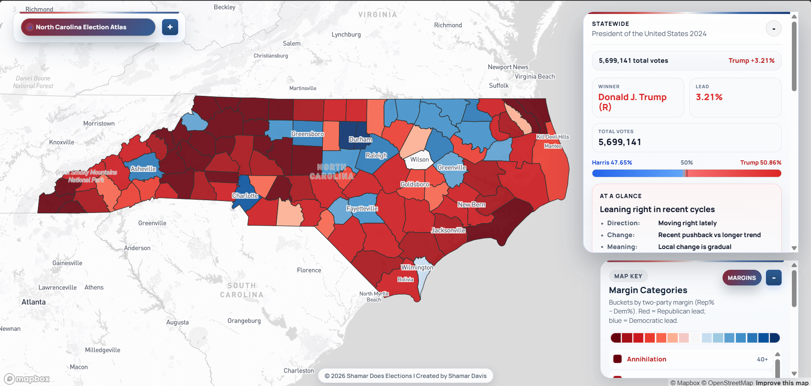
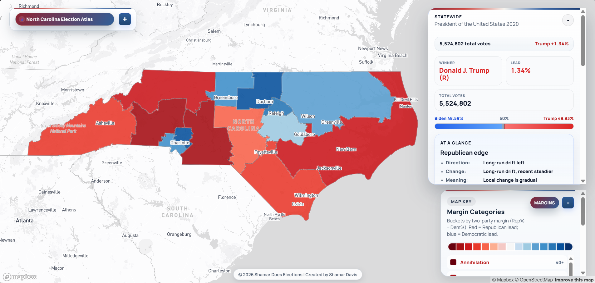
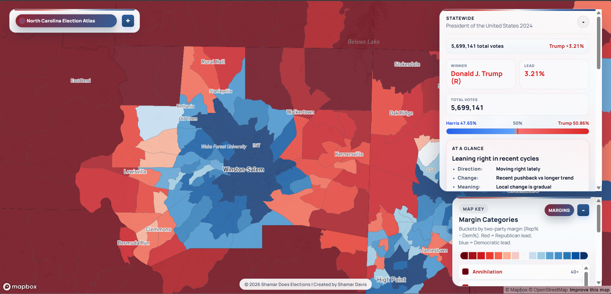
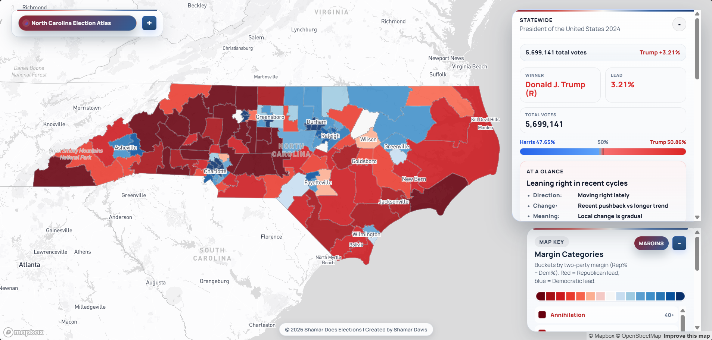
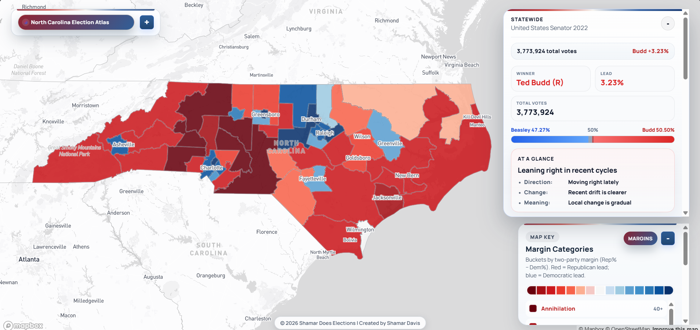

# NCPrecinctMap
[](LICENSE)


**NCPrecinctMap** is an interactive web-based map for exploring North Carolina election results at the precinct and district level, covering general elections from **2000 through 2024**. It is designed for researchers, journalists, and citizens who want to understand how election results map onto changing precinct and district boundaries over time.

The live app is now presented as **North Carolina Election Atlas**, which is the public-facing name used in the current UI.

**Live site:** [https://tenjin25.github.io/NCElectionAtlas/](https://tenjin25.github.io/NCElectionAtlas/)

---

## Screenshots

**Counties view — 2024 Presidential Compromise Color Palette**


**Congressional Districts — 2020 Presidential**


**Precinct view — Forsyth County zoomed in**


**State House — 2024 Presidential** 


**State Senate - 2022 US Senate**


---

## Project Overview

North Carolina's election data is complex: precinct boundaries and IDs change frequently, and non-geographic voting buckets (like early voting or absentee) do not map cleanly to physical locations. This project focuses on two hard problems:

- **Making historical precinct-level results usable with modern geometry** (handling precinct ID changes, splits, merges, and early-vote/absentee buckets that don't map to geography)
- **Showing district results on consistent district lines** — district views default to the court-ordered 2022 MQP lines (see below), with an optional toggle to 2024 lines for comparison; results are reallocated via block/VAP crosswalks where needed

The project is powered by prebuilt JSON data slices and raw [OpenElections](https://openelections.net/) precinct CSVs, with geometry from NC OneMap / NCSBE and Census Bureau TIGER files.

## Who This Atlas Is For

- **General public:** See how your county or precinct voted without downloading data files or GIS tools.
- **Students and educators:** Explore long-run election trends (2000-2024) with map-first visuals that are easier to use in class projects.
- **Political junkies and campaign watchers:** Compare margins, flips, shifts, and district outcomes quickly across multiple election years.
- **Data journalists and researchers:** Use the map for rapid story discovery, then trace the underlying JSON/CSV inputs and coverage diagnostics in this repo.
- **Civic tech and redistricting users:** Inspect how statewide results look when reallocated to a consistent district baseline (2022 MQP), and compare against the 2024 line option.

### Quick Start by Audience

- **General public:** Open the live site, pick a contest/year, click a county or precinct, and read winner/margin/trend cards.
- **Students:** Start with Counties view, then switch to Congressional/State House/State Senate to compare the same contest across geographies.
- **Political junkies:** Use `Compare`, `Split-ticket`, `Shift`, `Flips`, and `Reset View` to scan for ticket splitting, realignment, and crossover patterns.
- **Data journalists:** Pin a county/precinct/district, use `Copy Link` for reproducible map state, use the pinned hover tooltip `Copy` button for quick labels, and cross-check with files in `data/contests/` and `data/reports/`.

## Why the 2022 Court-Ordered (MQP) Lines?

District views (Congressional, State House, State Senate) default to the **court-ordered "MQP" remedial maps** drawn in 2022 by court-appointed Special Masters following the NC Supreme Court's ruling that the legislature's own maps were unconstitutional partisan gerrymanders.

These lines were chosen as the consistent historical baseline for two reasons:

1. **Neutrality** — they were drawn by independent experts under court supervision, not by either party, making them the most politically neutral set of modern statewide district lines available. Using party-drawn maps as a baseline would embed partisan intent into the geographic frame when comparing results across years.
2. **Practical coverage** — the 2022 remedial maps were actually used for a real election (the 2022 general), making them a grounded modern baseline for reallocating earlier results.

Historical district views are still presented on the selected modern district line set (default 2022 MQP). Historical election results remain canonically allocated to the **December 2025 OneMap/SBE precinct basis** at `data/census/SBE_PRECINCTS_20251212/SBE_PRECINCTS_20251212.shp`, with 2020-block assignments in `data/crosswalks/block20_to_onemap_2025_12.csv`. The live precinct overlay uses the **August 24, 2026 SBE precinct layer** and maps the December 2025 keys forward through `data/crosswalks/precinct_stable_to_sbe_2026_08_24_best_old_to_new.csv`.

The current bridge chain has two main branches. Modern SBE precinct vintages for **2020, 2022, and 2024** are VAP-weighted to the December 2025 OneMap basis. Early-era SBE 2006 is reached through [NHGIS](https://www.nhgis.org/) block-to-block crosswalks: `2000 tabblocks -> NHGIS 2000-to-2010 -> NHGIS 2010-to-2020 -> SBE 2006 precincts -> Dec 2025 OneMap / modern districts`.

For the most difficult **2000, 2002, and 2004 urban-county district allocations**, the atlas now adds a Census 2000 SF1 / historical-plan layer before the modern-district aggregation. It combines Census VTD codes and voting-age population, official historical NCGA block-assignment files, NCSBE voter-history code evidence, and the NHGIS 2000-to-2010-to-2020 bridge. The 2000 path requires an exact VTD to agree with the precinct's historical House/Senate/congressional cell; otherwise it falls back to the matching historical plan cell. The 2002/2004 path uses direct SF1 VTD matches where supported, historical-plan cells for rejected/split codes, and narrowly documented SBE 2006 lineage fallbacks. For Buncombe in 2004, 68 explicit county-year precinct aliases now take priority over coarse plan cells so the 2022 SD-46/SD-49 split retains Asheville-versus-outer-county geography; three precincts without a unique alias remain BAF-backed plan-cell estimates. These remain VAP-weighted estimates rather than reconstructed cast-vote records at the block level.

## Features

- **Multiple Views:** Counties, Precincts (zoomed in), Congressional Districts, State House, State Senate
- **District Lines Toggle (2022 / 2024 / 2026):** District views can switch between the 2022 MQP baseline and 2024 lines; the 2026 option supplies the enacted `SL 2025-95` congressional plan while State House and State Senate continue to use the 2024 slices. The first alternate-line load can take longer while boundary GeoJSON downloads/parses.
- **Progressive District Linework (DRA-style):** Congressional/State House/State Senate boundaries use a bright halo + crisp charcoal inner stroke with smooth zoom interpolation, stronger statewide readability, and a close hierarchy (Congress strongest, Senate very close, House only slightly thinner)
- **Contest Picker:** Only valid contests for the current view are shown, driven by manifest files
- **Contest Comparison:** `Compare` can map any two available contests as the change in signed R−D margin from the comparison contest to the primary contest. It works on counties, Congressional districts, State House districts, and State Senate districts; supports cross-year and same-year ticket-split pairs; includes statewide and judicial races on county layers; and adds named outcomes to hover and pinned-detail cards. The selected pair is preserved in share links.
- **Comparison Source Caution:** Comparison cards call out modeled contests and geographic estimates so small changes are not mistaken for exact shifts when the source boundaries or vote allocations differ.
- **Data Export:** Export the active map view as CSV for spreadsheets or JSON for programmatic analysis. Exports are generated entirely in the browser and include vote totals, percentages, margins, contest names, and comparison fields when Compare mode is active, so GitHub Pages remains static and fast.
- **Atlas-Style Desktop UI:** Refined left/right control rails, statewide snapshot cards, and map-first layout inspired by modern election atlas interfaces
- **Mobile Dock + Sheet UI:** On phones, Search / Layers / Legend open as bottom sheets with snap states (collapsed, half, full) so controls stay reachable without covering the map
- **Regional Quick Jumps:** Grouped metro, region, and corridor shortcuts—including Southeast NC—zoom to their selected counties and pin an aggregated regional result summary
- **Unopposed Filtering:** Unopposed Council of State contests and uncontested / same-party-only judicial contests are hidden from the Counties picker. Judicial district overlays must also match an authoritative statewide contest, preventing stale uncontested district slices from appearing as all-`Other` ties.
	- **Hover + Sidebar Details:** Margins, vote shares, flip/shift modes, statewide summaries, and trend history for each geography
	- **County Focus Panel (Newsroom-style):** Clicking a county gives a dominant **At a glance** summary (winner, margin strength, vote split, story, “what to watch”), plus a short **Why it votes this way** explainer, a **Confidence** meter, and a one-line **Compared with North Carolina** context sentence; deeper detail stays behind expandable sections
	- **Trajectory / Status Card:** County/district/precinct trend panels include an edge-case-aware trajectory block with composite labels such as `Stable Republican (Stronghold)`, `Strengthening Democratic (Edge)`, `Emerging Republican (Tilt)`, or `Battleground`, with the category pill stacked under the trajectory header for more readable long labels
	- **Trajectory Snapshot Add-ons (Structured):** Appends a subtype line, a `Margin Category` line (Stronghold/Safe/Likely/Lean/Tilt/Tossup), and a `Growth Dynamic` note beneath the `Latest Result` row (`R +X · D +Y`); `Latest Result` is styled as the dominant headline, with long-term and vote-change lines de-emphasized and a softer (reduced-motion-respecting) shift arrow pulse
	- **County Census Context:** County sidebar panels add qualitative Census-style growth context (`Urban anchor`, `Metro spillover`, `Coastal growth`, `Rural slowdown`, `Mixed growth`) to frame why local trajectories may be changing, and can now surface a supporting `Census check` inside the trajectory card when population growth clearly reinforces the electoral direction
	- **County Census Insight Growth Type Chip:** The in-popup `County Census Insight` block now appends a small growth-type chip (`🌊 Coastal Growth`, `🌆 Metro Spillover`, `🛣️ Corridor Growth`, `🏭 Stable / Local Growth`) derived from county heuristics
	- **Dynamic Competitiveness Tier Labels:** Focus headers and hover cards show tier labels (for example, `Safe Republican` / `Stronghold Democratic`) derived from the same margin thresholds used for map styling
	- **Default Atlas/DRA Compromise 15-Tier Palette:** The active table blends the original Atlas colors with a modified version of the DRA color table across Margins, Winners, Shift, and Flips in county, precinct, and district views. It maps directly to the atlas's 40/30/20/10/5.5/1/0.5-point margin thresholds, with darker strongholds and smoother competitive transitions. `DRA Colors On` under `More` can be switched off to use the unchanged original Atlas palette; the choice is remembered. Demographics, Population Change, and colorblind mode retain their own semantic palettes.
	- **Comparative Controls:** One-click split-ticket overlay (`President` base with `Governor` overlay) plus a what-if swing slider for fast scenario exploration
- **Modeled 2026 Statewide Races:** Synthetic `US Senate (2026) model` and `NC Supreme Court Associate Justice Seat 1 (2026) Model` entries use recent statewide baselines and respond to the same swing controls as real contests. The Senate model uses `2022 + 2020 US Senate` anchors and the `2024 President` climate, all loaded from the production precinct slices. County and statewide comparisons are derived in memory from those precinct rows; files in `data/county_contests/` and attached county-total sidecars are not frontend authorities for modeled output. Reliability, repeatability, anomaly, federalization, and candidate-coalition brakes allow realistic ticket splitting without turning the race into a presidential clone. A precinct reconciliation step preserves each calibrated county target without flattening precinct ordering. The current calibration gives Cooper stronger Guilford, Pitt, Northampton, and App State-centered Watauga performance, gives Chatham and Granville softer Triangle-adjacent treatment, and allows Whatley to approach Budd-like margins in selected rural areas. A Senate-only turnout-composition layer keeps the raw precinct and **Congressional / State House / State Senate** statewide aggregates near one another. In modeled mode, the statewide summary includes a compact methodology indicator, while **What-if & overlays** exposes light model-tuning sliders and `Copy Link` preserves non-default tuning.
- **Layering Controls:** Turnout-intensity opacity mode and overlay opacity presets (`Reveal map`, `Balanced`, `Focus overlay`) for cleaner map readability
- **Demographics Mode:** County, district, and precinct overlays can be shaded by plurality race share (white / black / Hispanic, plus Native / Asian / Pacific / multiracial / other where available), with synchronized legend colors in both standard and colorblind palettes
- **High-Contrast Demographics Toggle:** Optional high-contrast demographic shading and chip styling for better visibility on dark tooltip surfaces
- **Unified Demographic Hover Cards:** County, precinct, and district hover cards use the same compact race-share chip layout in Demographics mode, with the demographic summary shown before election results. County mobile/sidebar details prefer CVAP race shares when available, and source notes distinguish CVAP totals and shares from VAP or total-population fallbacks.
- **Precinct Click Behavior (Precincts On):** Clicking a precinct is passive (no selection/highlight, no pinned tooltip, no zoom). Hover remains the primary interaction.
- **CVAP Hover Totals (Optional):** When available, hover cards prefer RDH `CVAP_TOT24` (citizen voting-age population, 18+) for “total” metrics; otherwise they fall back to VAP/total population (this does not change election calculations)
- **Recount Radar Badge:** A live topbar badge appears at higher zoom when the active focus margin is under `0.5%`, showing vote margin and percent gap
- **Barometer Counties (Optional):** Click the `Barometer` legend chip to outline counties that mirror the statewide two-party margin most closely across the last 2–3 available cycles for the selected contest (purple outline; off by default)
- **Story Copy + Loading Skeletons:** Story cards can be copied to clipboard in one click, and trend/story panels show lightweight skeleton loaders while data is loading
- **Mobile "MapTalk" Actions:** `Find My Precinct` (GPS) and `Story Snapshot` (9:16 share export of current map view)
- **Share + Reset Actions:** `Copy Link` captures the current deep-linked map state (view/contest/mode/lines/focus plus scenario swing/scope and any model tuning); `Reset View` recenters/clears pinned focus; `Reset Swing` returns scenario shift to `0.0%`
- **Advanced Analytics Cards:** Realignment Index (`Top shifting precincts`) and Ghost Precinct tracker for unmatched-key transparency
- **Source & Confidence Inspector:** The focus panel identifies certified county totals, official NCGA benchmarks, calibrated or high-coverage estimates, bridged precincts, county fallbacks, and modeled scenarios. Expand the card to see direct-match coverage, non-geographic vote handling, boundary basis, and the source bridge when those fields are available.
- **Custom county regions:** Under Quick Jumps, name a region and select its counties. The saved region appears as a jump button, uses the existing regional totals/trend calculations, and is included when you copy a link while it is selected. One region is saved per browser.
- **Accessibility Support:** Colorblind palette toggle (`B`), live screen-reader summaries for hovered/selected results, keyboard focus rings (`:focus-visible`), reduced-motion support, and stronger map label halos for town/county labels
- **State URL Sync:** View/contest/mode/district-lines/focus are encoded in URL params so links reopen to the same map state
- **County Population Change Mode:** Counties view includes a `Pop Change` visualization mode for 2020-2025 Census Vintage population change, with percent/absolute metric toggle and a dedicated legend badge/subtitle
- **Compact Map Key:** Margins use named category rows; Winners, Flips, and Demographics use color swatches, while Shift and Compare use a 15-step diverging spectrum with labeled 0.5-, 1-, 5-, 10-, 15-, 20-, and 25-point thresholds on either side of zero (including a colorblind-safe blue/orange option).
- **Margin Categories (Map Key):** Category chips are *absolute* two-party margin buckets (|Rep% − Dem%|), while the red/blue spectrum shows the signed margin (Rep% − Dem%).
- **Judicial Contests:** NC Supreme Court and Court of Appeals seats in Counties / Precincts (and district overlays) when a meaningful major-candidate comparison can be shown. Coverage includes **seat-numbered** comparable races for **2000–2006** plus named-seat / seat-numbered contests from **2008 onward**. Ballots were nonpartisan in **2004–2016**; DEM/REP display parties generally come from `data/mappings/judicial_candidate_party_overrides.csv` (for example 2004 Orr vacancy: James A. Wynn, Jr. → DEM, Paul Martin Newby → REP; remaining plurality field → OTHER). The exceptional 19-candidate 2014 Seat 10 vacancy compares the actual top two candidates—John S. Arrowood and John M. Tyson—while preserving all other candidates as OTHER instead of combining party-endorsed candidates. Named historical contests are joined to modern numbered seats through stable seat families (for example, Martin Seat → Seat 10). Seat lineages use Wikipedia seat numbers via `data/mappings/judicial_seat_crosswalk.csv`. Tooltips and panels prefer OpenElections nicknames in parentheses when present (for example, `Mike Morgan`, `Bob Edmunds`)
- **Flexible Data Model:** Add new contests, years, or district lines by updating manifests and data files

## Recent Updates

See [the change history](CHANGELOG.md) for the dated development notes. The current features and limitations are documented below.

The main stylesheet lives in `css/atlas-main.css`; the smaller `index.html` keeps the page structure and application script. The current asset cache token is `2026-09-23-atlas-reliability-v4` and is shared by the stylesheet, local modules, and data requests. The published contest catalog can be checked with `npm run validate:data`, which verifies manifest targets and vote-row arithmetic. CI runs that check along with core tests and inline-script parsing. Before publishing, run `npm run test:core` and `npm test` as well; the browser suite exercises the map UI.

## UI Performance Enhancements

The current `index.html` includes several speed-focused improvements that are already live in the app:

- **Manifest-first contest indexing:** Contest dropdowns are built from `data/contests/manifest.json` and `data/district_contests/manifest.json`, avoiding expensive full-data scans for availability.
- **Slice/result caching:** In-memory caches (`contestSliceCache`, `districtSliceCache`, `candidateNameCache`) reduce repeated fetch/parse work while switching contests or views.
- **In-flight request dedupe:** Promise-based in-flight maps (`jsonInflightByPath`, `csvInflightByPath`, `contestSliceInflight`, `districtSliceInflight`) prevent duplicate concurrent loads during rapid switching.
- **Warm caches across normal use:** Contest/district slice caches stay warm across view switches and hydration, rather than being reset unnecessarily.
- **Lazy precinct loading:** County/district layers load first; precinct polygons load on demand, while centroids are used for faster statewide interaction.
- **Centroid-first rendering path:** Precinct centroids are shown at lower zoom, then polygons take over at higher zoom to keep navigation responsive.
- **Missing-polygon fallback:** Centroids remain visible for precincts without polygon geometry so data stays interactive without blocking rendering.
- **RAF-throttled hover updates:** Hover handlers use `requestAnimationFrame` and feature-state highlighting to reduce pointer-move churn and flicker.
- **Worker-based CSV parsing fallback:** Historical presidential OpenElections CSVs are stream-parsed in a Web Worker (Papa Parse) when needed, reducing main-thread UI stalls.
- **Deferred trend loading:** County trend series are loaded asynchronously so contest application and map recoloring happen immediately.
- **County trend series caching:** Aggregated county history is cached in-session (`countyTrendSeriesCache`) so re-selecting counties is snappier.
- **Precinct trend matching fallback:** Selected precinct trend lookups now use precinct alias/variant matching across years, then fall back to county history when no valid precinct series is found.
- **Counties-mode contest switch optimization (March 3, 2026):** Contest changes with `Precincts Off` now avoid unnecessary precinct matching/index work, improving responsiveness and reducing main-thread churn.
- **Cached derived aggregates:** County rollups + statewide totals are cached per contest/year/modeled signature + scenario inputs (`countyAggregateBundleCache`) to avoid re-looping the full row arrays.
- **Cached Mapbox color expressions:** County and precinct color expressions are cached per contest/year/mode/toggles and reused on re-apply, reducing repeated `setPaintProperty` churn.
- **Lazy legacy district fallback:** The large `district_election` fallback payload is deferred until users actually need district fallback lookups.
- **Optional pipeline timings:** Set `localStorage.setItem('atlasPerfDebug','1')` to log `[atlas] ...ms` timings (slice loads, aggregate builds, etc.).

## UI and Presentation Notes

- **Desktop atlas layout:** The main map now uses dedicated desktop rails instead of treating controls and summaries like generic floating cards.
- **Statewide snapshot focus:** The right-side summary stays visible while browsing counties, districts, and prior-election trend history.
- **Regional focus mode:** Quick-jump presets can pin multi-county regional summaries and use the same top-right module as statewide and county selections.
- **Trend display:** The top-right trend area now uses a more readable history/timeline layout rather than leaning on a compact line graph alone.
- **Selection clarity:** Selected precincts (via search/GPS/deep links) keep a yellow highlight and zoomed focus so selection is distinct from hover/overlay styling.
- **Header language:** The control header and minimized state now use the full `North Carolina Election Atlas` title in pill form for stronger branding and consistency.
- **Responsive winner labels:** The winner pill keeps full candidate names on wider desktop widths and shortens them only when space is tighter.

## Demographics Mode Guide

### What Demographics Mode Displays

- **Primary signal:** Each geography is colored by the largest reported race share among available fields.
  - County/precinct overlays use white, black, Hispanic, Native, Asian, Pacific, and multiracial shares when present.
  - District overlays use the district CSV race-share columns (white/black/Hispanic, plus Native/Asian/Pacific/Multiracial/Other where present).
- **Near-tie handling:** If the top two race shares are effectively tied, the map uses a mixed-color class (`Near tie / mixed`) rather than forcing one group.
- **No-data handling:** Geographies without usable fields render as `No demographic data`.

### Data Source by View

- **Counties:** `data/county_demographics_2020_2024_cvap.json` (official 2020–2024 ACS CVAP race/ethnicity estimates, released January 30, 2026).
- **Congressional / State House / State Senate:** District demographic CSVs (`data/nc_congressional_districts.csv`, `data/nc_state_house_districts.csv`, `data/nc_state_senate_districts.csv`).
- **Precincts:** `data/precinct_demographics_2020_vap.csv` (block-aggregated precinct VAP race fields).

### Controls and URL State

- Switch map mode using the `Demographics` button in the visualization mode row.
- Use `High contrast demographics` to force stronger demographic fills/chips (especially useful over dark tooltips).
- Colorblind mode (`B` or the accessibility toggle) continues to apply in demographics mode; legend swatches stay synchronized with the active palette.
- Deep-link state is preserved in URL parameters:
  - `mode=demographics`
  - `democontrast=high` (parser also accepts `demo_contrast`)

### Hover/Sidebar Behavior

- County and precinct detail cards include race-share chips for quick demographic context.
- District detail cards show additional race lines (Native / Asian / Pacific / Multiracial / Other) when a group is ≥ 30%.
- Hover cards include a compact competitiveness tier chip next to winner/shift/flip badges (instead of relying only on a small title badge).
- Recent styling passes specifically targeted county hover, precinct hover, and pinned tooltip readability on dark backgrounds.
- If a field is missing for a group, the chip can display `N/A` while the map still renders any available race shares.

## Regional Presets

The preset region buttons are more than camera shortcuts. They use curated North Carolina county groups so the app can calculate grouped results and trend history for commonly used regions.

- **Current presets:** Triangle, Triad, Charlotte Metro, Asheville Metro, Fayetteville Metro, Western Mountains, Foothills / Unifour, Sandhills, Inner Banks, NC Coast, Cape Fear, Southeast NC, and I-95 Corridor
- **How they work:** Clicking a preset zooms the map and pins an aggregated multi-county summary in the top-right analysis panel
- **Zoom bounds:** Bounds are derived from the same county boundary features used by the selected preset, then padded in the map viewport. This keeps every included county visible when boundary data is available.
- **Southeast NC source:** The 12 counties follow [NC Commerce's Southeast Prosperity Zone](https://www.commerce.nc.gov/about-us/divisions-programs/rural-economic-development-division/nc-main-street-rural-planning-center).
- **Definition note:** These are curated regional groupings for atlas use, so they may not match every economic-development, media-market, or commuting-region definition

## Current Limitations

- **District-only precinct coloring:** Precinct overlays on district maps work best for statewide contests. True precinct coloring for district-only races still depends on having precinct-level district results.
- **Non-geographic vote buckets:** Early vote, absentee, provisional, and similar buckets remain in totals but do not map to precinct shapes.
- **Regional definitions:** Region margins depend on the county set chosen for that preset, so broader or narrower definitions (for example Charlotte, Triad, Coast, or Sandhills) will change the result.

## What to Expect on the Live Site

Visit [https://tenjin25.github.io/NCElectionAtlas/](https://tenjin25.github.io/NCElectionAtlas/) — no installation or login required.

- **Interactive Map:** Zoom and pan across North Carolina, with overlays for counties, precincts, and legislative districts.
- **Contest Picker:** Select from available contests (President, US Senate, Governor, State House, etc.) and election years. Only contests with data will appear.
- **Dynamic Views:** Switch between Counties, Precincts, Congressional Districts, State House, and State Senate. The map and sidebar update to reflect your selection.
- **Regional Presets:** Grouped quick jumps cover metro areas, broad regions (including Southeast NC), and the I-95 corridor; each zooms to its included counties and shows grouped vote summaries.
- **Hover and Sidebar Details:** See candidate names, vote totals, margins, and trend lines for any geography.
- **Demographics Layering:** Use `Demographics` mode to shade geographies by plurality race share, with optional high-contrast rendering for better visibility.
- **Data Coverage:** Precinct-level results span **2000–2024**. Some contests or years may be incomplete depending on source data availability.
- **Judicial and Special Contests:** Appear in the Counties view contest picker where available.

**Navigation Tips:**
- Use the zoom controls or mouse wheel to zoom in/out.
- Click on a map feature for detail in the sidebar.
- If a contest or year is missing from the dropdown, it has not yet been processed into the data pipeline.

**Note:** This is a static site — all data loads directly from the repository's JSON and GeoJSON files. If you see stale results, try a hard refresh (Ctrl+Shift+R).

## Data Sources

| Data | Source |
|------|--------|
| Precinct-level election results | [OpenElections North Carolina](https://github.com/openelections/openelections-data-nc) |
| Precinct boundaries | August 24, 2026 SBE precinct source archive (`data/SBE_PRECINCTS_20260824.zip`) for display; December 2025 and older SBE vintages retained for historical allocation |
| Census block geography | US Census Bureau TIGER/Line files |
| Block-to-precinct crosswalks | Current target: `data/crosswalks/block20_to_onemap_2025_12.csv`; older SBE vintage maps remain in `data/crosswalks/` |
| Block-to-block crosswalks (cross-vintage) | [NHGIS Longitudinal Block Crosswalks](https://www.nhgis.org/documentation/tabular-data/crosswalks) |
| Precinct-to-precinct bridges | VAP-weighted SBE vintage / SBE 2006 bridges in `data/crosswalks/` and `data/mappings/` |
| District lines (2022 MQP + optional 2024) | Court-ordered remedial maps (2022 MQP); US Census TIGER/Line 2024 (CD/SLDL/SLDU) |

### Crosswalk Coverage Audit

The historical allocation target is the December 2025 OneMap/SBE precinct layer; the browser maps it forward to the August 24, 2026 display layer. Coverage below is read from the existing CSV/JSON bridge artifacts rather than recomputed contest outputs.

| Chain | Main artifact(s) | Current coverage | Keys / notes |
|-------|------------------|------------------|--------------|
| December 2025 OneMap target | `block20_to_onemap_2025_12.csv` | 236,633 / 236,638 NC 2020 blocks (99.9979%) | 2,632 target precinct keys |
| Dec 2025 target -> Aug 2026 display | `precinct_onemap_2025_12_to_sbe_2026_08_24_*.csv`; composed browser bridge `precinct_stable_to_sbe_2026_08_24_best_old_to_new.csv` | 2,632 / 2,632 old precincts and 2,625 / 2,625 new precincts matched | 17 retired keys map to 10 replacement keys across seven counties; unchanged keys retain identical geometry |
| Early era / SBE 2006 | `block20_to_sbe_2006_via_block00_nhgis_filled.csv`; `sbe2006_to_onemap_precinct_*.json`; `sbe2006_to_modern_district_weights.json` | 236,638 / 236,638 blocks in the filled SBE 2006 map (100.0000%); district bridge report covers 2,715 / 2,715 SBE 2006 precincts in each modern district scope | 2,715 SBE 2006 precincts; 2,632 Dec 2025 target precincts |
| 2020 SBE precincts -> Dec 2025 OneMap | `precinct_sbe_2020_to_onemap_2025_12_vap.csv` | 8,155,075 / 8,155,075 source VAP assigned (100.0000%) | 2,658 source precincts -> 2,632 target precincts |
| 2022 SBE precincts -> Dec 2025 OneMap | `precinct_sbe_2022_to_onemap_2025_12_vap.csv` | 8,155,080 / 8,155,080 source VAP assigned (100.0000%) | 2,663 source precincts -> 2,632 target precincts |
| 2024 SBE precincts -> Dec 2025 OneMap | `precinct_sbe_2024_to_onemap_2025_12_vap.csv` | 8,155,075 / 8,155,075 source VAP assigned (100.0000%) | 2,656 source precincts -> 2,632 target precincts |

Production SBE 2006 bridge artifacts include `data/mappings/sbe2006_to_onemap_precinct_bridge.json` (17,673 county-scoped alias rows), `data/mappings/sbe2006_to_onemap_precinct_weights.json` (VAP-weighted precinct shares), and `data/mappings/sbe2006_to_modern_district_weights.json` (seven modern district scopes across 2022, 2024, and 2026 line sets). Debug overlays for inspecting the SBE 2006 bridge against current precinct geometry live in `data/reports/`.

## Getting Started

This project is deployed on GitHub Pages and requires no local setup to use. Simply visit the [live site](https://tenjin25.github.io/NCElectionAtlas/).

To build or modify data files locally, you will need Python 3.x and PowerShell. See the "Rebuilding Data" section below.

For GIS rebuilds, use the repo's virtual environment so `geopandas`, `shapely`, `pyproj`, `pyogrio`, and `rtree` resolve consistently:

```powershell
.\.venv\Scripts\activate
python scripts\build_block_crosswalk_to_current_onemap.py
```

If you prefer not to activate the shell, call the venv interpreter directly:

```powershell
.\.venv\Scripts\python.exe scripts\reaggregate_cd2026_lines.py
```

### Automated UI Regression (Playwright)

The repository now includes a focused Playwright suite that covers key interaction regressions:

- Load state with no contest selected (pre-contest defaults)
- Split-ticket overlay toggle (`President` base + `Governor` overlay)
- Precinct selection flow (search/jump, yellow selection target, zoom-in behavior)
- Story snapshot exports for all layout variants (`Balanced`, `Instagram`, `TikTok`)

Run locally:

```bash
npm install
npm test
```

Optional commands:

```bash
npm run test:core
npm run test:headed
npm run test:ui
npm run test:report
```

`test:core` runs fast Node regression tests for deterministic helpers extracted
from the main page. The browser-facing function names remain in `index.html` as
compatibility wrappers, so existing call sites can be migrated incrementally.

### Directory Structure

- `js/atlas-classification.js` — Shared trajectory rules, growth archetypes, and election-shift labels
- `js/atlas-data.js` — Shared resource paths, cache busting, request deduplication, and payload mapping
- `js/atlas-manifest.js` — Shared contest visibility and historical judicial-seat family helpers
- `js/atlas-modeling.js` — Shared modeled-contest signatures, county behavior labels, and confidence scoring
- `js/atlas-provenance.js` — Source and confidence labels for certified, estimated, and modeled results
- `js/atlas-regions.js` — Shared quick-jump county normalization and regional vote aggregation
- `js/atlas-custom-region.js` — Saved custom county selection and geometry bounds
- `js/atlas-trends.js` — Shared historical-series normalization, anchor shifts, and volatility analysis
- `js/atlas-turnout.js` — Shared turnout quantiles, opacity bands, and Mapbox expressions

- `js/atlas-core.js` — Shared deterministic normalization, precinct-alias expansion, and vote-math helpers
- `js/atlas-display.js` — Shared display rounding, close-race formatting, and HTML escaping
- `js/atlas-election.js` — Shared vote-swing, quantile, contest parsing, and flip helpers
- `js/atlas-url-state.js` — Shared URL token normalization and share-state parsing
- `core-tests/` — Fast deterministic helper regression tests
- `tests/` — Browser and data regression tests
- `scripts/validate_data_catalog.js` — Published manifest and vote-row validation
- `scripts/check_inline_scripts.js` — Inline application script syntax check

- `index.html`, `NCMap.html` — Main web app entry points
- `data/` — All data files (see below)
- `scripts/` — Python scripts for building and processing data
- `_external/` — External data sources and raw files

## Data Layout

### 1. County/Precinct Contest Slices (Counties View)

- `data/contests/<contest_type>_<year>.json` — Precinct-level results for a contest/year
- `data/contests/manifest.json` — List of available contests for the Counties view (including contested metadata)

Each row is keyed as `"COUNTY - PRECINCT"` and includes candidate names and vote totals:

```json
{ "county": "WAKE - 01-07", "dem_votes": 123, "rep_votes": 456, "dem_candidate": "...", "rep_candidate": "..." }
```

The Counties view aggregates these rows to county totals and also uses them to power precinct hovers (where precinct geometry exists).

`data/contests/manifest.json` entries now include:

- `rows`
- `dem_total`
- `rep_total`
- `total_votes`
- `major_party_contested`

The Counties dropdown uses `major_party_contested` to suppress unopposed Council of State contests and uncontested judicial contests.

### 2. Precinct Geometry (Precincts Overlay)

- `data/2026Voting_Precincts.geojson` — Live polygon boundaries for the atlas precinct overlay (August 24, 2026 SBE keyspace)
- `data/2025Voting_Precincts.geojson` — Canonical December 2025 geometry retained for historical result allocation and bridge generation
- `data/Voting_Precincts.geojson` — Earlier precinct geometry retained for scripts/comparisons that still reference it
- `data/precinct_centroids.geojson` — Point locations (used for high-zoom fallback/indexing)
- `data/precinct_alias_index.json` — County-scoped alias index for resolving variant precinct keys (code/name combos, spacing/underscore variants, etc.)
- `data/precinct_friendly_names.json` — County-scoped `precinct_code → display_name` labels used to show human-readable precinct names in hover/selection UI
- `data/mappings/judicial_candidate_party_overrides.csv` — Nonpartisan / blank-party judicial candidate → DEM/REP/OTHER affiliations used when building county/precinct contest slices (2004–2016 and selected later blanks)
- `data/mappings/judicial_seat_crosswalk.csv` — OE office labels for early appellate races ↔ Wikipedia seat number ↔ atlas `contest_type` (used by the create-only early judicial builders)

To rebuild the 2026 display geometry from the extracted NCSBE shapefile:

```powershell
Expand-Archive data/SBE_PRECINCTS_20260824.zip data/census/SBE_PRECINCTS_20260824
py scripts/build_voting_precincts_geojson.py --in-shp data/census/SBE_PRECINCTS_20260824/SBE_PRECINCTS_20260824.shp --out-geojson data/2026Voting_Precincts.geojson --out-centroids ""
py scripts/build_precinct_geometry_crosswalks.py --old data/2025Voting_Precincts.geojson --new data/2026Voting_Precincts.geojson --old-label onemap_2025_12 --new-label sbe_2026_08_24 --min-share 0.01 --out-prefix data/crosswalks/precinct_onemap_2025_12_to_sbe_2026_08_24
py scripts/compose_precinct_frontend_bridge.py --previous data/crosswalks/precinct_stable_to_nconemap_2026_07_best_old_to_new.csv --next data/crosswalks/precinct_onemap_2025_12_to_sbe_2026_08_24_best_old_to_new.csv --out data/crosswalks/precinct_stable_to_sbe_2026_08_24_best_old_to_new.csv
py scripts/build_precinct_centroids_geojson.py
py scripts/build_precinct_alias_index.py
```

To (re)generate friendly precinct display names from the alias index + live geometry:

```powershell
node scripts/build_precinct_friendly_names.js
```

Notes:
- This mapping is intentionally **county-scoped**: the same short code can mean different things in different counties.
- If a code has no known friendly name, the UI falls back to showing the raw code.
- The centroid, alias, and friendly-name builders default to `data/2026Voting_Precincts.geojson`; friendly-name county overrides still apply last so confirmed labels are not overwritten by smash tokens.
### 3. District Contest Slices (District Views)

- `data/district_contests/<scope>_<contest_type>_<year>.json` — Aggregated results for each district
- `data/district_contests/manifest.json` — List of available contests for district views
- `data/district_contests_2024_lines/<scope>_<contest_type>_<year>.json` — Parallel district slices for the 2024 district-line mode

Where `scope` is one of: `congressional`, `state_house`, `state_senate`.

Each file contains already-aggregated results and coverage metadata.

Review-only audit folders may also appear in `data/` (for example `data/district_contests_shapefile_overlap/` or `data/district_contests_dra_review/`). Those are comparison artifacts and are not read by the live atlas unless the front end is changed to point at them.

### 4. Statewide County Results (Fallback)

- `data/nc_elections_aggregated.json` — Used as a fallback for some contests/years

### 5. District Descriptions (Optional)

- `data/district_descriptions.json` — Human-readable labels for districts (used in hovers/sidebars)

```json
{
  "congressional": { "13": "Wake County (Raleigh) + Johnston (partial)" },
  "state_house": { "037": "Cary + Apex (West Wake)" },
  "state_senate": { "019": "Sampson & Bladen Counties" }
}
```

### 6. Demographic Overlays (Optional)

- `data/county_demographics_2020_dp1.json` — County-level demographic shares used for county hover/sidebar and demographics mode
- `data/nc_congressional_districts.csv` — Congressional district demographic shares
- `data/nc_state_house_districts.csv` — State House district demographic shares
- `data/nc_state_senate_districts.csv` — State Senate district demographic shares
- `data/precinct_demographics_2020_vap.csv` — Precinct-level VAP demographics aggregated from 2020 blocks

## Precinct Matching and Non-Geographic Votes

Many precinct exports include buckets like Absentee by mail, One Stop/Early vote, Provisional, and Transfer. These do **not** map to precinct geometry, and treating them as real precincts will distort maps (especially in Wake/Meck).

The district-building pipeline and front-end treat these as **non-geographic** and either:

- keep them only in statewide/county totals, or
- allocate them using candidate shares / county weights (depending on mode)

## Rebuilding Data

### Rebuilding District Slices

Use `scripts/build_district_contests_from_batch_shatter.py` to process an OpenElections precinct CSV and generate district-level results.

**Example:** Rebuild president + US senate for 2008:

```powershell
py scripts/build_district_contests_from_batch_shatter.py `
  --year 2008 `
  --results-csv data/2008/20081104__nc__general__precinct.csv `
  --office-source auto `
  --contest-type-regex "^(president|us_senate)$"
```

This produces three district slice files (congressional, state_house, state_senate) and updates the manifest.

**Note (2024 lines accuracy):** If you see obvious district misallocation in modern precinct-coded counties (for example, Gaston precinct numeric codes vs `A`-suffix geometry codes), rebuild using a block→precinct crosswalk derived from the official SBE precinct geometry for the same era. This improves precinct-key match coverage and reduces unmatched-vote smearing.

### Rebuilding the Urban SF1 Historical Weights (2000-2004)

The early urban-county pipeline is separate from the generic SBE 2006 fallback. Its checked-in outputs live under `data/reports/urban_sf1_historical/`.

1. Fetch or inventory the historical sources:

```powershell
py scripts/fetch_nc_historical_precinct_sources.py
```

2. Extract the Census 2000 SF1 block/VTD/VAP geography:

```powershell
py scripts/extract_census2000_block_vap.py
```

3. Build weights for every configured target plan:

```powershell
py scripts/build_urban_sf1_historical_legislative_weights.py
```

The resulting files are:

- `data/reports/urban_sf1_historical/district_weights_2000.json`
- `data/reports/urban_sf1_historical/district_weights_2002.json`
- `data/reports/urban_sf1_historical/district_weights_2004.json`

Each contains scopes for 2022 State House, State Senate, and congressional lines; 2024 State House, State Senate, and congressional lines; and the 2026 `SL 2025-95` congressional plan. The historical House/Senate/congressional IDs are evidence cells used to locate old precincts; the final JSON keys always come from the selected modern block assignment.

Run the audits before promoting results:

```powershell
py scripts/audit_urban_sf1_district_outliers.py
py scripts/audit_urban_sf1_historical_2000_full_ballot.py
py scripts/audit_mecklenburg_2004_vtd_plan_cells.py
py scripts/audit_urban_sf1_historical_2004_full_ballot.py
```

The promotion scripts are intentionally guarded and expect the complete audited file counts:

```powershell
py scripts/promote_urban_sf1_2000_full_ballot.py
py scripts/promote_urban_sf1_2026_congressional_2000.py
py scripts/promote_urban_sf1_2004_full_ballot.py
```

Do not promote directly from `data/district_contests_urban_sf1_*` merely because statewide totals match. Review the geographic sanity checks and district outlier reports first; an incorrect precinct link can conserve every vote while placing it in the wrong district.

### Rebuilding Historical District Slices on 2024 Lines (2000-2022)

Use `scripts/build_historical_district_contests_2024_lines.py` to batch-build historical district slices against 2024 district assignments.

Before running, make sure the Python runtime has `pandas` installed:

```powershell
py -m pip install pandas
```

Run the historical build (parallel example):

```powershell
py scripts/build_historical_district_contests_2024_lines.py `
  --min-year 2000 `
  --max-year 2022 `
  --jobs 4
```

Outputs are written to:

- `data/district_contests_2024_lines/*.json`
- `data/district_contests_2024_lines/manifest.json`

If `py` points to the wrong interpreter, pass an explicit runtime:

```powershell
py scripts/build_historical_district_contests_2024_lines.py `
  --python-exe "C:\Users\Shama\AppData\Local\Programs\Python\Python314\python.exe" `
  --min-year 2000 `
  --max-year 2022 `
  --jobs 4
```

### Reaggregating CD-01/CD-03 on 2026 Lines (SL 2025-95)

Use `scripts/reaggregate_cd2026_lines.py` to build a precinct-to-2026 congressional crosswalk from `SL 2025-95` geometry and patch only selected CDs (default: `1,3`) in copied congressional slice files.

Current app wiring for `2026 Lines`:

- `congressional` scope reads `data/district_contests_2026_lines/`
- `state_house` and `state_senate` scopes intentionally reuse `2024` slices

Recommended run (project venv):

```powershell
.\.venv\Scripts\python.exe scripts/reaggregate_cd2026_lines.py --district-col DISTRICT
```

Optional district override:

```powershell
.\.venv\Scripts\python.exe scripts/reaggregate_cd2026_lines.py --district-col DISTRICT --target-districts 1,3
```

Outputs:

- `data/crosswalks/precinct_to_cd2026_sl2025_95.csv`
- `data/district_contests_2026_lines/congressional_*.json`
- `data/district_contests_2026_lines/manifest.json`

Important: the 2026 congressional geometry file must be WGS84 (`EPSG:4326`) or the overlay will not render in Mapbox.

### Splitting Consolidated District Results JSON

Use `scripts/split_district_results_by_contest_year.py` to split a consolidated district-results file into per-scope/per-contest/per-year JSON slices.

Default input/output paths:

```powershell
py scripts/split_district_results_by_contest_year.py
```

Custom input/output paths (new optional flags):

```powershell
py scripts/split_district_results_by_contest_year.py `
  --src data/nc_district_results_2022_lines.json `
  --out-dir data/tmp_district_contests
```

### 2022-Lines District Slices

The atlas reads 2022-line legislative district slices from:

- `data/district_contests/*.json`
- `data/district_contests/manifest.json`

Only the production district-contest folders listed above are referenced by the live app.

### Rebuilding Demographic Layers

Rebuild the legacy 2020 DP1 county demographic artifact:

```powershell
py scripts/build_county_demographics_2020_dp1.py
```

Rebuild the preferred, newer county CVAP demographics after downloading and extracting the official Census CSV bundle:

```powershell
py scripts/build_county_demographics_cvap_2024.py path\to\County.csv
```

The county demographic-mode colors, race chips, and totals use this 2020–2024 CVAP artifact. The legacy 2020 DP1 builder remains available for historical comparisons.

Rebuild precinct-level demographics (2020 block VAP -> precinct CSV used by precinct overlays/tooltips):

```powershell
py scripts/build_precinct_demographics_2020.py
```

Rebuild district demographic CSVs for congressional/state-house/state-senate overlays:

```powershell
py scripts/build_district_demographics.py
```

Outputs include `*_vap_pct` fields for white/black/Hispanic plus Native/Asian/Pacific/Multiracial/Other (when available in the underlying VTD demographics file).

### Building CVAP Aggregates (Redistricting Data Hub)

The atlas can optionally use **Citizen Voting Age Population (CVAP, 18+)** totals from Redistricting Data Hub (ACS 2020–2024 special tabulation) for hover “total” metrics.

These aggregates are built from a **block-level CVAP CSV keyed by 2020 Census block GEOID** and aggregated onto atlas geographies via 2020 block crosswalks.

**Inputs (defaults):**

- Block CVAP CSV: `data/nc_cvap_2024_2020_b_csv/nc_cvap_2024_2020_b.csv` (one row per `GEOID20`)
- Crosswalks (if present):
  - `data/crosswalks/block20_to_precinct.csv`
  - `data/crosswalks/block20_to_cd118.csv`
  - `data/crosswalks/block20_to_cd119.csv`
  - `data/crosswalks/block20_to_2022_state_house.csv`
  - `data/crosswalks/block20_to_2024_state_house.csv`
  - `data/crosswalks/block20_to_2022_state_senate.csv`
  - `data/crosswalks/block20_to_2024_state_senate.csv`

**Outputs (default directory):** `data/cvap_aggregates/`

Run the builder (all outputs):

```powershell
py scripts/build_cvap_aggregates.py
```

If you only want the totals used by the current UI, you can limit fields:

```powershell
py scripts/build_cvap_aggregates.py --fields CVAP_TOT24
```

If some crosswalks are not available yet (for example, `block20_to_cd119.csv`), skip missing crosswalks:

```powershell
py scripts/build_cvap_aggregates.py --skip-missing-crosswalks
```

**Important:** CVAP is used only for hover “total” display metrics when available; it does **not** change election totals, margins, trend logic, or contest allocation math.

### Improving Wake/Meck Pre-2010 Allocations

Older years have many precinct keys that don't match the modern block-to-precinct crosswalk. When that happens, the builder uses an **unmatched-vote fallback** at the `##-##` level (e.g. `01-07A` becomes `01-07`), reducing "vote smearing" in counties like Wake and Mecklenburg.

If you still see obvious issues:

1. Check `data/reports/unmatched_precinct_examples.csv` for the exact unmatched precinct keys.
2. Add targeted overrides in `data/mappings/precinct_key_overrides.csv`.
3. Rebuild the affected year(s).

### Precinct Match Workflow (Recommended)

Use this loop to improve match rates safely:

1. Run diagnostics:

```powershell
.\.venv\Scripts\python.exe scripts\report_unmatched_precincts.py
```

2. Review year-level progress in:
   - `data/reports/unmatched_precinct_summary.csv`
   - `data/reports/precinct_match_health_summary_latest.csv`

3. Generate suggestion candidates for a single year:

```powershell
.\.venv\Scripts\python.exe scripts\suggest_precinct_overrides_2020.py --year 2016
```

4. Prefer county-guarded batches over global fuzzy applies:
   - Use county packets in `data/reports/` (for example `county_source_backed_packet_2016_top10.csv`).
   - Apply only counties that pass anti-collapse guardrails (avoid mapping most keys to one target).

5. Re-run diagnostics after every batch and keep only batches that improve:
   - `matched` increases
   - `unmatched` and/or `ambiguous` decreases

### New Scripts and Artifacts

- `scripts/suggest_precinct_overrides_2020.py`  
  Tiered suggestion builder (`AUTO_ACCEPT`, `AUTO_REVIEW`, `MANUAL_REQUIRED`) with county rule packs.
- `scripts/check_precinct_override_gold_cases.py`  
  Regression checks for known difficult keys.
- `scripts/block_assisted_disambiguate_year.py`  
  County profile-assisted disambiguation helper for ambiguous keys.
- `data/mappings/precinct_county_rule_pack.json`  
  County-specific tiering and guardrail policy.
- `data/reports/precinct_match_health_summary_latest.csv`  
  Consolidated before/after match-rate summary by year.

### What You Should Do With These Files

1. `data/mappings/precinct_key_overrides.csv`
   - This is your durable fix ledger.
   - Keep entries that repeatedly improve diagnostics.
   - Add a short source note in commit messages (county board doc, precinct list, etc.).

2. `data/reports/manual_review_pack_*.csv` and `data/reports/county_source_backed_packet_*.csv`
   - Treat these as review queues, not truth.
   - Fill approvals in batches (10-25), apply, then measure impact.

3. `data/reports/qa_*_added_overrides_*.csv`
   - Use these for spot audits after large rewrite passes.
   - Prioritize checking non-self-maps first.

4. `data/reports/unmatched_precinct_summary*.csv`
   - Keep dated snapshots before/after major passes.
   - This gives you an audit trail and rollback confidence.

### Adding Contests to the Counties Dropdown

The Counties view only shows contests in `data/contests/manifest.json`. If a contest exists in `data/district_contests/*` but not in `data/contests/*`, it won't load in Counties.

To write county/precinct contest slices from the same builder:

```powershell
py scripts/build_district_contests_from_batch_shatter.py `
  --year 2020 `
  --results-csv data/2020/20201103__nc__general__precinct.csv `
  --office-source auto `
  --contest-type-regex "^nc_" `
  --contests-only `
  --write-contests
```

To rebuild historical Council of State county slices (example: 2000/2004/2008/2012):

```powershell
$regex = "^(governor|lieutenant_governor|attorney_general|auditor|secretary_of_state|treasurer|labor_commissioner|insurance_commissioner|agriculture_commissioner|superintendent)$"

py scripts/build_district_contests_from_batch_shatter.py `
  --year 2000 `
  --results-csv data/2000/20001107__nc__general__precinct.csv `
  --office-source auto `
  --contest-type-regex $regex `
  --contests-only `
  --write-contests
```

To rebuild contested pre-2018 judicial county/precinct slices (overrides + uncontested skip):

```powershell
py scripts/reaggregate_pre2018_judicial_contests.py --years 2008,2010,2012,2014,2016
```

To add missing early (2000–2006) seat-numbered judicial contests without overwriting existing files:

```powershell
node scripts/add_early_comparable_judicial_contests.js
python scripts/add_early_comparable_judicial_district_contests.py
```

### Senate and Congressional Source Priority

Modern State Senate and congressional slices use the strongest available source in this order:

1. Exact NCGA StatPack district totals, when the StatPack publishes the contest for that plan.
2. Official NCSBE precinct general-election results (2008–2024), projected through the election-vintage precinct crosswalk and the official plan's 2020 Census blocks using VAP weights.
3. MGGG's NCGA-derived VTD election fields for the available 2008–2014 Governor, President, and U.S. Senate contests.

The projected-source apply script will not overwrite files marked `ncga_statpack_calibrated` or preserve a stronger MGGG VTD projection when NCSBE has an overlapping headline race. It defaults to a 97% directly matched source-vote threshold; unmatched NCSBE precinct totals that pass that gate are allocated within their county by district VAP share. The 2016–2024 NCSBE benchmark's minimum direct vote coverage is 97.9137%. The 2008/2012 regular-result files contain larger administrative vote buckets (59.7207% and 88.3794% minimum direct coverage), so those historical Council projections are explicitly marked as lower-confidence allocations. The MGGG benchmark is 100%.

Rebuild and audit the benchmarks with:

```powershell
python scripts/build_ncsbe_mggg_senate_congress_benchmarks.py --source ncsbe --output data/reports/ncsbe_senate_congress_benchmarks.json
python scripts/build_ncsbe_mggg_senate_congress_benchmarks.py --source mggg --output data/reports/mggg_senate_congress_benchmarks.json

python scripts/apply_projected_senate_congress_benchmarks.py --benchmark data/reports/ncsbe_senate_congress_benchmarks.json --report data/reports/ncsbe_senate_congress_audit.json
python scripts/apply_projected_senate_congress_benchmarks.py --benchmark data/reports/mggg_senate_congress_benchmarks.json --report data/reports/mggg_senate_congress_audit.json
```

Add `--write` to an apply command only after reviewing its audit report. NCSBE precinct geometry provenance is recorded from `https://dl.ncsbe.gov/?prefix=ShapeFiles/Precinct/`; the builder reuses the repository's existing vintage crosswalks and allocation helpers.

### Calibrated Precinct-Sort District Results (September 4, 2026)

Congressional, State Senate, and State House estimates for the 2016, 2018, 2020, 2022, and 2024 elections are calibrated from the official NCSBE precinct-sort distributions. The benchmark covers the 2022, 2024, and 2026 congressional plans and both the 2022 and 2024 legislative plans. Each county/contest/party bucket is reconciled to the non-noised official NCSBE returns before projection through election-vintage precinct geometry and 2020-block VAP weights. Largest-remainder rounding preserves the official statewide Democratic, Republican, and other-party totals exactly on every plan.

Exact NCGA StatPack district rows remain authoritative and are never replaced. The consolidated apply updated 12,304 estimated rows while preserving 6,898 NCGA-backed rows; the post-apply audit reports zero remaining differences and no unmatched positive-vote geographic precincts. Historical exceptions are explicit: the 2024 Union sort codes `0020B`, `0044`, and `0045` normalize to geometry codes `020B`, `044`, and `045`; New Hanover `W32` uses the verified adjacent `W33` district lineage; and Christopher Anglin is assigned to `other_votes` in the 2018 Supreme Court race while incumbent Barbara Jackson remains the principal Republican candidate.

These are reproducible district estimates rather than certified district canvass totals. Votes in precincts split by a district boundary are apportioned with 2020 VAP, not individual ballots, and non-geographic one-stop/absentee/provisional rows are allocated within their county.

Rebuild, audit, apply, and verify with:

```powershell
python scripts/fetch_ncsbe_precinct_sorts.py
python scripts/build_ncsbe_congressional_precinct_sort_benchmarks.py
python scripts/apply_ncsbe_all_plans_precinct_sort_benchmarks.py --report data/reports/ncsbe_all_plans_precinct_sort_apply_audit.json
python scripts/apply_ncsbe_all_plans_precinct_sort_benchmarks.py --write --report data/reports/ncsbe_all_plans_precinct_sort_apply.json
python scripts/apply_ncsbe_all_plans_precinct_sort_benchmarks.py --report data/reports/ncsbe_all_plans_precinct_sort_post_apply.json
```

### State Senate District 3 Lineage Lock (September 9, 2026)

The 2024-lines State Senate District 3 covers the same area as State Senate District 2 under the 2022 lines. Every shared 2000–2024 contest slice in `data/district_contests_2024_lines/` therefore locks SD-03 to the corresponding 2022-lines SD-02 result. This targeted correction leaves every other district unchanged; because it replaces only SD-03, the sum of the district rows may differ from the prior statewide aggregate.

Audit or reapply this district-only correction with:

```powershell
python scripts/lock_geopandas_senate_clusters.py --scope state_senate --district 3 --no-rebalance
python scripts/lock_geopandas_senate_clusters.py --write --scope state_senate --district 3 --no-rebalance
```

## Known Limitations

### Crosswalk Coverage and Accuracy

Current block/VAP bridge coverage is summarized in the Crosswalk Coverage Audit above. Contest-level match rates still vary by office, county, and year, and generated district contest JSON may include per-file metadata such as `match_coverage_pct`, `matched_precinct_keys`, and the target crosswalk used.

Early-year district and precinct layers are approximate shatter/apportionment estimates. The SBE 2006 bridge gives the 2000-2006 era a reproducible cross-vintage path into the December 2025 OneMap basis, while the urban SF1/historical-cell pipeline supplies better-supported 2000/2002/2004 district weights where the required source evidence exists. Neither path recreates cast votes at block level. Those outputs stay as shatter estimates unless an explicit trusted calibration target exists.

The 2004 and 2012 county-constrained historical trials remain staged, not published. Their [trial report](data/reports/historical_county_constrained_trial.json) confirms statewide vote conservation but still records split-county outliers; historical precinct lineage and SF1 weights need validation before promotion.

### Other Limitations

- **Wake and Mecklenburg:** These large counties have complex precinct histories with frequent splits and renumbering. The 2000 and 2004 modern-district slices now use the audited SF1/historical-cell path, including Mecklenburg-specific geographic anchors and an official-plan check for 2004. Other early cycles and precinct-mode geometry can still have gaps.
- **Guilford 2000:** Zero-filled out-of-district contest rows must not be interpreted as geographic membership. The historical builder now requires positive votes (or one uniquely listed zero-turnout district), and the full-ballot audit checks central/outer Guilford before promotion.
- **Non-geographic votes:** Absentee and early-voting totals are distributed by county weight or candidate share, not mapped 1:1 to precincts. This can smooth precinct-level variation.
- **Reallocation approximation:** Block-to-district crosswalks use population-based weights, not actual voter rolls. Small precincts straddling district lines may have minor inaccuracies.
- **Boundary vintage:** The 2022 MQP lines are modern — applying them retroactively to 2000–2020 results is an approximation of what those contests would have looked like under current districts.
- **CVAP vs VAP vs population:** When CVAP is shown, it represents *citizen voting-age population (18+)* from ACS special tabulation (2020–2024), not total population and not VAP-by-race; race/ethnicity chips in hover panels still reflect DP1 total-population shares.

## Troubleshooting

- **Contest shows but hover displays just `D`/`R`:** Candidate names are missing in that slice. Newly generated 2024-lines district slices now carry `dem_candidate`/`rep_candidate`; older slices may still need fallback from `data/contests/<contest>_<year>.json`.
- **New contests don't show in dropdown:** Ensure the correct manifest is updated:
  - Counties view → `data/contests/manifest.json`
  - District views → `data/district_contests/manifest.json`
- **A Council of State contest/year is missing in Counties view:** Check `major_party_contested` in `data/contests/manifest.json`. Unopposed contests are intentionally hidden.
- **A pre-2018 judicial contest is missing in Counties view:** Confirm it exists in `data/contests/` and that `major_party_contested` is `true` after overrides. For **2008–2016** named seats, rebuild with `scripts/reaggregate_pre2018_judicial_contests.py` if needed; uncontested / same-party seats are intentionally skipped. For missing **2000–2006** seat-numbered slices, use the create-only scripts above (`add_early_comparable_judicial_contests.js` / `add_early_comparable_judicial_district_contests.py`) and confirm the OE office is listed in `data/mappings/judicial_seat_crosswalk.csv`.
- **Controls panel is missing / you only see the map:** This is almost always a UI layering issue. Confirm `.main-controls` is `position: fixed` (or `absolute`) with a `z-index` above `#map`; hard refresh (`Ctrl+Shift+R`) after CSS edits.
- **On desktop, hover feels “too thin” (no vote deltas / census line):** Hover previews are intentionally compact, but should still show a small `Votes Δ`/population line plus a single census context line. If you don’t see them, hard refresh (`Ctrl+Shift+R`) after pulling the latest `index.html`.
- **Demographics chips are hard to read in hover cards:** Turn on `High contrast demographics` in controls, then hard refresh (`Ctrl+Shift+R`) to ensure latest CSS/JS assets are loaded.
- **Hover totals show VAP instead of CVAP:** Ensure `data/cvap_aggregates/*.csv` exists (or rebuild via `py scripts/build_cvap_aggregates.py`) and hard refresh to clear cached assets.
- **Legend colors do not appear to match map colors in colorblind mode:** Refresh once to clear cached assets; the latest build ties legend swatches to the same palette functions used for map fills.
- **Wake/Meck district accuracy looks off in 2000 or 2004:** Run the urban SF1 audits above before adding overrides. For 2004 Mecklenburg, inspect `mecklenburg_2004_vtd_plan_cell_audit.csv`; for 2000, inspect the full-ballot geographic checks and `precinct_linkage.csv`.
- **Guilford's early legislative districts all have nearly identical margins:** Rebuild the 2000 weights with the current positive-vote district parser. That symptom indicates the zero-filled congressional rows were treated as ambiguity and Guilford's geographic precincts were discarded.

## Contributing

Contributions are welcome! Please open an issue or pull request for bug fixes, new features, or data improvements.

## License

This project is licensed under the Apache License 2.0. See [LICENSE](LICENSE) for details.

## Notes / Disclaimer

- This is a personal/data engineering project. Treat results as **best-effort** until validated against official canvass totals.
- Precinct and district boundary vintages vary by year; reallocation is an approximation that depends on crosswalk coverage.
- Always verify results against official sources before using for analysis or reporting.
